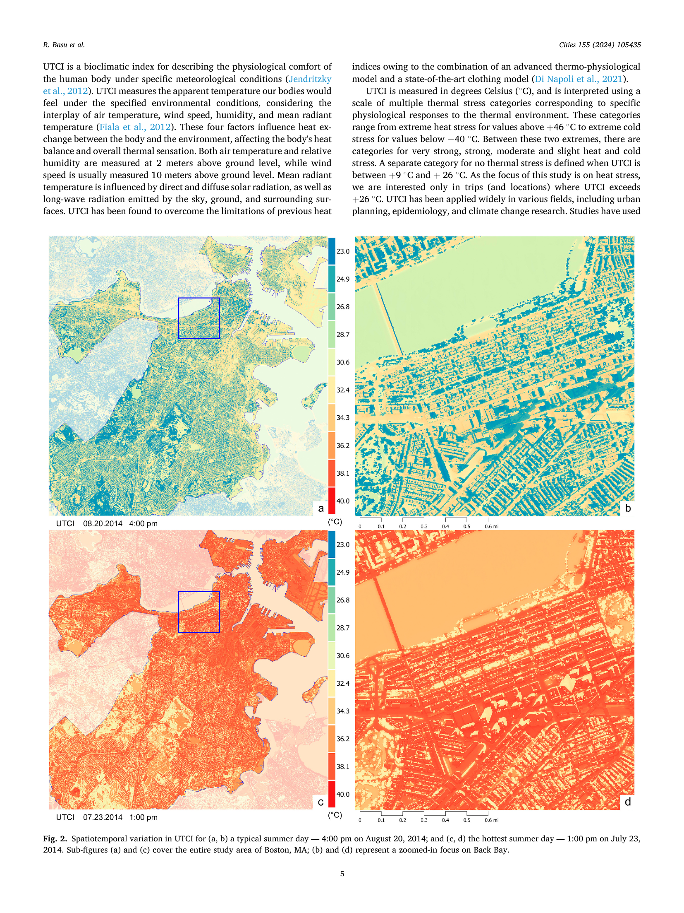
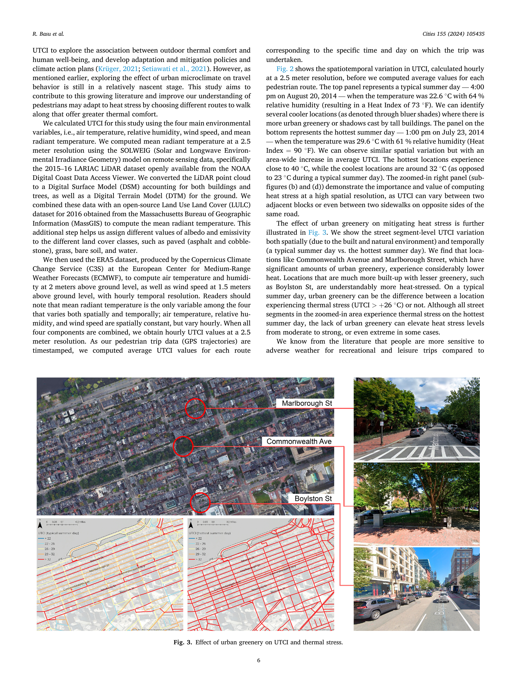
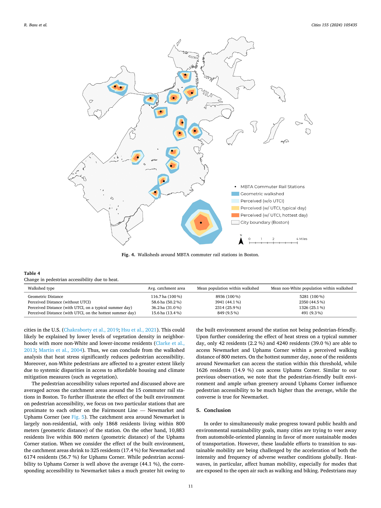

# Basu et al. (2024) — Hot and Bothered: Heat Effect on Pedestrian Route Choice and Accessibility

## 기본 정보
- **저자**: Rounaq Basu, Nicola Colaninno, Aziz Alhassan, Andres Sevtsuk
- **소속**: MIT Department of Urban Studies and Planning; Politecnico di Milano
- **저널**: Cities, 155 (2024), 105435
- **DOI**: https://doi.org/10.1016/j.cities.2024.105435
- **투고/채택**: 2023-08-31 투고 → 2024-09-10 채택 → 2024-09-24 온라인 게재

---

## 연구 개요

보스턴 여름 GPS 이동 궤적 데이터로 UTCI가 보행 경로 선택과 대중교통 역세권 접근성에 미치는 영향 분석. **실제 보행자 이동 데이터** 기반으로 열 스트레스가 보행 의지(Willingness to Walk)에 미치는 영향을 계량화한 최초 대도시 스케일 연구.

**핵심 발견**: UTCI 1°C 증가(26°C 초과)마다 인지 이동 거리 **80.8m** 증가 (보행 기피)

---

## 열환경 지표 및 산출 방법

### 사용 지표
- **UTCI (Universal Thermal Climate Index)**: 주 열환경 지표
- 열 스트레스 기준: **26°C** 이상 (No thermal stress 상한)

### UTCI 계산 방법
1. **MRT**: SOLWEIG 모델
   - LiDAR 기반 DSM (NOAA 2015-16 LARIAC 데이터셋 — 건물+수목 포함 Digital Surface Model)
   - LULC (Massachusetts MassGIS 2016) → 알베도·방사율 지정
   - 공간 해상도: **2.5m**

2. **기온·습도**: ERA5 재분석 데이터 (Copernicus C3S/ECMWF)
   - 2m 높이 기온·습도, 1.5m 풍속, 1시간 해상도

3. **UTCI 최종 계산**: 4개 입력 (Ta, RH, wind, MRT) → 시간별 UTCI
   - 각 보행 여행의 **출발 시간대** 기준 UTCI 할당 (경로별 평균)
   - 보행 여행과 UTCI 값 매칭 → 시간 스탬프 활용

---

## SOLWEIG 입력 완전성 체크리스트 (2026-07-06 재정독 추가, 원문 Section 3.2/3.3 확인)

| 입력 항목 | 채운 값 | 세부 내용 | 우리 Method C와 비교 |
|-----------|--------|----------|-------------------|
| DSM | LiDAR(LARIAC 2015-16) → **건물+나무를 하나로 합친 단일 DSM** + 별도 DTM(지면) | 원문: "converted the LiDAR point cloud to a DSM accounting for **both buildings and trees**" | ⚠️ **CDSM/수간(trunk zone)을 별도로 분리하지 않음** — 나무를 불투명한 고체 장애물처럼 처리(반투과 캐노피 아님). Buo et al.(2026)의 BSM+CDSM 분리 방식보다 단순함 |
| **바닥 알베도·방사율(LULC)** | ✅ **명시됨** — MassGIS 2016 LULC로 포장재(아스팔트/자갈), 잔디, 나지, 수역 등 클래스별 값 지정 | "combined these data with an open-source LULC dataset... to assign different values of albedo and emissivity to the different land cover classes" | **우리가 계획한 "환경부 토지피복지도 재분류→클래스별 알베도" 접근과 정확히 같은 구조** — 실제 적용 선례로 인용 가능 |
| 기상 강제 | ERA5, Ta·RH는 2m, 풍속은 1.5m, **시 단위**, **도시 전역 단일값(공간적으로 균일)** | 원문: "mean radiant temperature is the **only** variable... that varies both spatially and temporally; air temperature, relative humidity, and wind speed are spatially constant, but vary hourly" | **우리 Method C(단일 기상값 + SOLWEIG 공간분포 MRT)와 정확히 같은 구조** — 이 논문을 "단일 기상값+공간분포 MRT" 설계의 선례로 인용 가능 |
| ONLYGLOBAL 여부 | ❌ 명시 안 됨 | — | 확인 불가 |
| SOLWEIG 결과 자체 검증(현장 실측 대조) | ❌ **없음** | Buo et al.(2026)처럼 MaRTy 등으로 MRT/UTCI를 현장 검증한 절차가 이 논문엔 없음 — SOLWEIG+ERA5+LULC 산출값을 그대로 신뢰하고 사용 | 우리도 검증 없이 쓸 경우 이 논문과 같은 수준(선례는 있으나 정확도 보증 없음) |

**핵심 발견**: 이 논문은 **알베도·기상 입력 설계 면에서는 우리 Method C와 거의 동일한 구조**를 이미 SCI 저널에 게재해 사용한 선례다. 다만 (1) CDSM을 분리하지 않아 나무를 불투명 장애물로 단순화했고, (2) SOLWEIG 출력 자체의 현장 검증은 하지 않았다는 한계가 있음 — 이 두 가지는 우리도 그대로 답습할지, 개선할지 판단이 필요.

---

## 데이터 및 공간 범위

| 항목 | 내용 |
|------|------|
| 연구 지역 | 보스턴, MA (미국) |
| 기후 | 아열대~대륙성 (여름 고온다습) |
| 기간 | 2014년 6월 7일~10월 17일 (여름~초가을 보행 여행) |
| 원시 데이터 | 스마트폰 앱 GPS 궤적 11,165건 → 여름 샘플 2,165건 |
| UTCI-flexible 샘플 | 1,361건 (대안 경로 중 더 높은 UTCI 선택지가 있는 경우) |
| 역세권 분석 | 보스턴 MBTA 통근 철도역 **15개** 역 중심 워크쉐드 |
| 워크쉐드 반경 | **800m** (→ 비교: 기하학적 vs 인지적 vs UTCI 반영) |

---

## 접근성 반영 방식

### 경로 선택 모델
- **Path-Size Logit (PSL) 모델**: 경로 간 중복을 보정한 이산선택모형
- 종속 변수: 경로 i 선택 확률
- 독립 변수: 경로 길이, 회전 수, 보도 너비, 편의시설 수, NDVI, SVF, **UTCI**
- WTW(Willingness-to-Walk) 공간 추정

### 워크쉐드 4가지 유형 비교
| 워크쉐드 유형 | 평균 면적 | 평균 인구 비율 |
|--------------|----------|--------------|
| 기하학적 거리 | 116.7 ha (100%) | 8,936명 (100%) |
| 인지 거리 (UTCI 제외) | 58.6 ha (50.2%) | 3,941명 (44.1%) |
| 인지 거리 (UTCI 포함, 일반 여름날) | 36.2 ha (31.0%) | 2,314명 (25.9%) |
| 인지 거리 (UTCI 포함, 최고 폭염일) | 15.6 ha (13.4%) | 849명 (9.5%) |

**핵심 수치**: 폭염 최고 날, 기하학적 대비 역세권 면적 **13.4%**만 남음

### UTCI 비선형 효과 (Table 3)
| UTCI 구간 | 인지 거리 증가 (m/°C) |
|-----------|-------------------|
| 26~29°C | **21.7m** |
| 29~32°C | **44.0m** |
| >32°C | **64.3m** |

→ 26°C를 초과할수록 기하급수적으로 가파른 증가 (지수함수 형태)

---

## 주요 결과

1. **열 스트레스는 보행 경로 선택에 통계적으로 유의한 영향** (p<0.001)
2. UTCI 1°C 증가마다 인지 이동 거리 증가 — **수치가 표본에 따라 다름 (원문 재확인, 혼동 주의)**:
   - Model (2), UTCI-flexible 전체(N=1361, 하루 전체 시간대): **104m/°C** (t=3.99)
   - Model (4/5), UTCI-flexible 중 낮 통행만(N=742, 9AM~7PM): **80.8m/°C** (t=3.06) ← 기존에 인용하던 수치는 이 서브셋 기준
   - 반면 표본 전체(N=2165, UTCI-flexible 제한 없음)에서는 Model (1) 효과가 **통계적으로 유의하지 않음**(t=0.66) — "대안 경로 중 더 더운 곳이 있었는데도 안 바꾼" 사람들까지 포함하면 신호가 희석됨. UTCI-flexible로 표본을 좁혀야 효과가 드러난다는 방법론적 시사점
3. **비선형 효과**: UTCI 32°C 이상에서는 인지 거리 효과가 더 급격히 증가 (26~29°C: 21.7m, 29~32°C: 44.0m, >32°C: 64.3m)
   - ⚠️ 저자 스스로 명시: 2014년 보스턴 여름 데이터는 UTCI 32°C 초과 관측치가 부족(평균 26.3°C, 최댓값 37.3°C)해 "지수함수의 왼쪽 부분(거의 선형으로 보이는 구간)"만 관측했을 가능성이 있고, 실제로는 지수적으로 더 가파를 것이라 추정 — **확증은 못 했지만 저자들의 가설**임을 명확히 구분해서 인용할 것
4. **비백인 거주자(Non-White)**: 일반 여름날도 전체보다 낮은 접근성 → 인종 불평등 확인
5. 역세권 면적 감소: 일반 여름날 31.0% → 폭염일 13.4% (급격한 축소)
6. **경로선택모형 설명력 기여도**: 경로 길이·회전수만 넣은 모형(R²=0.815)에 UTCI를 추가하면 설명력이 2.1%p 상승 — 다른 변수(SVF, NDVI, 편의시설, 보도폭)보다 UTCI의 기여도가 가장 큼 (원문 Section 4.1)

---

## 우리 연구에서 따라할 수 있는 부분

### 1. SOLWEIG + ERA5 조합 (MRT 계산)
- SOLWEIG + LiDAR DSM + ERA5(Ta, RH, wind) → UTCI 계산 표준 파이프라인
- 우리 연구 참고: LiDAR 없으면 건물 DSM 대안 필요
- **인용 가능**: "Basu et al.(2024)은 SOLWEIG와 ERA5를 결합하여 2.5m 해상도 UTCI를 산출, 보스턴 보행자 경로 선택 분석에 적용하였다"

### 2. 역세권(Walkshed) 감소 프레임
- 기하학적 vs 열환경 반영 역세권 비교 → 우리 연구의 Classic vs Thermal Catchment와 구조 동일
- 결과 표현 방식 참고 가능 (면적 비율로 제시)

### 3. UTCI 26°C 임계값 vs 우리 42°C
- Basu2024는 **26°C (No thermal stress 상한, Bröde 등 UTCI 표준 등급)** → 소프트 패널티 시작점
- 우리는 **42°C (Very Strong Heat Stress 중앙값)** → Hard Cut
- 서술 방식: "Basu et al.은 소프트 패널티 시작점을 26°C로 설정했으나, 본 연구는 보수적 플래닝 시나리오로 Very Strong Heat Stress 중앙값인 42°C를 Hard Cut 기준으로 채택"

### 4. 비선형 효과 → Hard Cut 정당화
- UTCI 32°C+ 에서 인지 거리 효과 급증 → 높은 임계값에서 사실상 보행 포기와 동일
- Hard Cut이 현실을 잘 반영할 수 있다는 논거로 활용 가능

### 5. 대중교통 역 중심 분석 → 우리 연구와 동일
- "보행-대중교통 연계 first/last-mile 접근성" 프레임 → 우리 역세권과 같은 문제 의식
- 단, 우리 연구에서 대중교통이 메인이 되면 안 됨 → 보행 접근성 자체를 강조

---

## 우리 연구와의 차별점

| 항목 | Basu2024 | 우리 연구 |
|------|----------|----------|
| 열 패널티 방식 | **소프트** (WTW 경로 선택 모델) | **Hard Cut** (링크 제거) |
| UTCI 임계값 | 26°C (소프트 패널티 시작) | 42°C (Hard Cut) |
| 데이터 기반 | 실제 GPS 궤적 (실증) | 공간 모델링 (시뮬레이션) |
| 도시 | 보스턴 (미국, 온대) | 서울 (한국, 온대 계절풍) |
| 공간 해상도 | 링크 레벨 (경로 단위) | 링크 레벨 (엣지 단위) |
| 분석 결과 | 경로 선택 확률 + walkshed | 감소율([검증 지표]) |
| 형평성 분석 | 인종별 접근성 불평등 | 공간환경변수별 감소 패턴 |
| 기간 | 여름 전체 (June~Oct) | 폭염 특보 발효 기간 |

---

## 한계 (논문 명시 + 재확인 추가)
- 2014년 데이터 (현재 보스턴은 더 더워짐 — 저자들이 "여름이 더 더워졌다"고 결론에서 직접 언급)
- 익명 GPS → 개인 특성(연령·성별·소득 등) 통제 불가, 반복측정 불가(패널 보정 불가)
- 비선형 효과 검증을 위한 UTCI > 32°C 데이터 부족 (보스턴 기후 특성) — 지수적 형태는 가설일 뿐 미확증
- ERA5 공간 해상도 한계 (도시 블록 수준 변이 반영 불가) — 단, 저자들은 이를 "MRT만 공간적으로 정밀하게, 나머지는 균일하게" 처리하는 설계로 정당화
- **CDSM 미분리** — 나무를 불투명 장애물로 단순화(위 체크리스트 참고)
- **SOLWEIG 출력 자체의 현장검증 없음** (위 체크리스트 참고)
- UTCI 26°C 임계값은 "전 세계 공용" 표준이라 밝히면서도, 더 더운 지역 주민은 열에 더 적응(tolerance)했을 수 있어 지역별로 다르게 설정할 필요가 있다고 결론에서 직접 언급 — 우리 연구가 42°C(더 높은 임계값)를 쓰는 것에 대한 지지 논거로 활용 가능

---

## Figure 모음 (PDF 페이지 캡처, 200dpi)

- **Fig.2 (p.5)**: 보스턴 UTCI 시공간 분포 — 평범한 여름날(4시) vs 가장 더운 날(오후1시), 2.5m 해상도 확대컷 포함
  
- **Fig.3 (p.6)**: 도시 녹지가 UTCI에 미치는 영향 — Commonwealth Ave(녹지多) vs Boylston St(녹지少) 스트리트뷰 대조
  
- **Fig.4 (p.11)**: MBTA 통근철도역 15곳 walkshed 비교(기하학적/인지거리/UTCI 반영 typical day/hottest day) — **핵심 결과 그림**
  

---

## 영-한 단어장 (읽으면서 헷갈렸을 만한 단어)

| 영어 | 한글 발음/뜻 | 문맥 |
|------|------------|------|
| willingness to walk (WTW) | 보행 의향 | 특정 경로 속성 한 단위 변화를 감수하고 걸을 의향 (거리로 환산) |
| path-size logit (PSL) model | 경로크기 로짓 모델 | 경로 간 중복(겹침)을 보정한 이산선택모형 |
| discrete choice model | 이산선택모형 | 유한한 대안 중 하나를 선택하는 상황을 모델링하는 통계기법 |
| Hidden Markov model (map-matching) | 은닉마르코프모델 (맵매칭) | GPS 좌표를 실제 도로망에 정렬시키는 알고리즘 |
| Normalized Difference Vegetation Index (NDVI) | 정규식생지수 | 위성영상으로 식생 밀도를 나타내는 지수(−1~1) |
| Sky View Factor (SVF) | 하늘 개방도 | 한 지점에서 보이는 하늘 비율 (여기선 street view 이미지 기반 산출) |
| catchment area | 역세권/집수역 | 특정 지점(역)으로부터 접근 가능한 공간 범위 |
| walkshed | 보행권역 | 도보로 도달 가능한 범위 (catchment의 보행 버전) |
| perceived distance | 인지 거리 | 실제 거리가 아니라 사람이 "느끼는" 심리적 이동거리 |
| goodness-of-fit | 적합도 | 모델이 실제 데이터를 얼마나 잘 설명하는지의 정도 |
| McFadden's pseudo R-squared | 맥파든 유사결정계수 | 로짓모델에서 선형회귀 R²에 대응하는 적합도 지표 |
| Akaike Information Criterion (AIC) | 아카이케 정보기준 | 모델의 적합도와 복잡도를 함께 고려하는 비교지표(낮을수록 좋음) |
| robust t-statistic | 로버스트 t통계량 | 이분산성 등을 보정한 t값 |
| heteroskedasticity | 이분산성 | 오차의 분산이 관측치마다 다른 현상 |
| Census Block Group (CBG) | 인구총조사 블록그룹 | 미국 인구총조사의 최소 집계 단위(우리의 행정동/통계구역과 유사) |
| American Community Survey (ACS) | 미국지역사회조사 | 미국 인구총조사국의 표본조사(소득·인종 등 세부통계 제공) |
| transit-oriented development (TOD) | 대중교통중심개발 | 역 주변을 고밀·복합 개발하는 도시계획 기법 |
| first-/last-mile (connection) | 첫/마지막 마일 연계 | 대중교통역과 최종 목적지 사이의 도보 구간 |
| equity (lens) | 형평성 (관점) | 여기선 "인종·소득에 따른 열노출 불평등"을 살피는 분석 시각 |
| Non-White | 비백인 | 미국 인구총조사에서 백인이 아닌 인종 범주를 통칭 |
| built-up volume | 건축 연면적(용적) | 건물의 총 바닥면적 합, 인구 배분 시 가중치로 사용 |
| exponential (functional form) | 지수함수 형태 | 증가율 자체가 갈수록 커지는 곡선 형태 |
