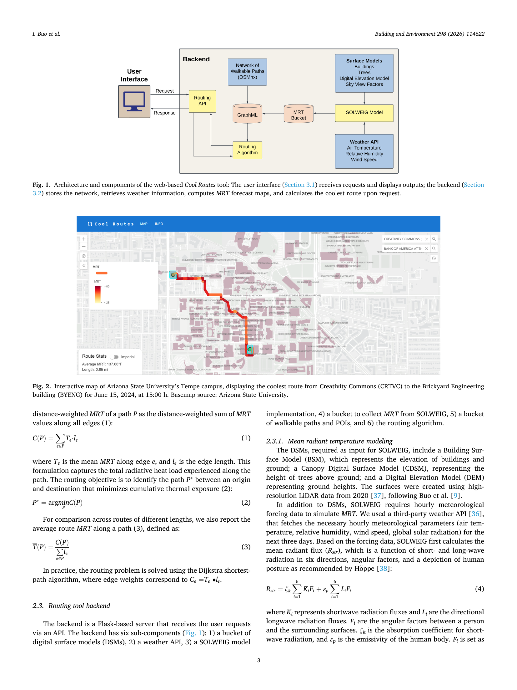
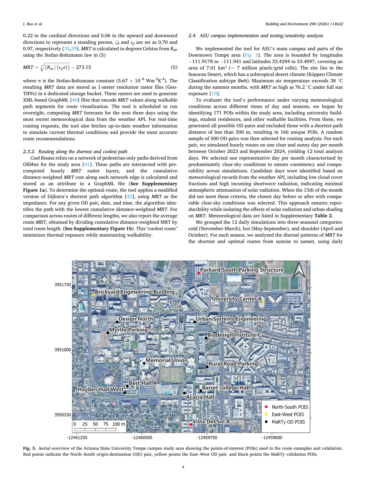
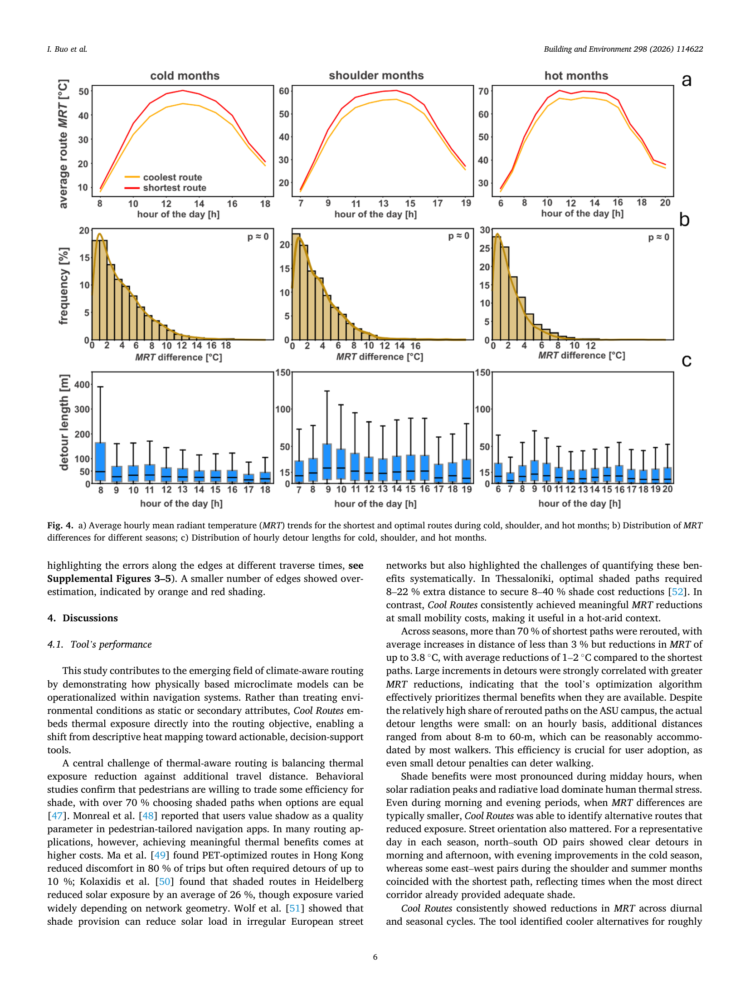
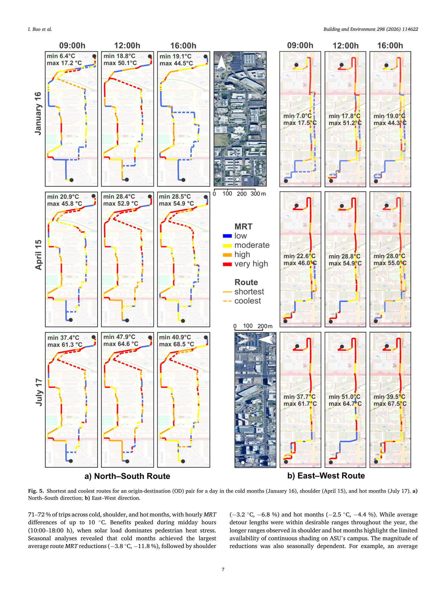
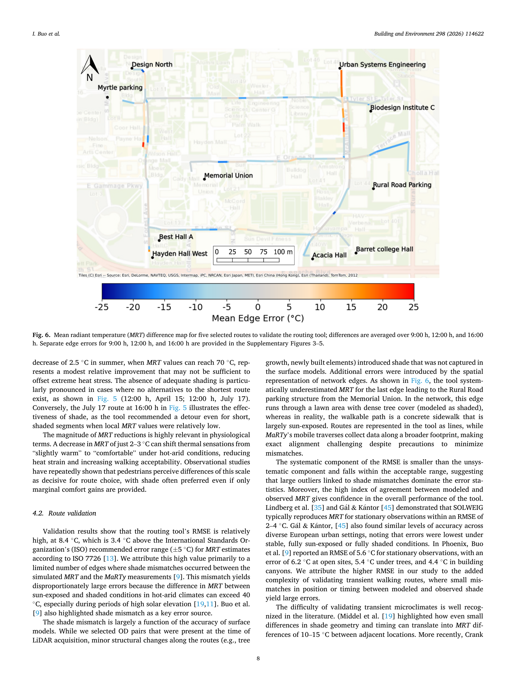

# Buo et al. (2026) — Cool Routes: Real-time Human Thermal Exposure Routing

## 기본 정보
- **저자**: Isaac Buo, Waqar Hassan Khan, Evan Crabtree, Fletcher Emmott, Devbrat Hariyani, Ariane Middel
- **소속**: The GAME School, Arizona State University; School of Computing and Augmented Intelligence, ASU; School of Geographical Sciences and Urban Planning, ASU
- **저널**: Building and Environment, 298 (2026) 114622
- **DOI**: https://doi.org/10.1016/j.buildenv.2026.114622
- **투고/채택**: 2026-02-13 투고 → 2026-04-11 수정 → 2026-04-13 채택 → 2026-04-18 온라인 게재

---

## 연구 개요

피닉스(Arizona) ASU 캠퍼스에서 **MRT를 임피던스(impedance)로** 직접 사용하는 실시간 보행 라우팅 시스템 *Cool Routes* 개발. SOLWEIG 1m 해상도 MRT를 사전 계산하고 Dijkstra 알고리즘으로 최소 누적 MRT 경로 탐색.

**핵심 기여**:
- 최초의 실시간 MRT 기반 보행 내비게이션 시스템
- SOLWEIG + LiDAR DSM + weather API 완전 파이프라인
- 모바일 센서(MaRTy)로 MRT 예측 검증 (d=0.73)

---

## SOLWEIG 입력 완전성 체크리스트 (2026-07-06 재정독 추가)

> 목적: 이 논문이 실제로 "정식 SOLWEIG full input set"을 다 채웠는지, 원문 Section 2.3.1과 2.4를 직접 재확인.

| 입력 항목 | 이 논문에서 채운 값 | 출처/해상도 | 논문에 명시? |
|-----------|------------------|------------|------------|
| Building Surface Model (BSM) | LiDAR 기반 건물+지면 표고 | 2020년 LiDAR, **1m** | ✅ 명시 (Section 2.3.1) |
| Canopy DSM (CDSM) | 나무 캐노피 높이(지면 기준) | 2020년 LiDAR, **1m** | ✅ 명시 |
| DEM | 지면 표고 | 2020년 LiDAR, **1m** | ✅ 명시 |
| 기상 강제(forcing) | Ta, RH, 풍속, 전천일사(global solar radiation) | 3rd-party Weather API, **시간별(hourly)**, 72시간 예보 | ✅ 명시 (site 단일값으로 추정, 공간분포 기상 언급 없음) |
| ONLYGLOBAL 여부 | 직달/확산 분리 여부 | — | ❌ **명시 안 됨** — "global solar radiation"만 언급, ONLYGLOBAL 세팅값 자체는 본문에 안 나옴. 우리 프로젝트처럼 확산/직달 미분리일 가능성이 높지만 확정 불가 |
| **바닥 알베도 / 토지피복(Land cover) 래스터** | — | — | ❌ **본문에 전혀 언급 없음.** BSM+CDSM+DEM+기상 4가지만 "the DSMs, required as input for SOLWEIG" 로 명시(2.3.1) — 알베도 공간분포는 아마 SOLWEIG 기본값(default) 사용한 것으로 추정되나 논문이 밝히지 않음 |
| 인체 파라미터 | ζk(단파 흡수율)=0.70, εp(방사율)=0.97, Fi(방향별 각도계수)=0.22(수평 4방향)/0.06(상하) | Höppe(1992) 권고값 인용 | ✅ 명시 (eq. 4-5, [38][39]) |

**핵심 발견 — 우리 연구에 중요**: "정식 SOLWEIG"의 대표 사례로 꼽은 Buo et al.(2026)조차 **알베도/토지피복 공간분포 입력을 논문에 명시하지 않았다.** 즉 CDSM·1m DSM까지 완비해도 "지표 재질별 알베도 차별화"는 SOLWEIG 적용 사례에서 흔히 생략되는 항목일 수 있음 — 우리 Method C의 "바닥 알베도 미반영" 한계가 유독 부실한 게 아니라 이 분야에서 일반적으로 자주 생략되는 부분일 가능성. (단, 이 논문이 안 밝혔다고 안 썼다는 뜻은 아니므로 ⚠️ 저자에게 직접 문의하거나 SOLWEIG 기본 매뉴얼 확인 필요 — 단정 금지)

---

## 핵심 모델

### 누적 열 노출 (Cumulative Thermal Exposure)
```
C(P) = Σₑ∈P Tₑ · lₑ          ...(1)
```
- Tₑ: 엣지 e의 평균 MRT (°C)
- lₑ: 엣지 e의 길이 (m)
- **임피던스 = 거리 가중 MRT 합산**

### 최적 경로 탐색
```
P* = argmin C(P)          ...(2)
```
- Dijkstra 알고리즘 적용 (MRT × 길이를 edge weight로 사용)

### 평균 경로 MRT
```
T(P) = C(P) / Σₑ lₑ          ...(3)
```

### MRT 계산 (SOLWEIG 출력)
```
R_str = ζₖ Σᵢ₌₁⁶ KᵢFᵢ + εₚ Σᵢ₌₁⁶ LᵢFᵢ          ...(4)
MRT = ⁴√(R_str / (εₚ·σ)) − 273.15          ...(5)
```
- Kᵢ: 단파 복사 플럭스, Lᵢ: 장파 복사 플럭스
- Fᵢ: 인체 각도 계수 (6방향)
- ζₖ = 0.70 (단파 흡수율), εₚ = 0.97 (방사율)
- σ = 5.67×10⁻⁸ Wm⁻²K⁻⁴ (Stefan-Boltzmann 상수)

---

## 데이터 및 시스템 구조

### 시스템 아키텍처 (Cool Routes)
- **Frontend**: 웹 앱 (사용자: O-D 입력 + 날짜/시간 선택)
- **Backend**: Flask 서버
  1. DSM bucket (건물 + 나무 + DEM)
  2. Weather API (Ta, RH, wind, solar radiation — 72시간 예보)
  3. SOLWEIG model → 1m MRT 래스터 (매시간 사전 계산)
  4. MRT bucket (GeoTIFF 저장)
  5. Walkable paths bucket (OSMnx 기반 GraphML)
  6. Routing algorithm (Dijkstra)

### 입력 데이터
| 데이터 | 소스 | 해상도 |
|--------|------|-------|
| 건물 Surface Model (BSM) | LiDAR 2020 | 1m |
| 나무 캐노피 Surface Model (CDSM) | LiDAR 2020 | 1m |
| DEM | LiDAR 2020 | 1m |
| 기상 | Weather API (실시간) | 사이트별 |
| 보행 네트워크 | OSMnx | 링크 단위 |

### 공간 범위
- ASU Tempe 캠퍼스 + Downtown Tempe
- 7.01 km² (−111.9178°~−111.941°E, 33.4294°~33.4097°N), 약 700만 픽셀/그리드 셀
- 기후: 건조 아열대 (Köppen Bwh), 여름 최고 38°C (MRT 76.2°C 가능)

### 계산 비용 (Section 3.1, 원문 확인)
- 32GB RAM, 2.9GHz Intel Xeon CPU 서버 1대 기준, **24시간치 1m MRT 래스터 생성에 약 4시간 소요**
- 매일 밤 익일~72시간 예보분을 사전계산(precompute)하는 구조 — 실시간 요청 자체는 라우팅 API 호출 시 약 2초 응답
- **시사점**: 서울 전역(수백 km²) 스케일로 확장 시 계산 비용이 캠퍼스(7km²)보다 수십~수백 배— Method C(30m) 채택 동기 중 하나로 인용 가능

---

## 검증

### MaRTy 모바일 센서 검증
- 3개 net-radiometers → 6방향 복사 측정 (2초 간격)
- 핫 서머 데이터 (July 5, 6, 9, 2025) — Ta ≈ 40°C
- 5개 경로, 319개 엣지 검증

### 검증 결과
| 지표 | 값 |
|------|-----|
| Index of Agreement (d) | **0.73** |
| MAE | 6.2 °C |
| MBE | −2.0 °C (과소추정) |
| RMSE | 8.4 °C |
| 오차 5°C 이하 엣지 비율 | 72% (228/319개) |

### 검증 오차가 높게 나온 이유 (Section 4.2, 원문 확인 — 중요)
- ISO 7726 권장 오차범위(±5°C)보다 RMSE(8.4°C)가 높음 — 저자들이 원인을 자체 분석:
  1. **정지(stationary) vs 이동(transient) 관측의 근본적 차이**: SOLWEIG는 고정 격자셀의 순간 복사환경(Eulerian)을 산출하지만, MaRTy는 사람이 경로를 걸으며 측정한 연속적 노출(Lagrangian) — 공간 정렬/시간 동기화 오차가 필연적으로 발생
  2. **그늘 불일치(shade mismatch)**가 핵심 오차원 — 대부분의 큰 오차가 여기서 발생. 예: 2020년 LiDAR 촬영 이후 나무가 자라 실제로는 그늘이 생겼는데 지표모델엔 반영 안 됨(과소추정 원인)
  3. 비교 문헌: Lindberg et al., Gál & Kántor는 **정지 관측** 검증 시 RMSE 2~4°C — 본 논문처럼 **이동 경로** 검증은 구조적으로 오차가 더 큼 (Crank et al.도 ENVI-met 이동측정에서 RMSE 6~12°C로 유사하게 높음)
- **우리 연구 시사점**: 우리는 링크 단위 정적 스냅샷 분석(Eulerian, 사람이 안 움직임)이라 Buo처럼 이동 검증 오차가 발생할 이유는 없음. 다만 검증 자체를 안 하면 이 논문 수준의 신뢰도 근거도 없다는 점은 유의.

---

## 주요 결과

### 계절별 라우팅 성능
- 500개 OD 쌍 × 12 맑은 날 (계절별 1일/월)
- **70% 이상**: 최단 경로와 다른 경로 권장 (재경로 발생)

| 계절 | 평균 우회 거리 | 평균 MRT 감소 |
|------|--------------|--------------|
| 냉월 (11~3월) | +5.0% | **−3.8°C** (−11.8%) |
| 어깨철 (4, 10월) | +32.2m | **−3.2°C** (−6.8%) |
| 열월 (5~9월) | +22.3m (평균) | **−2.5°C** (−4.4%) |

- 우회 거리: 주로 8~60m (중앙값 50m 이하)
- 정오(10:00~18:00) 최대 효과

### MRT 범위 (ASU 캠퍼스, 열월)
- 완전 햇빛: max MRT **76.2°C**
- 완전 그늘: −20~40°C 감소 가능
- 최저 MRT: 37.4°C (7월 오전)

---

## 우리 연구에서 따라할 수 있는 부분

### 1. SOLWEIG 1m 해상도 MRT 계산 파이프라인 ← A5 해결
- **완전한 파이프라인**: LiDAR DSM + CDSM + DEM + weather API → SOLWEIG → MRT
- 우리도 동일 파이프라인 사용 (단, LiDAR 없으면 DSM 대안 필요)
- **인용 가능**: "Buo et al.(2026)은 SOLWEIG와 1m LiDAR DSM을 결합하여 캠퍼스 규모 실시간 MRT를 산출하고 보행 라우팅에 적용하였다"

### 2. MRT를 임피던스로 직접 사용 ← E1 보완
- 우리 Hard Cut: 기상 조건 고정 후 UTCI=42°C(Bröde et al. 2012, Very Strong Heat Stress 38~46°C 중앙값) 역산 MRT 임계값 초과 링크 제거 = 해당 링크를 통행 불가로 설정하는 것
- Buo는 MRT를 연속적 비용으로 사용 (소프트) → 우리는 역산 MRT 임계값 초과 시 제거 (하드)
- **비교 서술**: "Buo et al.(2026)은 MRT를 연속적 임피던스로 사용해 누적 열노출을 최소화하는 경로를 탐색한 반면, 본 연구는 UTCI ≥42°C(Very Strong Heat Stress 중앙값)에 대응하는 역산 MRT 임계값 초과 링크를 완전 제거하는 Hard Cut 접근을 채택한다"

### 3. SOLWEIG 검증 정확도 수치 참고
- d=0.73, MAE=6.2°C, RMSE=8.4°C
- 우리 SOLWEIG 적용 시 모델 불확실성 논의에 인용 가능
- "Buo et al.(2026)의 검증 결과(d=0.73, MAE=6.2°C)는 SOLWEIG가 도시 보행 맥락에서 MRT를 합리적으로 추정함을 시사한다"

### 4. Dijkstra 알고리즘으로 MRT 최소 경로 탐색
- 우리도 Hard Cut 후 Dijkstra 재실행 → 동일 알고리즘 사용
- Buo의 edge weight = Tₑ×lₑ / 우리 edge weight = 기존 이동 시간

### 5. 우회 거리 10m~60m, +3~5% 수준
- 열 최적 경로 선택 시 실제 우회 거리 매우 작음 → 현실적
- 우리 연구 Hard Cut이 더 극단적 (도달 불가 = ∞ 우회)이지만 보수적 시나리오 명시

### 6. MRT 최대 76.2°C (피닉스 여름)
- 우리 Hard Cut: UTCI ≥42°C(Bröde et al., 2012, Very Strong Heat Stress 중앙값) → 서울 폭염 기상 조건 고정 후 역산 MRT 임계값 산출 → MRT로 링크 제거
- **한국 폭염 MRT 범위 산출 필요** (분석 단계에서 확인)

---

## 기후 전이가능성 한계 (Section 4.4, 원문 확인 — 서울 연구에 중요)

저자들이 명시적으로 밝힌 한계:
> "SOLWEIG currently uses standard meteorological inputs (e.g., air temperature, relative humidity, cloud cover). MRT-based thermal stress focuses on the radiative component, which is dominant in hot-arid climates but may be less predictive in humid subtropical or tropical settings where air temperature and humidity more strongly influence human heat balance. To be transferable to more humid climates and support more comprehensive thermal comfort indices such as UTCI or PET, additional input variables and more complex modeling frameworks will be required."

**핵심**: 이 논문(피닉스, 건조 아열대 Bwh)은 MRT(복사 성분)만으로 열 스트레스를 대표할 수 있다고 전제하는데, 이는 **건조·맑은 하늘 기후에 특화된 가정**이다. 저자 스스로 **습윤 아열대/열대 기후에서는 기온·습도의 기여가 더 커서 MRT 단독으로는 예측력이 떨어질 수 있다**고 인정하며, UTCI/PET 같은 종합 지표로 가려면 추가 변수·더 복잡한 모델링이 필요하다고 명시.

**우리 연구(서울, 온대 계절풍·여름 고온다습)에 주는 함의**:
- 서울은 Bwh(건조)가 아니라 습윤한 여름 몬순 기후 — Buo의 "MRT 중심 접근"을 그대로 가져오는 것에 대한 정당화가 더 필요함
- 다행히 우리는 MRT를 최종 임피던스로 안 쓰고 **UTCI로 변환**(6개 변수: Ta, RH, 풍속, MRT 포함) 후 Hard Cut을 적용 — 저자가 제안한 "더 종합적인 지표(UTCI)로 가라"는 방향과 이미 부합함. Methods/Discussion에서 이 논문의 한계 인정을 "우리가 UTCI를 채택한 이유"로 인용 가능
- **인용 문구 초안**: "Buo et al.(2026)은 MRT 기반 접근이 건조 기후에 최적화되어 있으며 습윤 아열대·열대 환경으로의 전이를 위해서는 UTCI 등 종합 지표가 필요함을 지적하였다. 본 연구는 이에 따라 서울(습윤 대륙성/몬순 기후)의 열환경 평가에 MRT를 직접 사용하지 않고 UTCI로 변환하여 Hard Cut 임계값을 적용한다."

---

## 우리 연구와의 차별점

| 항목 | Buo2026 | 우리 연구 |
|------|---------|----------|
| 목적 | 실시간 개인 내비게이션 | 역세권 접근권 분석 |
| 열 지표 | MRT (직접) | MRT → UTCI (생리 지표) |
| 패널티 방식 | 소프트 (누적 MRT 최소화) | **Hard Cut** (UTCI≥42°C 링크 제거) |
| 스케일 | 캠퍼스 (~7km²) | 서울 전역 (성동구 파일럿 기반) |
| 기후 | 건조 아열대 (피닉스) | 온대 계절풍 (서울) |
| 결과 | 개별 OD쌍 최적경로 | 보행권 감소율([검증 지표]) |
| 실시간 여부 | 실시간 MRT 예보 반영 | 특정 폭염일 단일 시점 분석 |

---

## 한계 (논문 Section 4.4, 5 원문 확인 — 보강)
- 단일 사용자 요청 처리 (동시 세션/실시간 부하분산 불가) — 도시 규모 확장 시 인프라 필요
- 정적 지면 모델 (식생 성장, 계절 낙엽, 신축 건물 미반영) — LiDAR 재촬영 주기 문제. 드론 측량 등 대안은 비용·항공허가 제약
- LiDAR 취득 비용 + 항공 허가 제약
- **열대·습윤 기후 적용 가능성 미검증** (현재는 건조 아열대 한정, 위 "기후 전이가능성" 항목 참고)
- MaRTy 이동 중 측정 vs SOLWEIG 정지 추정 간 방법론적 차이(Eulerian vs Lagrangian)
- **형평성(equity) 우려**: 모든 사용자가 "가장 시원한 경로"로 라우팅되면 그늘 있는 경로에 보행량이 집중되어 혼잡·불균형 발생 가능 — 개인 최적화와 도시 전체 보행 흐름 간 트레이드오프 (저자들이 명시적으로 지적, 향후 연구 필요 항목)
- 경로 평균 MRT만 사용 — 실제 보행 중 걷는 속도, 정지(신호 대기 등), 그늘/햇빛 급전환에 따른 순간적 생리 반응은 미반영

---

## Figure 모음 (PDF 페이지 캡처, 200dpi)

> 원문 그림 위치 그대로 페이지 단위 캡처. 파일: `figures/Buo2026/`

- **Fig.1–2 (p.3)**: Cool Routes 시스템 아키텍처(백엔드 6개 서브컴포넌트: DSM bucket, Weather API, SOLWEIG, MRT bucket, Walkable paths bucket, Routing algorithm) + 실제 웹 인터페이스 스크린샷
  
- **Fig.3 (p.4)**: ASU Tempe 캠퍼스 연구 지역, POI 171개 표시, MaRTy 검증 경로 위치
  
- **Fig.4 (p.6)**: 계절별(한랭기/완충기/혹서기) 시간대별 평균 경로 MRT, MRT차이 분포, 우회거리 분포 — **가장 중요한 결과 그림**
  
- **Fig.5 (p.7)**: 남북/동서 방향 OD쌍의 계절별·시간대별 최단경로 vs 최적경로 지도 (MRT 색상 단계: low/moderate/high/very high)
  
- **Fig.6 (p.8)**: 5개 검증 경로의 MaRTy vs 모델 MRT 오차 지도 (파란색=과소추정)
  

---

## 영-한 단어장 (읽으면서 헷갈렸을 만한 단어)

| 영어 | 한글 발음/뜻 | 문맥 |
|------|------------|------|
| impedance | 임피던스 (여기선 "이동 저항/비용") | 경로 탐색에서 거리 대신 쓰는 비용 함수 |
| radiative heat load | 복사 열부하 | 몸에 가해지는 복사에너지의 총량 |
| angular factor (Fᵢ) | 각도 계수 | 인체 표면이 특정 방향 복사를 받는 비율 (6방향 가중치) |
| absorption coefficient (ζk) | 흡수율 | 인체가 단파복사를 흡수하는 비율 (0.70) |
| emissivity (εp) | 방사율 | 인체가 장파복사를 방출/흡수하는 효율 (0.97) |
| Stefan–Boltzmann law | 스테판-볼츠만 법칙 | 복사에너지↔절대온도 변환 물리법칙 |
| Willmott's index of agreement (d) | 윌모트 일치도 지수 | 0(불일치)~1(완전일치), RMSE 대안적 검증지표 |
| systematic / unsystematic RMSE | 체계적/비체계적 오차 성분 | 체계적=모델의 구조적 편향, 비체계적=무작위 오차 |
| stationary vs transient (observation) | 정지관측 vs 이동(경과)관측 | 고정된 지점 측정 vs 이동하며 연속 측정 |
| Eulerian vs Lagrangian | 오일러 방식 vs 라그랑주 방식 | 고정좌표 기준 서술 vs 이동체 기준 서술 (유체역학 용어 차용) |
| canopy digital surface model (CDSM) | 수목 캐노피 표면모델 | 나무 윗면 높이를 표현한 래스터 |
| sky view factor (SVF) | 하늘 개방도 | 한 지점에서 보이는 하늘 비율(0~1), 그늘·복사 계산 핵심 변수 |
| shade mismatch | 그늘 불일치 | 모델상 그늘 위치·시점과 실제 그늘이 어긋나는 현상 (핵심 오차원) |
| clear-sky day | 맑은 날 (구름 적은 날) | 태양복사가 대기에 의해 감쇠되지 않는 조건 |
| diurnal | 일중(하루 동안의) | diurnal pattern = 하루 시간대별 변화 패턴 |
| detour tolerance | 우회 허용도 | 사용자가 감수할 수 있는 추가 이동거리/시간 |
| cloud cover fraction | 운량(구름 비율) | 하늘에서 구름이 덮은 비율 |
| forecast lead time | 예보 선행시간 | 예보 시점부터 실제 시각까지의 시간 간격 (여기선 최대 72시간) |
| GraphML | 그래프 마크업 언어(파일 포맷) | 네트워크(노드·엣지) 데이터를 저장하는 XML 기반 포맷 |
| Dijkstra('s) shortest-path algorithm | 다익스트라 최단경로 알고리즘 | 그래프에서 최소 비용 경로를 찾는 표준 알고리즘 |
| origin–destination (OD) pair | 출발-도착지 쌍 | 경로 탐색의 기본 입력 단위 |
| points of interest (POI) | 관심지점 | 목적지 후보로 등록된 장소들 |
| congestion | 혼잡 | 특정 경로에 보행량이 몰리는 현상 |
| equity | 형평성 | 여기선 "그늘 자원의 공평한 분배" 맥락 |
| decision-support tool | 의사결정 지원 도구 | 정책·계획 결정을 돕는 분석 도구 (자동 결정이 아님) |
| microclimate | 미기후 | 국지적(수 m~수백 m 스케일)인 기후 조건 |
| biometeorological (station) | 생기상학적 (관측소) | 인체에 영향을 미치는 기상요소를 측정하는 분야/장비 |
| net-radiometer | 순복사계 | 입사·반사·방출 복사를 함께 측정하는 센서 |
| Köppen climate classification | 쾨펜 기후 분류 | 전 세계 기후를 문자코드(Bwh=건조 사막 고온 등)로 분류하는 체계 |
| synergistic / trade-off | 상호보완적 / 트레이드오프 | 두 요소가 서로를 강화 / 하나를 얻으면 하나를 잃는 관계 |
