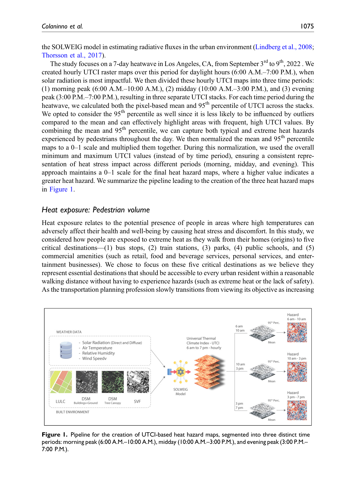
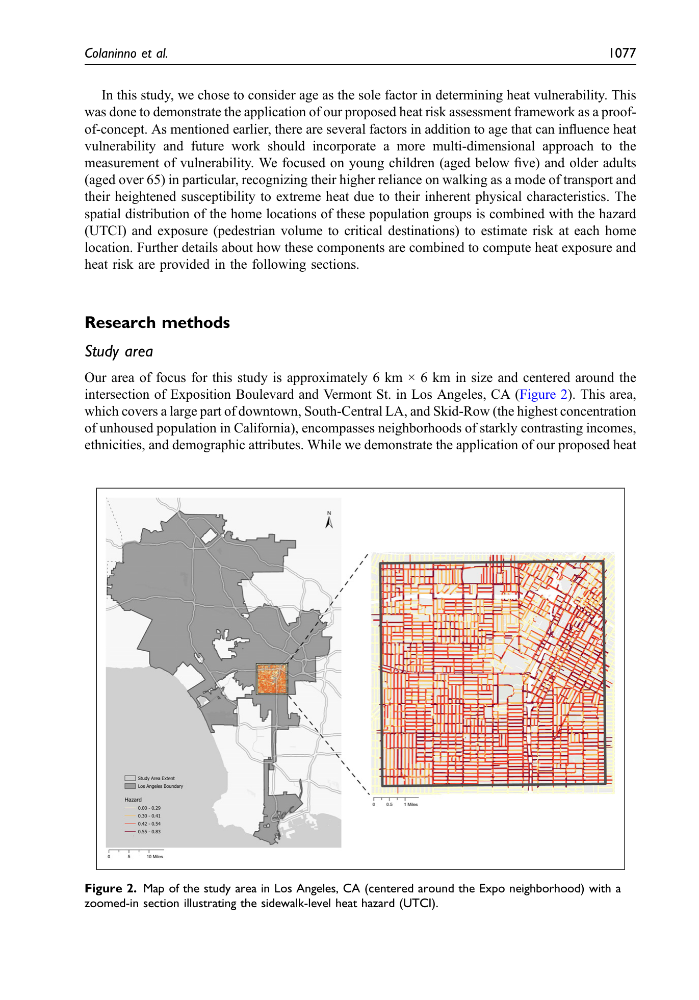
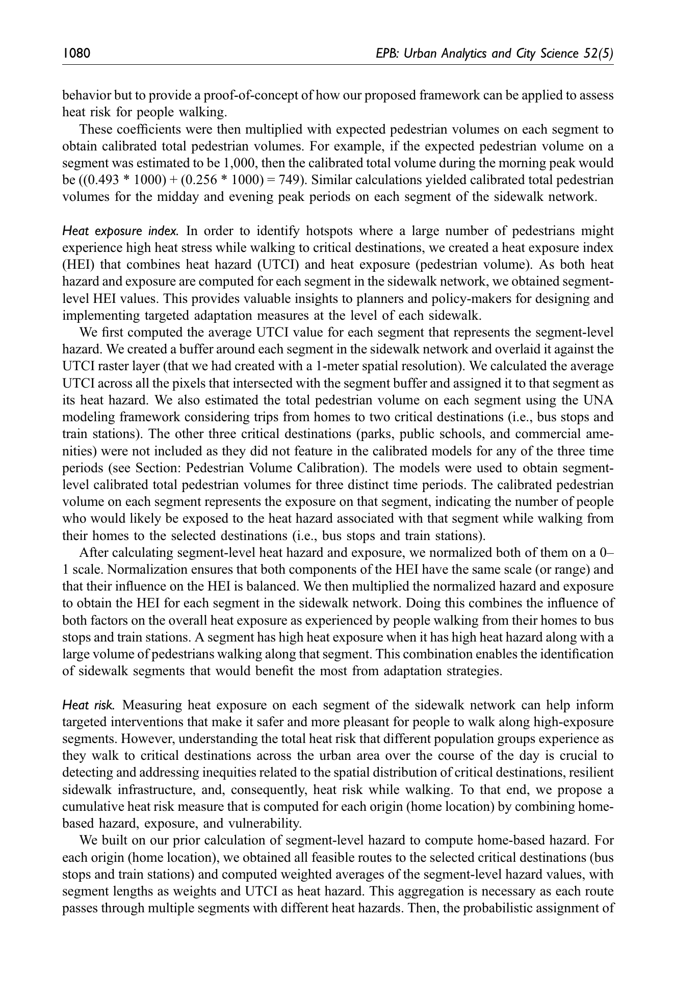
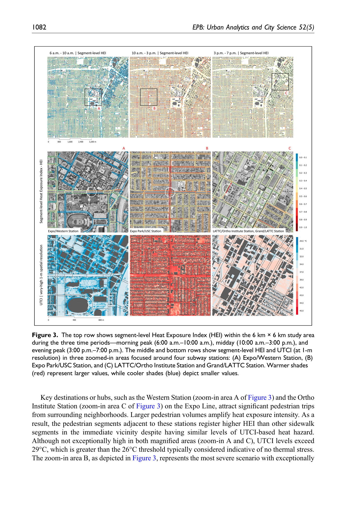

# Colaninno et al. (2024) — 보도 단위 열위험 평가 프레임워크

작성일: 2026-07-01  
버전: v1.0  
근거논문: Colaninno, N., Basu, R., Hosseini, M., Alhassan, A., Liu, L., & Sevtsuk, A. (2024). A sidewalk-level urban heat risk assessment framework using pedestrian mobility and urban microclimate modeling. *EPB: Urban Analytics and City Science*, 52(5), 1071–1090. DOI: 10.1177/23998083241280746

---

## 1. 논문 기본 정보

- **저자**: Nicola Colaninno (Politecnico di Milano + MIT), Rounaq Basu, Maryam Hosseini, Abdulaziz Alhassan, Liu Liu, Andres Sevtsuk (MIT)
- **저널**: EPB: Urban Analytics and City Science (2025) 52(5):1071–1090
- **DOI**: 10.1177/23998083241280746
- **연구지역**: Los Angeles, CA — Expo 지역 6km×6km (약 36 sq.km)
- **재정지원**: EU Horizon 2020 Marie Skłodowska-Curie, MultiCAST 프로젝트 (No. 101028035)

---

## 2. 핵심 프레임워크

**IPCC 리스크 3요소를 보도 단위로 구현**:

$$\text{Heat Risk} = \text{Hazard (UTCI)} \times \text{Exposure (보행자량)} \times \text{Vulnerability (연령)}$$

| 요소 | 측정 방법 | 해상도 |
|------|----------|--------|
| Hazard | UTCI (SOLWEIG) | 1m 픽셀 |
| Exposure | 보행자 이동량 (UNA) | 사이드워크 세그먼트 |
| Vulnerability | 연령 (5세 이하, 65세 이상) | 주소 단위 |

---

## 3. 방법론 — Hazard (UTCI)

### 3.1 SOLWEIG 설정
- **모델**: SOLWEIG (UMEP 플러그인) — Lindberg et al. (2008, 2018) 인용
- **공간해상도**: **1m**
- **기상입력**: ERA5 (Copernicus C3S, ECMWF) — 시간별
- **공간입력**: LiDAR DSM (건물+지면 + 수목 캐노피 분리), LULC 2016

### 3.2 분석 기간 및 시간 구분
- **폭염**: 2022년 9월 3일~9일 (7일, LA)
  - 폭염 판별: 일 최고기온이 1980~2022 기준기간 90th percentile 초과
- **시간 범위**: 6:00 AM ~ 7:00 PM (일조 시간)
- **시간대 3구분**:
  - 아침 peak: 6:00–10:00 AM
  - 낮(midday): 10:00 AM–3:00 PM
  - 저녁 peak: 3:00–7:00 PM

### 3.3 열위험 지도 산출
각 시간대별로:
1. UTCI 래스터 스택 생성 (시간별)
2. **mean + 95th percentile** 동시 계산 → 0–1 정규화
3. 정규화 mean × 95th percentile → 최종 heat hazard map
- 95th percentile 사용 이유: 극단값 이상치 영향 줄이면서 고빈도 고강도 구역 강조

---

## 4. 방법론 — Exposure (보행자량)

### 4.1 보행 네트워크
- **Tile2Net** (Hosseini et al., 2023): 항공영상 → 사이드워크 네트워크 자동 추출
- **사이드워크 네트워크** 사용 (도로 centerline ❌) — 이유: 같은 거리 양쪽이 그림자·폭 달라 서로 다른 열노출

### 4.2 보행 모델 (UNA Framework)
- **Madina** Python 라이브러리 (Alhassan & Sevtsuk, 2024)
- 5개 목적지: 버스정류장, 기차역, 공원, 공립학교, 상업시설
- **보행거리 임계값**: 800m (≈ half mile)
- **경로 배정**: 확률적 (최단경로의 1.15배 이내 모든 경로에 확률 할당)
- 출발지: 주거 주소 단위 (address point)

### 4.3 보행자량 Calibration
- Calibration 데이터: **Streetlight** 보행자 카운트 (foot traffic index)
- **OLS 회귀 결과 (Table 1 직접 확인)**:

| 목적지 | 아침(6-10am) | 낮(10am-3pm) | 저녁(3-7pm) |
|--------|------------|------------|------------|
| 버스정류장 | **0.493***  | **0.847*** | **0.945*** |
| 기차역    | **0.256*** | **0.336*** | **0.267*** |
| 공원·학교·상업시설 | 유의하지 않음 → **제외** | | |

- Adj. R²: 0.077 / 0.066 / 0.071 (낮지만 proof-of-concept으로 수용)

---

## 5. 방법론 — Vulnerability

- **대상**: 5세 이하 어린이 + 65세 이상 노인
- **데이터**: 미국 Decennial Census 2020 블록그룹 → 주소 단위로 비례 배분
- **한계 (저자 직접 인정)**: 연령만 고려 — 소득, 인종, 녹지 접근성 등 미포함 (proof-of-concept)

---

## 6. 지수 산출

### 6.1 Heat Exposure Index (HEI) — 세그먼트 단위
$$\text{HEI} = \text{norm}(\text{UTCI hazard}) \times \text{norm}(\text{보행자량})$$
- UTCI: 세그먼트 버퍼로 픽셀 평균
- 버스정류장·기차역 통행만 포함 (calibration 유의 항목만)

### 6.2 Home-based Heat Risk — 주거 출발지 단위
$$\text{Risk}_{origin} = \text{norm}(\text{hazard}) \times \text{norm}(\text{exposure}) \times \text{norm}(\text{vulnerability})$$
- 경로별 세그먼트 길이 가중 평균 UTCI 집계
- 최종 0–1 정규화

---

## 7. 주요 결과

- **가장 위험한 시간대**: 낮(10am–3pm) — HEI·Risk 모두 최대
- **공간 패턴**: 주거 밀집 지역 인근에서 HEI 높음 (버스/기차역 접근 보행량 많음)
- **사이드워크 비대칭**: 같은 거리 양쪽 사이드워크에서 그림자·보행자량 차이로 비대칭적 HEI — **centerline 대신 사이드워크 네트워크 필수 근거**
- **UTCI 수준**: study area 전반 >29°C, extreme heat(46°C↑) 없음

---

## 8. 우리 연구와의 비교 (Discussion 인용 핵심)

| 항목 | Colaninno et al. (2024) | 우리 연구 (TCA) |
|------|------------------------|----------------|
| 목적 | 열위험 평가 (어디가 더 위험한가) | 접근성 범위 변화 (얼마나 못 가게 되나) |
| 임계값 처리 | 없음 — 연속 지수(HEI) | Hard Cut ≥42°C 링크 완전 제거 |
| 공간 단위 | 사이드워크 세그먼트 수준 | 보행자 catchment area 수준 |
| DSM | LiDAR 1m | GLO-30 30m (오픈소스) |
| 취약성 | 연령 포함 | 미포함 (접근성 감소 자체가 주제) |
| 연구 규모 | 6km×6km (LA) | 서울 전역 |
| 기상 데이터 | ERA5 (글로벌) | S-DoT (도시 센서 네트워크) |

**우리 연구의 차별성 강조 포인트**:
1. Colaninno는 리스크 평가 → 우리는 **접근 가능 공간 범위의 정량적 변화** (새로운 공간 단위 TCA 제안)
2. Colaninno는 소프트 접근(연속 지수) → 우리는 **Hard Cut이라는 보수적 시나리오**
3. Colaninno는 LiDAR → 우리는 **오픈소스 30m DSM으로 확장성 검토**
4. Colaninno는 취약성 포함 → 우리는 **감소율([검증 지표])로 공간 형평성 논의 가능**

---

## 9. 논문에서 직접 확인된 핵심 수치 정리

| 항목 | 값 | 출처 |
|------|-----|------|
| SOLWEIG 공간해상도 | **1m** | p.1074 |
| 분석기간 | 2022년 9월 3~9일 (7일) | p.1078 |
| 보행거리 임계값 | **800m** | p.1075 |
| detour ratio | ≤1.15 | p.1076 |
| 버스정류장 계수(낮) | **0.847*** | Table 1 |
| 기차역 계수(낮) | **0.336*** | Table 1 |
| Adj. R² | 0.066~0.077 | Table 1 |
| 최위험 시간대 | 10am–3pm | p.1081 |
| 연구면적 | 6km×6km ≈ 36 sq.km | p.1077 |

---

## 10. 핵심 인용 형식

```
Colaninno, N., Basu, R., Hosseini, M., Alhassan, A., Liu, L., & Sevtsuk, A. (2024).
A sidewalk-level urban heat risk assessment framework using pedestrian mobility
and urban microclimate modeling.
EPB: Urban Analytics and City Science, 52(5), 1071–1090.
https://doi.org/10.1177/23998083241280746
```

**인용 가능 문구 (Discussion 비교)**:
> "Colaninno et al.(2024)는 SOLWEIG와 보행 이동량을 결합하여 사이드워크 단위 열위험 지수(HEI)를 제안하였으나, 연속적 지수를 통한 상대적 위험 순위 파악에 초점을 맞춘다. 이에 반해 본 연구는 열환경 임계값(UTCI ≥42°C) 초과 링크를 완전 제거하는 Hard Cut을 적용하여, 보행 가능 공간 범위 자체의 변화를 Thermal Catchment Area라는 새로운 공간 단위로 정량화한다."

---

## SOLWEIG 입력 완전성 체크리스트 (2026-07-06 원문 재확인 — Figure 1 파이프라인 그림 직접 확인)

> 원문 Figure 1이 SOLWEIG 입력을 명확히 도식화함: **WEATHER DATA**(Solar Radiation **Direct and Diffuse**, Air Temperature, Relative Humidity, Wind Speed) + **BUILT ENVIRONMENT**(LULC, DSM Buildings+Ground, **DSM Tree Canopy**, SVF) → SOLWEIG → UTCI(1m, hourly, 6am-7pm)

| 입력 항목 | 채운 값 | 비고 |
|-----------|--------|------|
| DSM | LiDAR 기반, **건물+지면 DSM과 수목 캐노피 DSM을 별도 레이어로 구분**(Fig.1에 "DSM Buildings+Ground"와 "DSM Tree Canopy" 별개 박스로 표시) | Basu et al.(2024, 공저자 겹침)은 이를 병합된 단일 DSM으로 처리했는데, 이 논문은 **분리** — 같은 연구팀도 논문마다 처리 방식이 다름을 확인 |
| **직달/확산 일사 분리(ONLYGLOBAL 여부)** | ✅ **Direct and Diffuse를 별도 입력으로 명시** (Fig.1) | 우리 Method C처럼 전천일사(Kdown)만 넣는 게 아니라 **직달/확산을 분리 입력** — ONLYGLOBAL=False로 추정됨. ERA5에서 직달 성분을 얻고 전천-직달=확산으로 산출했을 가능성 높음(원문에 정확한 산출식은 없음) |
| LULC 역할 | 입력으로 사용됨은 확인되나, **알베도·방사율 지정이라고 명시적으로 서술하지 않음** (Basu2024는 명시했음) | ⚠️ Fig.1에 "LULC" 박스만 있고 본문에 구체적 용도 설명 없음 — 알베도 목적일 가능성이 높지만 단정 불가 |
| 기상 강제 | ERA5, 시간별 | 공간적으로 균일한지/격자별로 다른지 명시 안 됨(Basu2024는 "공간적으로 균일"이라고 명시했는데 이 논문은 언급 없음) |
| SOLWEIG 자체 현장검증 | ❌ 없음 (Lindberg et al., Thorsson et al. 기존 문헌의 신뢰도만 인용) | Buo(2026)류의 자체 검증 없음 — Basu(2024)와 동일한 한계 |

**핵심 시사점**: 이 논문은 **직달/확산 일사를 분리 입력**한 몇 안 되는 확인 사례 — 우리 Method C의 "Kdown=708W/m² 근거 미확보, ONLYGLOBAL 여부 불명" 문제를 해결하는 데 참고할 최적의 선례. ERA5(무료, 전지구, 시간별)에서 직달·확산 성분을 뽑아 SOLWEIG에 넣는 방식을 검토해볼 가치가 있음.

---

## 한계 (원문 Discussion 직접 확인, 보강)
- **취약성(vulnerability) 정의가 연령만 포함** — 소득, 인종, 녹지 접근성 등 미반영. 저자 스스로 "proof-of-concept"이라 명시하며 향후 다차원 취약성 반영 필요성 언급
- **보행행동의 사회인구학적 차이 미반영** — 어린이·노인이 평균 보행자보다 덜/더 걷거나 다른 목적지를 택할 수 있는데, 데이터 부족으로 "모든 사람이 동일하게 걷는다"고 가정
- 자전거 통행은 미고려 (보행만 분석) — 자전거는 야외 노출시간이 더 길어 열 스트레스가 더 클 수 있음
- 도보 네트워크 연결성 문제 — 일부 주거블록이 사이드워크 네트워크에서 고립되어("No Data") 리스크 계산 불가
- 목적지 5종 중 2종(버스정류장·기차역)만 calibration에서 유의 — 공원·학교·상업시설은 모델에서 제외되어 실제 열노출을 과소 대표할 가능성

---

## Figure 모음 (PDF 페이지 캡처, 200dpi)

- **Fig.1 (p.5)**: SOLWEIG 입력→UTCI 열위험지도 생성 파이프라인 — **입력 완전성 확인에 가장 중요한 그림** (WEATHER: 직달+확산일사/기온/습도/풍속, BUILT ENV: LULC/DSM건물+지면/DSM수목캐노피/SVF)
  
- **Fig.2 (p.7)**: LA 연구지역 위치 및 확대된 사이드워크 단위 UTCI 열위험 지도
  
- **Fig.3 (p.10)**: 시간대별(아침/낮/저녁) 세그먼트 단위 Heat Exposure Index(HEI) 지도 + 3개 확대구역(지하철역 인근) + UTCI 1m 해상도 비교
  
- **Fig.4 (p.12)**: 거주지 단위 누적 열위험(Home-based Heat Risk) 시공간 분포 + 스트리트뷰 비교(수목 그늘 유무)
  

---

## 영-한 단어장 (읽으면서 헷갈렸을 만한 단어)

| 영어 | 한글 발음/뜻 | 문맥 |
|------|------------|------|
| hazard / exposure / vulnerability | 위해성/노출/취약성 | IPCC 리스크 3요소 프레임워크 |
| proof-of-concept | 개념증명 | 완전한 해법이 아니라 접근법의 실현가능성만 보여주는 실증 |
| Urban Network Analysis (UNA) | 도시 네트워크 분석 | 보행 네트워크 상 흐름·접근성을 계산하는 프레임워크(Sevtsuk) |
| address point | 주소점 | 개별 건물/주거지를 나타내는 점 데이터(필지보다 세밀) |
| detour ratio | 우회 비율 | 실제 경로 길이 ÷ 최단경로 길이 |
| foot traffic index | 보행 트래픽 지수 | StreetLight 등 상업 데이터의 보행량 프록시 지표 |
| calibration (model) | 보정 | 모델 추정치를 실측 데이터에 맞춰 조정하는 과정 |
| OLS regression | 최소자승 회귀 | 잔차 제곱합을 최소화하는 표준 선형회귀 기법 |
| block group | 블록그룹 | 미국 인구총조사 집계 단위(우리 행정동보다 작음) |
| proportional (volume) split | 비례 배분 | 상위 단위 통계를 하위 단위에 면적/속성 비례로 나눠 배분 |
| home-based (risk/hazard) | 거주지 기반 (위험/위해) | 개인의 집을 출발점으로 산정한 지표 |
| segment-level | 세그먼트(구간) 단위 | 사이드워크를 잘게 나눈 개별 구간 기준 |
| sidewalk network (vs street centerline) | 사이드워크 네트워크(도로 중심선과 대비) | 도로 양쪽 보도를 별개 경로로 취급하는 네트워크 |
| Tile2Net | 타일투넷 (도구명) | 항공영상에서 보도망을 자동 추출하는 딥러닝 프레임워크 |
| Madina | 마디나 (Python 라이브러리명) | 확률적 보행 경로 배정을 수행하는 UNA 프레임워크 구현체 |
| GTFS (General Transit Feed Specification) | 대중교통 데이터 표준 | 노선·정류장 등 대중교통 정보를 표준화한 포맷 |
| climate-proof planning | 기후대응형 계획 | 기후변화 영향에 견디도록 설계하는 도시계획 접근 |
| socio-spatial disparity | 사회공간적 불균형 | 특정 집단·지역에 자원·위험이 불균등하게 분포하는 현상 |
| granular(ity) | 세분화(된) | 더 작은 단위로 쪼개어 분석하는 정도 |
| island (in a network) | (네트워크상) 섬 | 다른 부분과 연결이 끊겨 고립된 구간/블록 |
