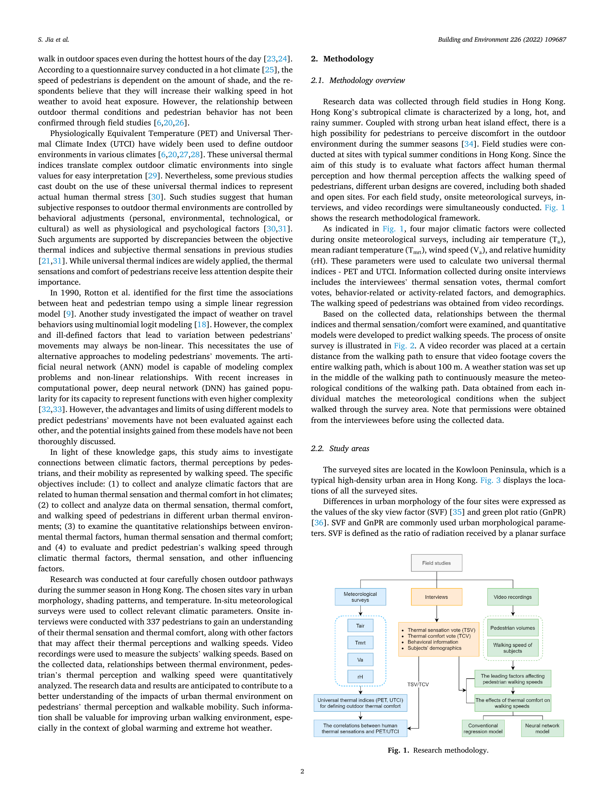
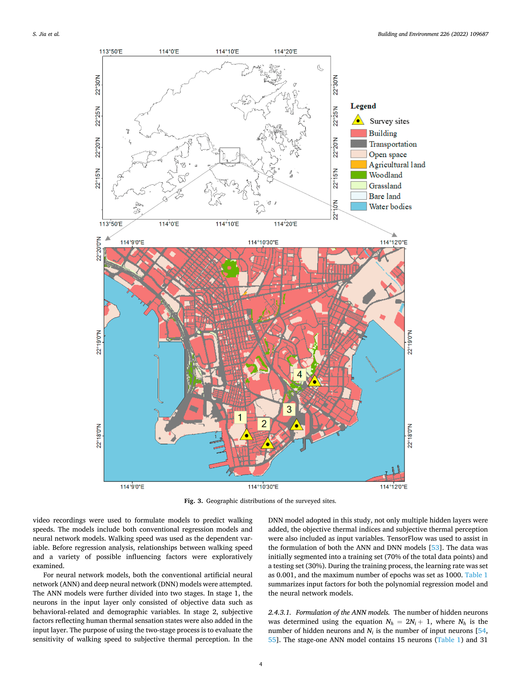
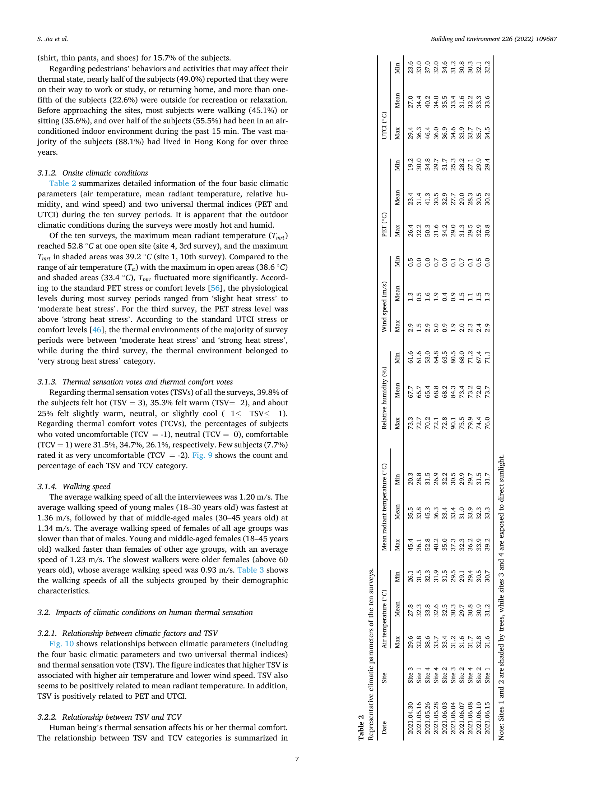
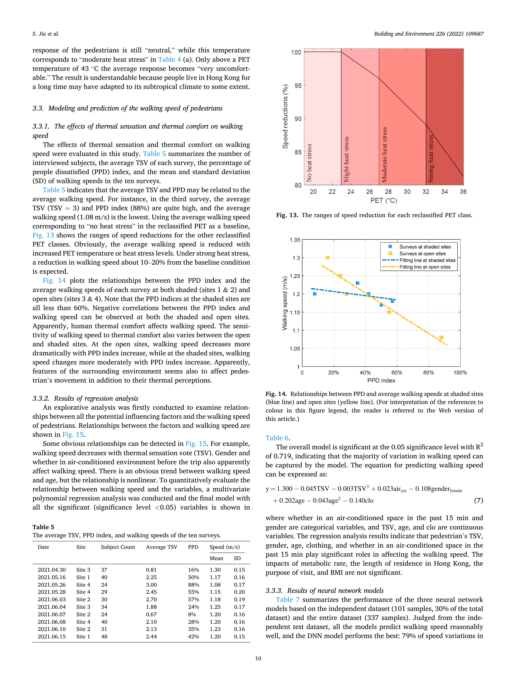

# Jia et al. (2022) — Thermal Environment Influences on Pedestrian Thermal Perception and Travel Behavior

## 기본 정보
- **저자**: Siqi Jia, Yuhong Wang, Nyuk Hien Wong, Wu Chen, Xiaoli Ding
- **소속**: 홍콩 폴리텍 대학교 토목환경공학과 + 국립싱가포르대학교 건축환경학과
- **저널**: Building and Environment, 226 (2022), 109687
- **DOI**: https://doi.org/10.1016/j.buildenv.2022.109687
- **투고/채택**: 2022-08-04 투고 → 2022-10-07 채택 → 2022-10-12 온라인 게재

---

## 연구 개요

홍콩 Kowloon Peninsula 4개 조사지점에서 337명의 보행자를 대상으로 야외 열환경과 열 인지(TSV, TCV) 및 **보행 속도** 간의 관계를 정량화. PET와 UTCI 모두 적용하여 비교.

**핵심 발견**: 열 스트레스 증가 → 보행 속도 감소 (Strong heat stress에서 10~20% 감소)

---

## 열환경 지표 및 산출 방법

### 사용 지표
- **PET (Physiologically Equivalent Temperature)**: 주 예측 지표
- **UTCI (Universal Thermal Climate Index)**: 비교 검증용
- **TSV (Thermal Sensation Vote)**: 주관적 열 감각 (-1~3)
- **TCV (Thermal Comfort Vote)**: 주관적 열 쾌적도 (-2~2)

### 측정 및 계산

**현장 기상 관측**
- Kestrel 5400 (Nielsen-Kellerman) 기상 관측 기기
- 지상 1.5m 높이 설치, 1초 간격 측정
- 측정 항목: 기온 (Ta), 구형 온도 (Tg), 상대습도 (RH), 풍속 (Va), 풍향
- 범위: Ta 26~38°C, Tg 29~70°C, RH 53~85%, Va 0~4 m/s

**Tmrt 계산 (야외용) — ⚠️ SOLWEIG의 복사 계산이 아니라 현장 실측 경험식**
글로브 온도계법 (Kuehn et al. 1970 경험식) 적용 — **원문 Section 2.4.1 재확인 결과, 이 논문의 Tmrt는 SOLWEIG가 계산한 값이 아니라 현장에서 흑구온도계(globe thermometer)로 측정한 Tg를 아래 식에 대입해 산출한 것**:
```
Tmrt = [(Tg + 273.15)⁴ + (1.1×10⁸ × Va⁰·⁶) / (ε × D⁰·⁴) × (Tg - Ta)]^0.25 - 273.15
```
- Tg: 구형 온도(현장 실측), Va: 풍속, D: 구형 직경, ε: 방사율

**SVF 계산**
- Fish-eye 사진 → RayMan 1.2 소프트웨어로 자동 계산 (SOLWEIG가 아닌 **별도 도구**)
- Site 1,2 (저SVF, 0.45~0.50): 나무 그늘, 협소한 도로
- Site 3,4 (고SVF, 0.82~0.91): 개방 공간, 직사광선 노출

**PET, UTCI 계산에서 SOLWEIG의 실제 역할 (원문 재확인)**
> 원문: "In addition to the climatic parameters, the geometry of the modeled areas also had to be entered into the SOLWEIG simulation. The high-resolution digital surface model (DSM)... was used to derive the geometry information. Onsite surveys were conducted to collect other inputs such as **tree height, trunk height, and canopy diameter**."

- SOLWEIG는 **Tmrt를 직접 산출하는 데 쓰인 게 아니라, PET/UTCI 계산에 필요한 "지오메트리(그늘 형상)" 처리 도구로 보조적으로 사용**된 것으로 읽힘 — Ta·Tmrt(현장실측)·RH·Va를 입력해 PET/UTCI라는 최종 지표로 변환하는 과정에서 SOLWEIG의 geometry 모듈을 사용한 것으로 추정 (논문 서술이 다소 모호함 — ⚠️ 정확한 파이프라인은 원문만으로 100% 특정 불가)
- **입력 데이터**: DSM(건물+교량, 해상도 수치 미명시 — "high-resolution"이라고만 서술), + 현장 조사로 얻은 **나무별 수고·수간고·수관 직경** (라이다 CDSM 래스터가 아니라 **개별 나무 실측값**)

**⚠️ 우리 CDSM 아이디어에 중요한 선례**: 이 논문은 CDSM 래스터 없이 **현장에서 나무 개체별 수고·수간고·수관직경만 측정**해 SOLWEIG 지오메트리에 반영했다. 이는 우리가 논의한 "산/공원/가로수 SHP(면적 속성) + 유형별 대표 수고값 부여 → 합성 CDSM" 접근과 같은 방향 — 완전한 라이다 CDSM이 없어도 SOLWEIG 적용 선례가 있다는 근거로 인용 가능. 다만 이 논문은 4개 지점 현장조사(개별 실측)라 서울 전역 스케일에 그대로 쓸 순 없고, "폴리곤 속성 기반 대표값 부여"로 일반화하는 것은 우리가 추가로 정당화해야 함.

---

## 데이터 및 공간 범위

| 항목 | 내용 |
|------|------|
| 연구 지역 | 홍콩 Kowloon Peninsula, 4개 야외 보도 |
| 기후 | 아열대 고온다습 (여름 극심한 폭염) |
| 조사 기간 | 2021년 4월 30일 ~ 6월 15일 (10회 현장 조사) |
| 조사 시간 | **14:00~17:00** (일반 여름 더운 시간대) |
| 조사 대상 | 337명 (남 168명/여 169명) |
| 사이트 | 4곳: Nathan Rd (SVF↓), Chatham Rd (SVF↓), Cheong Wan Rd (SVF↑), Fat Kwong St (SVF↑) |
| 보도 너비 | 3~5m |

### 현장 기상 조건 요약 (Table 2 기반)
| 조건 | 범위 |
|------|------|
| UTCI 최대값 | 29.4~46.4°C |
| UTCI 평균 | 27.0~40.2°C |
| PET 최대값 | 26.4~50.3°C |
| Tmrt 최대값 | 36.1~52.8°C |

---

## 분석 모델

### 회귀 모델 (보행 속도 예측)
- 다항 회귀: R² = 0.719
- 최종 방정식:
```
y = 1.300 - 0.045TSV - 0.003TSV³ + 0.023air_ac - 0.108gender_female
    + 0.202age - 0.043age² - 0.140clo
```
- 유의 변수: TSV, 에어컨 사용 여부, 성별, 나이, 의복 단열

### 신경망 모델
| 모델 | 테스트 R² | 전체 R² |
|------|----------|---------|
| Stage 1 ANN | 0.669 | 0.817 |
| Stage 2 ANN (TSV 추가) | 0.762 | 0.907 |
| DNN (3 hidden layers) | **0.791** | **0.931** |

### UTCI-TSV 관계
```
MTSV = -7.068 + 0.276 × UTCI   (R² = 0.860)
```
→ UTCI 37°C 이상에서 TSV 포화 (절단됨)

### PET-TSV 관계
```
MTSV = -5.218 + 0.245 × PET    (R² = 0.921)
```
→ PET로 더 높은 설명력

### 속도 감소 구간 (Fig. 13 기반)
- No heat stress (PET < 23°C): baseline
- Slight heat stress (23~27°C): ~3~5% 감소
- Moderate heat stress (27~32°C): ~5~10% 감소
- Strong heat stress (PET > 32°C): **10~20% 감소**

---

## 우리 연구에서 따라할 수 있는 부분

### 1. SOLWEIG + 글로브 온도계 Tmrt 공식
- 야외 현장 Tmrt 계산 경험식 → 우리 현장 데이터가 없으면 SOLWEIG로 대체
- SOLWEIG 사용 방법론적 정당화에 활용

### 2. 조사 시간대 14:00~17:00
- 폭염 최고 시간대 → 우리 연구 14시 기준 선정과 일치
- **인용 가능**: "Jia et al.(2022)은 14:00~17:00를 여름 조사 시간대로 설정하였으며, 이는 보행자의 열 스트레스가 최대에 달하는 시간대와 일치한다"

### 3. UTCI 기반 TSV 관계식 인용
- MTSV = -7.068 + 0.276 × UTCI (R²=0.860) → UTCI가 주관적 열감과 선형 관계 실증
- UTCI 지표의 타당성 입증에 활용 가능

### 4. SVF와 열 스트레스 관계
- SVF 낮은 곳(나무/건물 그늘) → UTCI 낮고 보행 속도 변화 더 완만
- 우리 연구의 SVF 변수를 TARR 설명변수로 쓰는 근거

### 5. 보행 속도 감소 → Hard Cut 정당화 우회 논거
- UTCI Strong heat stress에서 10~20% 보행 속도 감소 실증
- Very Strong (UTCI ≥42°C, Bröde 2012 중앙값)에서는 더 극적인 영향 예측 가능
- Hard Cut(보행 포기)이 현실적 반응을 단순화한 보수적 시나리오임을 설명하는 근거

### 6. MTSV-UTCI 관계식의 "포화(saturation)" — Hard Cut 정당화에 직접 활용 가능 (원문 재확인, 중요)
- 원문(Section 3.2.3): TSV≤3에서 컷오프되어 있어, **UTCI>37°C에서는 TSV 값이 더 이상 증가하지 않음** ("there is no change in TSV value when PET>35°C or UTCI>37°C")
- 즉 회귀식 MTSV = −7.068 + 0.276×UTCI (R²=0.860)는 **UTCI ≤37°C 구간에서만 성립**하고, 그 이상은 사람의 주관적 열감 자체가 "더 이상 뜨거워질 수 없는" 포화 상태에 도달
- **Hard Cut 논거로 인용 가능**: "Jia et al.(2022)은 UTCI 37°C 이상에서 열 감각(TSV)이 포화되어 더 이상 선형적으로 증가하지 않음을 실증하였다. 이는 매우 높은 열 스트레스 구간에서 열 노출을 연속변수가 아닌 사실상 이분법적(견딜 수 있음/없음) 반응으로 볼 수 있다는 행동적 근거를 제공하며, 본 연구의 Hard Cut(UTCI ≥42°C 링크 완전 제거) 접근과 일맥상통한다"
- Table 4(a) PET 재분류: No heat stress <23°C / Slight 23~27°C / Moderate 27~32°C / Hot(Strong/extreme) >32°C — 홍콩 표본은 표준 PET 등급보다 약간 더 높은 온도까지 "참을 만함"으로 응답(현지 적응 효과, Kruger et al. 2017 인용)

---

## 우리 연구와의 차별점

| 항목 | Jia2022 | 우리 연구 |
|------|---------|----------|
| 방법 | 현장 실험 (N=337) | 공간 모델링 |
| 종속변수 | 보행 속도 | 역세권 면적 감소율 |
| 지표 | PET (주), UTCI (보조) | MRT (SOLWEIG 계산) |
| 공간 | 4개 지점 (소규모) | 서울 전역 |
| 임계값 | PET 35°C (재분류상 "hot" 하한), UTCI 37°C(MTSV 회귀식 상한/포화점) | UTCI ≥42°C → 역산 MRT 임계값 (Hard Cut) |
| 시간 | 2021년 봄-여름 | 폭염 특보 발효일 |

---

## 한계 (논문 명시)
- 현장 조사 4개 지점만 → 일반화 한계
- 라이프스타일·보행 습관 미통제
- 홍콩 한정 → 기후가 다른 도시 적용 시 보정 필요

---

## Figure 모음 (PDF 페이지 캡처, 200dpi)

- **Fig.1 (p.2)**: 연구 방법론 흐름도 — 현장조사(기상측정/인터뷰/영상촬영) → TSV·TCV·보행속도 → 회귀·신경망 모델
  
- **Fig.3 (p.4)**: 홍콩 Kowloon 4개 조사지점 위치 (site 1,2=수목그늘/저SVF, site 3,4=개방공간/고SVF)
  
- **Fig.10 (p.7)**: 기상변수(Ta, Tmrt, 풍속, RH, PET, UTCI) vs TSV 박스플롯 — 상관계수 표시, **UTCI 상관 0.672로 가장 높음**
  
- **Fig.13 (p.10)**: PET 재분류 등급별 보행속도 감소율 곡선 (No/Slight/Moderate/Strong heat stress 구간 색상 구분) — **핵심 인용 그림**
  

---

## 영-한 단어장 (읽으면서 헷갈렸을 만한 단어)

| 영어 | 한글 발음/뜻 | 문맥 |
|------|------------|------|
| thermal sensation vote (TSV) | 열 감각 투표 | 응답자가 느낀 더위/추위 정도 (−3~3, ASHRAE 7점 척도) |
| thermal comfort vote (TCV) | 열 쾌적감 투표 | 응답자가 느낀 쾌적/불쾌 정도 (5점 척도) |
| globe thermometer | 흑구온도계 | 검은 구 안의 온도로 복사열을 간접 측정하는 기구 |
| green plot ratio (GnPR) | 녹지용적률 | 잎면적지수 기반 식생 밀도 지표 (엽면적÷대지면적) |
| percentage of people dissatisfied (PPD) | 불만족자 비율 | 특정 열환경에서 불쾌감을 느낄 사람의 비율(%) |
| polynomial regression | 다항 회귀 | 독립변수의 거듭제곱 항을 포함하는 회귀모델 |
| artificial neural network (ANN) | 인공신경망 | 입력-은닉-출력 층 구조의 예측모델 |
| deep neural network (DNN) | 심층신경망 | 은닉층이 여러 개(3개 이상)인 신경망 |
| metabolic rate | 대사율 | 신체 활동에 따른 열 생산량 (met 단위) |
| clothing insulation (clo) | 의복 단열값 | 옷이 몸의 열손실을 막는 정도를 나타내는 단위 |
| saturation (of a relationship) | 포화 | 입력이 늘어도 출력이 더는 변하지 않는 상태 |
| coefficient of determination (R²) | 결정계수 | 회귀모델이 설명하는 분산의 비율 (0~1) |
| Pearson correlation | 피어슨 상관계수 | 두 변수 간 선형 상관 정도(−1~1) |
| reclassified | 재분류된 | 표준 기준을 현지 데이터에 맞게 다시 나눈 것 |
| heat mitigation strategy | 열 저감 전략 | 그늘·녹지·재질 개선 등으로 열스트레스를 낮추는 방안 |
| green façade / green roof | 녹화 파사드 / 옥상녹화 | 건물 외벽/지붕에 식생을 도입하는 열저감 기법 |
| permeable pavement | 투수성 포장 | 물이 스며들어 표면온도를 낮추는 포장재 |
| local adaptation (thermal) | (열)현지 적응 | 특정 기후에 오래 거주하며 열 인내도가 달라지는 현상 |
| trip purpose | 통행 목적 | 출근/등교/여가 등 이동의 이유 |
| air-conditioned space | 냉방 공간 | 에어컨이 가동되는 실내 |
