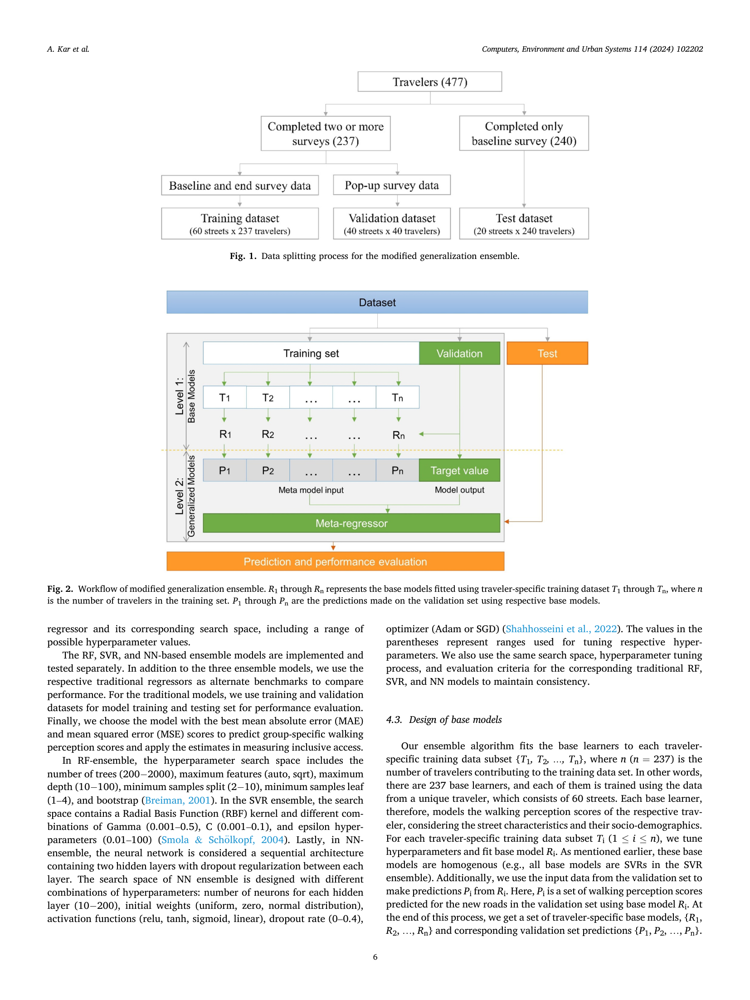
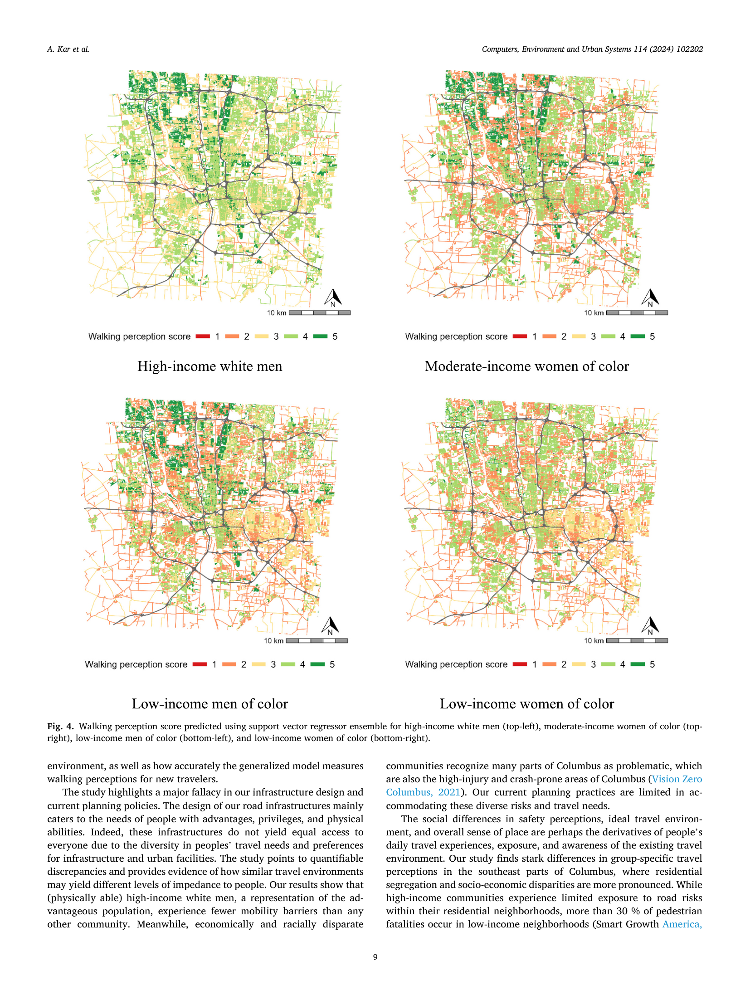
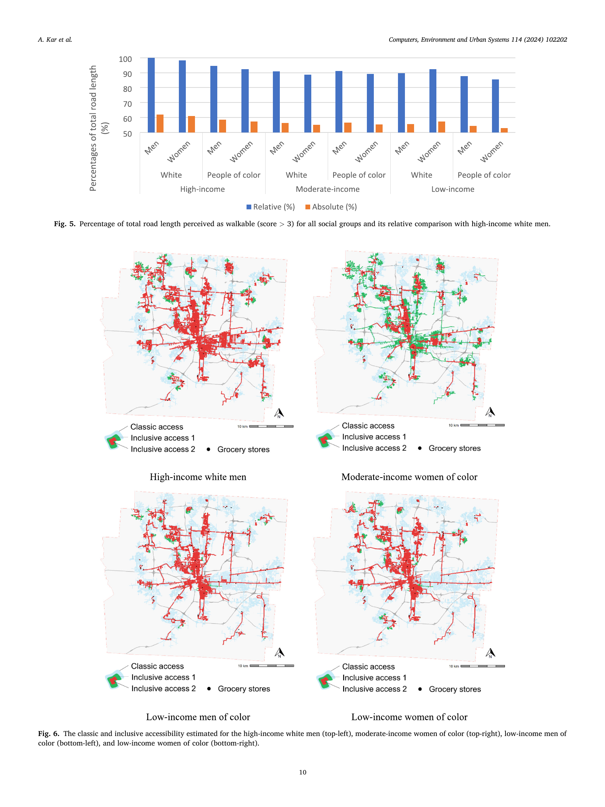

# Kar et al. (2024) — Inclusive Accessibility: Analyzing Socio-economic Disparities in Perceived Accessibility

작성일: 2026-07-06
버전: v1.0
근거논문: Kar, A., Xiao, N., Miller, H.J., & Le, H.T.K. (2024). Inclusive accessibility: Analyzing socio-economic disparities in perceived accessibility. *Computers, Environment and Urban Systems*, 114, 102202. DOI: https://doi.org/10.1016/j.compenvurbsys.2024.102202

> ⚠️ **이 논문은 열환경/SOLWEIG와 무관함** (PDF 전체 검색 결과 heat/thermal/UTCI/MRT/SOLWEIG 언급 0건). Buo2026·Jia2022·Basu2024·Colaninno2024와 달리 "SOLWEIG 입력 완전성" 체크리스트는 적용하지 않음 — 대신 **접근성 이론·형평성(soft constraint → Hard Cut 구조) 관점**에서 정리.

---

## 1. 기본 정보
- **저자**: Armita Kar, Ningchuan Xiao, Harvey J. Miller, Huyen T.K. Le
- **소속**: Ohio State University (Geography), George Mason University
- **저널**: Computers, Environment and Urban Systems, 114 (2024) 102202
- **연구지역**: 컬럼버스, 오하이오 (미국)
- **투고/채택**: 2023-08-08 투고 → 2024-10-07 채택 → 2024-10-17 온라인 게재

---

## 2. 핵심 개념 — 우리 연구와 구조적으로 가장 유사한 지점

### Hard constraint vs Soft constraint
- **Hard constraint**: 물리적·비협상적 시공간 제약 (네트워크 존재 여부, 이동시간 예산, 대중교통 스케줄 등) — 전통적 접근성 측정이 다루는 부분
- **Soft constraint**: 주관적·인지적 제약 (안전 인지, 편안함, 보행 의향 등) — 물리적으로 막지는 않지만 "실제로 이용 안 하게 만드는" 요인

### ⭐ Inclusive Access 1 — 우리 Hard Cut과 정확히 같은 메커니즘
> 원문(5.3절): "we first modify the road network **to eliminate the streets with low walking perception scores (walking perception score ≤ 3)**... this modified road network, inclusive access 1 for a social group identifies the network space that any traveler from the respective social group perceives as accessible."

- **보행 인지 점수(1~5) ≤3인 도로 링크를 네트워크에서 완전 제거**한 뒤 접근성(식료품점 도달 가능성)을 재계산
- 이는 우리의 **"UTCI≥42°C 링크를 완전 제거하는 Hard Cut"과 정확히 동일한 구조** — 차이는 제거 기준이 "인지된 안전·편안함 점수"냐 "열환경 임계값"이냐 뿐
- **인용 가능**: "Kar et al.(2024)은 보행 인지 점수가 특정 임계값(≤3) 이하인 도로를 네트워크에서 완전히 제거하는 방식으로 'inclusive access'를 정의하였다. 이는 연속적 인지 지표를 이분법적 임계값으로 전환하여 접근성 네트워크를 수정한다는 점에서, 본 연구의 Hard Cut(UTCI≥42°C 링크 제거) 접근과 구조적으로 동일한 논리를 공유한다."
- **한계도 그대로 인정**(원문 6.2절 마지막): "the inclusive accessibility measure treats the walking perception score as **a binary constraint**... a route is excluded... if any link on that route feels unwalkable" — 저자들 스스로 이 이분법적 처리가 단순화임을 인정하며, 향후 연속적 비용함수(soft) 방식과의 결합을 과제로 남김. **우리 Hard Cut의 한계 서술에도 그대로 참고 가능한 문구**

### Inclusive Access 2 — 시간 제약까지 추가
- 위 Inclusive Access 1(공간 제약)에 더해, 개인/집단이 선호하는 이동시간(mode-specific travel time preference)을 고정된 30분 예산 대신 소프트 시간제약으로 적용
- 우리 연구의 "TIME_BUDGET=15분 고정" 방식과 비교하면, 이 논문은 **집단별로 시간 예산 자체를 다르게(선호 기반) 설정**하는 추가 확장 아이디어 — 우리도 향후 "집단별 상이한 time budget" 민감도 분석에 참고 가능

### Classic vs Inclusive Access — 우리 Classic vs Thermal Catchment와 동일 프레임
| Kar2024 | 우리 연구 |
|---------|----------|
| Classic access (하드 제약만) | Classic Catchment (열환경 무시) |
| Inclusive access 1/2 (소프트 제약 추가) | Thermal Catchment (Hard Cut 적용) |
| 감소 비율로 결과 제시 (예: 고소득 백인 남성 대비 저소득 유색인종 1/4 수준) | 감소율([검증 지표]) |

---

## 3. 방법론 요약 (참고용)

### 데이터 수집 (3단계 모바일 설문, N=477)
1. **Baseline survey**: Google Street View 20개 대표 도로 평가 (안전·편안함·보행의향, 5점 리커트)
2. **Pop-up survey**(선택, N=40): ArcGIS Field Maps 앱으로 일주일간 실제 이동경로 추적 + 경로상 40개 사진 촬영·평가
3. **End survey**(N=237 중 다수): 추가 40개 GSV 평가

### 예측 모델 — 3단계 스태킹 앙상블
- Level 1: 여행자별(traveler-specific) 기반 모델(RF/SVR/NN 중 택1, 237명=237개 base model)
- Level 2: 메타모델(같은 회귀 타입)로 base model 예측 결합 → 새로운 도로에 대한 group-specific 보행인지점수 예측
- **최종 채택**: SVR 앙상블 (MAE·MSE 기준 최고 성능, 신경망은 데이터 부족으로 저조)
- 12개 사회집단(성별2×소득3×인종2)별로 별도 예측

### 사회집단 정의
- 성별: 남/여, 소득: 저(≤$45k)/중($45~75k)/고(≥$75k), 인종: 백인/유색인종 → 12개 상호배타적 집단

---

## 4. 주요 결과
- **고소득 백인 남성**이 가장 넓은 보행 가능 도로(전체의 53~62%가 "walkable"로 인지)를 가짐 — 성별·인종·소득 모두에서 가장 유리한 집단
- **저소득 유색인종**이 가장 좁은 인지적 접근성 — Classic access 대비 Inclusive access 1은 약 **1/4 수준**까지 축소
- 식료품점 접근 가능 비율: Classic 대비 소프트 제약 고려 시 전체 평균 **약 1/3**, 저소득 유색인종은 **약 1/4**
- 공간 패턴: 컬럼버스 남동부(저소득·유색인종 밀집지역)에서 인지 격차 가장 크고, 실제 컬럼버스 Vision Zero(보행자 교통사고 다발지) 지도와 겹침 — 인지된 위험이 실제 사고 위험과 상관관계
- 중간소득 인지 시간선호가 가장 비대중교통친화적(대중교통 감수 시간에 더 민감) — 소득과 "시간가치" 관계가 U자형(저소득·고소득 모두 시간 덜 민감, 중간소득만 민감)

---

## 5. 한계 (원문 6.2절 직접 확인)
- 사회집단별 표본 수 불균형(무작위 모집) → 특정 집단(예: 고소득 유색인종 남성)은 테스트셋에 아예 없음
- 신체·정신 장애가 있는 보행자의 인지는 미반영
- **자기선택 편향(self-selection bias)**: 모바일 설문 참여자는 이미 도보에 관심 많은 사람일 가능성
- **정박 효과(anchoring effect)**: 실제 걷지 않고 GSV 사진만 보고 평가 → 응답자의 선입견(특정 동네에 대한 기존 인식)이 실제 인프라와 무관하게 평가에 영향
- 안전·편안함·의향 3개 지표를 **동일 가중치로 평균** — 집단별로 각 지표의 중요도가 다를 수 있는데 이를 무시
- **보행 인지 점수를 이분법적 제약으로 처리**(위 Inclusive Access 1 한계 참고) — 연속적 비용함수화가 향후 과제
- 삼각검증(다른 방법으로 결과 재확인) 없음 — 앙상블 모델 성능만 확인, inclusive accessibility 측정치 자체의 타당성 검증은 없음

---

## 6. 우리 연구 Discussion/Introduction에 활용 포인트

1. **이론적 위치 서술**: Geurs & van Wee(2004) place-based/person-based 구분, Hägerstrand(1970) space-time prism을 이 논문도 동일하게 인용 — 우리 CLAUDE.md의 접근성 이론 계보(Geurs & van Wee → 우리 TCA)에 "soft constraint 확장" 사례로 나란히 배치 가능
2. **Hard Cut 방법론적 선례**: 열이 아닌 "인지된 안전/편안함"을 임계값으로 링크를 제거한 선행연구가 이미 존재 — 우리의 "임계값 초과 링크 완전 제거"라는 접근이 유별난 게 아니라 접근성 연구에서 통용되는 방법론임을 뒷받침
3. **형평성 논의 확장 가능성**: 우리 연구가 감소율([검증 지표])을 사회경제적 변수(소득/인구 밀도 등)와 교차 분석하면, 이 논문처럼 "누가 더 큰 타격을 받는가"를 다룰 수 있음 — 단, 현재 우리 연구 범위에 포함할지는 별도 논의 필요 (CLAUDE.md 상 검증 시설=대중교통, 형평성 미확정 주제)
4. **이분법적 임계값의 한계 서술 참고**: 저자들이 스스로 인정한 "binary constraint 단순화" 문구를 우리 Hard Cut 한계 서술에도 유사하게 활용 가능

---

## Figure 모음 (PDF 페이지 캡처, 200dpi)

- **Fig.1·2 (p.6)**: 데이터 분할 구조(Training/Validation/Test) + 앙상블 모델 전체 워크플로우(2단계 스태킹), 한 페이지에 같이 있음
  
- **Fig.4 (p.9)**: 4개 사회집단별 보행인지점수 예측 지도(고소득 백인남성/중간소득 유색인종여성/저소득 유색인종남녀) — **핵심 결과 그림**
  
- **Fig.6 (p.10)**: Classic access vs Inclusive access 1·2 비교 지도 — 우리 Classic vs Thermal Catchment 비교와 가장 유사한 그림
  

---

## 영-한 단어장 (읽으면서 헷갈렸을 만한 단어)

| 영어 | 한글 발음/뜻 | 문맥 |
|------|------------|------|
| inclusive accessibility | 포용적 접근성 | 이 논문이 제안하는 핵심 개념 — 인지적 제약까지 반영한 접근성 |
| hard constraint / soft constraint | 경성 제약 / 연성 제약 | 물리적으로 불가능한 제약 vs 심리적으로 꺼려지는 제약 |
| perceived accessibility | 인지된 접근성 | 실제 도달 가능 여부가 아니라 "느껴지는" 접근성 |
| place-based / person-based (measure) | 장소기반 / 개인기반 (측정) | 지역 단위로 일괄 측정 vs 개인별로 따로 측정 |
| space-time prism | 시공간 프리즘 | 개인이 주어진 시간 내 도달 가능한 시공간 범위(Hägerstrand) |
| walking perception score | 보행 인지 점수 | 안전·편안함·의향을 종합한 도로별 주관적 평가 점수(1~5) |
| ensemble modeling | 앙상블 모델링 | 여러 모델을 결합해 더 안정적인 예측을 만드는 기법 |
| stacking (generalization) | 스태킹 | 여러 base 모델의 예측을 다시 메타모델에 입력해 최종 예측하는 앙상블 기법 |
| base model / meta-model | 베이스 모델 / 메타 모델 | 1차 예측 모델들 / 그 예측들을 종합하는 2차 모델 |
| random forest (RF) | 랜덤포레스트 | 여러 의사결정나무를 앙상블한 모델 |
| support vector regressor (SVR) | 서포트벡터회귀 | 서포트벡터머신의 회귀 버전 |
| mean absolute error (MAE) / mean squared error (MSE) | 평균절대오차 / 평균제곱오차 | 예측값과 실제값의 오차를 요약하는 지표 |
| Likert scale | 리커트 척도 | "매우 반대~매우 찬성" 식의 순서형 응답 척도 |
| self-selection bias | 자기선택 편향 | 특정 성향을 가진 사람만 표본에 자발적으로 참여해 생기는 편향 |
| anchoring effect | 정박 효과 | 첫인상·기존 선입견이 이후 판단에 계속 영향을 주는 인지편향 |
| socio-economic disparity | 사회경제적 격차 | 소득·인종·성별 등에 따른 차이 |
| Vision Zero (initiative) | 비전 제로 (정책명) | 교통사고 사망자를 0으로 만들겠다는 도시정책 프로그램 |
| food desert / food store access | 식품 사막 / 식료품점 접근성 | 신선식품 구매처에 대한 접근 곤란 지역/문제 |
| binary constraint | 이분법적 제약 | 통과/불가 두 가지로만 나누는 단순화된 제약 처리 |
| triangulation (validation) | 삼각검증 | 서로 다른 방법으로 같은 결론이 나오는지 교차 확인하는 것 |
