# Stress-Exposure Adjusted Reach(SEAR): 열노출을 반영한 보행 환경 접근성 공간 단위 제안

> 통합 작성일: 2026-08-02 | 이 파일은 **국문 학위논문용** 마스터 원고 —
> SCI 논문(영문)은 별도 파일(`writing/00_최종초안/SCI_마스터초안.md`, 미작성)로
> 관리. 언어·분량(~40p vs 6,000~8,000단어)·구조(로마숫자 6장 vs 저널별 상이)가
> 달라 번역/파생이 아니라 별도 집필 필요. 작업 순서(2026-08-02 확정): 국문
> 학위논문 먼저 완성 → SCI는 그 이후 압축·번역.
> 새 날짜 버전 파일을 만들지 말고 이 파일을 직접 고쳐나갈 것 — 버전 관리는 git 커밋으로.
> 목차 구조 출처: `writing/03_논문구조/2026-08-02_국문목차_초안_v1.md`
> 내용 통합 출처: 서론(`01_서론/2026-07-30_v2`), 선행연구(`02_선행연구/2026-07-21_v5`),
> 방법·논의·결론(`03_논문구조/2026-07-17_v3`), 결과 §5.3(`05_결과/2026-07-30_v1`+§5.3.5 8/2 추가)
> 용어: "Hard Cut"→**이진적 제거**, "연속적 패널티"→**연속적 비용 부과**로 전면 교체 완료(2026-08-02)
> 상태(2026-08-06 갱신, 교수님 검토용 초안): III장(방법론)은
> `방법론_확장초안_v1.md` 병합 완료 — 5m 해상도 선택 근거(§2-1), KMA
> 500m 격자기상 전환(§3, Ta/RH/풍속 공간화·일사량만 ASOS 단일값 유지) 반영.
> IV장(결과)은 이 새 UTCI로 서울 집계구 17,754개·응봉역·성수역까지 전부
> 재계산 완료. 임계값은 38°C 단일값으로 확정(42.4°C 부차값은 데이터·코드만
> 보존, 본문 비언급). 아침 출근(07~10시)·저녁 퇴근(16~19시) 3시간 폭은
> 실제 전환 구간과 겹침을 §3 실측 비교로 확인. LISA·고령인구/녹지 상관관계
> 절은 근거 약함 판단으로 삭제. DEM은 1m 실측(공개제한)을 메인으로 유지하되
> 오픈소스 GLO-30과 사실상 동일(r=0.9995, 이진적 제거 판정 일치 99.27%,
> 재검증 완료)함을 §2-1·입력데이터 표에 재현성 근거로 명시. IV§1·§2·국문초록·
> Abstract·V§3·V§6·VI장 결론까지 KMA 격자기상 기준으로 전체 일관성 점검·
> 갱신 완료. §2-1 타일링 실측검증 캐비어트는 비교 대상(무타일 원본)이
> 애초에 존재하지 않아 문장 자체를 삭제(950m 버퍼의 물리적 근거만으로 충분,
> 2026-08-06 사용자 확인). **남은 항목**: 그림 2~6·10 최종본 제작 필요.

---

## 국문초록

기후변화로 인한 폭염의 빈도와 강도 증가는 도시 보행자의 열노출 위협을
심화시키고 있다. 그러나 기존의 열노출 반영 보행 접근성 연구는 열노출
정도를 보행속도 감소나 인지 보행거리 증가와 같이 이동 비용에 연속적으로
반영하는 방식에 그쳐, 열 스트레스가 특정 임계치를 넘어 해당 경로 자체가
선택 가능한 옵션에서 배제되는 현상은 포착하지 못한다는 한계를 갖는다.

이에 본 연구는 보행 네트워크에서 UTCI(Universal Thermal Climate Index)
임계값(38°C, Bröde et al., 2012)을 초과하는 링크를 이진적으로 제거한 뒤
남은 네트워크에서 접근 가능한 공간 범위를 재산출하는 새로운 접근성 공간
단위, Stress-Exposure Adjusted Reach(SEAR)를 제안한다. MRT는 SOLWEIG(UMEP)
파이프라인을 태양기하학 기반 버퍼 타일링으로 확장하여 서울 전역(약
605.70km²) 5m 해상도까지 산출하였으며, 2025년 폭염일 12일 평균 조건에서
아침 출근·저녁 퇴근·낮 최고포화 시각의 3축 프레임으로 UTCI를 산출하였다.
Geurs and van Wee(2004)의 컨투어 메저를 활용해 지하철역·버스정류장을
기회로 삼아 Classic Catchment(CA)와 SEAR를 비교하였다.

그 결과 SEAR 감소율은 정오~오후 시간대(10~17시)에 99% 내외로 수렴하는
반면, 아침·저녁 전환 시간대에는 급격히 낮아지는 종 모양 패턴을 보였다.
이러한 붕괴는 성긴 보행 네트워크(평균 노드차수
2.50)의 위상적 특성과 결합되어, 출발지 인접 소수 링크의 임계값 초과만
으로 접근 가능 영역 전체가 단절되는 비선형적 양상으로 나타났으며, 세
공간 스케일과 두 종류의 보행 네트워크 자료에서 반복적으로 검증되었다.
나아가 도로망 취약성 분석의 확립된 방법론(Jenelius, Petersen & Mattsson,
2006)을 적용해 이진적 제거로 손실된 링크 중 정책 개입으로 회복 가능한
병목 링크를 식별한 결과, 응봉역·성수역 등 국지적 지점에서는 특정 개입
규모(문턱값)를 넘어서면 접근성이 급격히 회복되는 지점이 확인되었고,
성동구 집계구 565개·하루 8개 시각으로 확장 적용한 결과 이 문턱값은
전환 시간대(09·18시)에는 대부분 소규모 개입만으로도 충분했던 반면
(09시 98.6%가 1,000m 이내 개입으로 회복), 정오~오후 포화 시간대에는
예외 없이 수만 m 규모의 개입 없이는 회복되지 않아, 병목 링크 개입이
정책 수단으로 성립하는 시간대가 뚜렷이 갈림을 확인하였다.

본 연구는 Catchment Area라는 접근성 개념 자체에 열노출을 반영하는 새로운
공간 단위를 제안함으로써 폭염 시대 도시 보행 접근성 평가에 개념적으로
기여하며, 병목 링크 식별을 통해 정책 개입의 우선순위를 지역 단위로
제시하는 실용적 도구로도 SEAR가 활용될 수 있음을 보인다.

**주요어**: Stress-Exposure Adjusted Reach(SEAR), 열노출, 보행 접근성, UTCI,
이진적 제거, 컨투어 메저, SOLWEIG

---

## I. 서론

도시의 보행가능성은 기후 환경의 영향을 받으며, 폭염일수와 발생빈도의 증가는
인간의 생명에 심각한 위협을 초래할 수 있다(Basu et al., 2024). 기후변화로 인해
도시 내 폭염의 빈도와 강도는 더욱 증가하는 추세이며(IPCC, 2022), 국내에서도
최근 폭염일수가 과거 대비 유의하게 증가하는 것으로 확인된다(Yoon et al.,
2020). 실외에서 신체 활동이 수반되는 보행의 경우 폭염 시 열노출로 인한
위협이 더욱 커질 것이다(Jia et al., 2022). 그럼에도 불구하고 도시 보행
공간은 대체로 기능성 위주로 계획되어 기후적 쾌적성에 대한 고려가 부족한
경우가 많다(Basu et al., 2024). 도시 내 이동 접근성의 공평한 분배와 이에
대한 정확한 측정은 거주민의 삶의 질 향상 및 증거 기반 도시계획의 전제가
되는 문제이나(Geurs & van Wee, 2004; Shin & Park, 2026), 접근성은
사회경제적 조건(Kar et al., 2024), 인프라 차이(Park et al., 2022), 환경
조성 차이(McDonald et al., 2021)에 따라 공간적으로 불균등하게 분포하는
경우가 많다. 이러한 공간적 불균등은 접근성 자체뿐 아니라 열노출의 정도에서도
나타나는데, 도시 내 건조환경 및 수목 분포 등에 따라 열노출 수준 또한
공간적으로 불균등하게 분포한다(Ali-Toudert & Mayer, 2006; Ali-Toudert &
Mayer, 2007; Kántor & Unger, 2011).

이러한 공간적 불균등을 고려하여 열노출을 반영한 보행 접근성을 평가하려는
연구가 최근 진행되어 왔다. 기존 선행연구들은 공통적으로 열노출을 연속적인
값으로 반영하는 방식을 채택해왔는데, 보행속도의 감소로 치환하거나, 인지
보행거리의 증가로 환산하거나, 인도 단위의 열 위험도 평가
프레임워크로 제안하는 등의 형태로 나타났다(Jia et al., 2022; Basu et al.,
2024; Aydin et al., 2026; Colaninno et al., 2024).

그러나 이러한 연속적 비용 부과 방식은 열노출 정도와 무관하게 이동 시간
혹은 이동 가능 거리와 같이 주어진 비용 내에서는 모든 경로가 원칙적으로
통과 가능하다고 전제한다. 열 스트레스가 특정 임계치를 넘어서면 그 경로는
더 이상 감내 가능한 선택지가 아니게 될 수 있으나, 연속적 비용 부과 방식은
이러한 변화까지는 상대적으로 잘 포착하지 못한다는 한계가 있다. 또한 속도나
인지거리에 비용을 부과하는 방식은 열환경이 보행 행동에 미치는 영향의
일부만을 설명할 뿐, 특정 경로 자체를 회피하거나 우회하는 선택의 문제는 다루지
못한다.

한편, 열환경은 보행속도만이 아니라 경로 선택 자체에도 영향을 미친다는 실증
결과들이 보고되어 왔다. 그늘 경로가 더 낮은 이동비용으로 인식되어 경로
선택이 달라지거나, 최단경로 대신 그늘 있는 경로를 우선 선택하며 신호
대기까지 감수하거나, 열 최적 경로 탐색 시 전체 경로의 70% 이상에서
최단경로 대신 우회가 선택되는 등의 양상이 확인되었다(Melnikov et al.,
2022; Azegami et al., 2023; Buo et al., 2026). 이는 보행자가 열환경
조건에서 속도뿐 아니라 경로 자체를 바꾼다는 것을 보여주며, 이러한 회피 경로를 반영해 도달 가능한
범위를 산출하는 문제는 연속적 비용 부과로는 포착되지 않는 차원, 즉 어떤
경로가 선택 가능한 옵션에서 배제되는가의 문제다. 이러한 회피는 보행 전체를
포기하는 것이 아니라 특정 구간(링크) 단위로 나타난다는 점에서, 열노출이
반영된 링크를 네트워크에서 배제하고 그 열환경이 개선되면 다시 포함함으로써,
개별 링크 개선이 접근성에 미치는 효과를 실증적으로 검토할 수 있다.

이러한 문제의식 하에, 본 연구의 목적은 보수적 열환경 플래닝 시나리오에서
폭염 조건에 실질적으로 도달 불가능해지는 공간 범위를 식별하는 것이다. 이에
본 연구는 열노출 정도가 반영된 보행 링크를 네트워크에서 이진적으로 제거하는
보수적 방식을 택해, 폭염 조건에서 실질적으로 도달 가능한 공간 범위를
산출하는 새로운 접근성 공간 단위, Stress-Exposure Adjusted Reach(SEAR)를
제안한다. SEAR의 유효성은 크게 두 가지 방식으로 검토한다. 먼저, 폭염
조건에서 이진적 제거를 적용하였을 때 SEAR가 기존 Catchment Area(CA) 대비
접근성이 얼마나 감소하는지를 사례 지역을 바탕으로 확인함으로써, 열노출을
고려한 접근성 측정의 개념적 타당성을 제시한다. 다음으로, 이진적 제거로
손실된 링크 중 기존에 확립된 도로망 분석 방법을 응용하여 정책적 개입(열환경
개선 시설 등)으로 회복 가능한 병목 링크를 식별하고, 이를 반영하였을 때
SEAR가 얼마나 회복되는지를 확인함으로써 SEAR의 정책적 활용 가능성과
함의를 제시한다.

### 논문의 구성

본 논문은 다음과 같이 구성된다. II장은 네트워크 기반 접근성 이론의 계보를
정리하고, 열노출을 반영한 기존 접근성 평가 연구(연속적 비용 부과 방식)의
갭을 짚어 본 연구의 이진적 제거 접근이 채우는 지점을 논증한다. III장은
연구 지역·자료와 MRT(SOLWEIG)·UTCI 산출 방법, SEAR 산출 절차를 기술한다.
IV장은 서울 전역의 UTCI/MRT 공간 분포, 3축 시간대별 이진적 제거 대상
링크 비율, SEAR 감소율 산출 결과를 제시한다. V장은 이 결과의 개념적 함의와 방법론적 한계를
논의하며, VI장은 연구를 요약하고 정책적 함의를 제시한다.

---

## II. 이론적 배경 및 선행연구

### 1. 네트워크 기반 보행 접근성과 Catchment Area

접근성 측정의 역사는 거리 지표에서 도달 가능 공간량 측정으로의 전환이었다.
Hägerstrand(1970)의 시공간 프리즘은 개인이 정해진 시간 예산 내에서 이동할 수
있는 공간 범위를 3차원으로 개념화하면서, 물리적 이동 가능성을 분석 단위로
설정하는 틀을 제시했다. Miller(1991)는 이를 GIS 네트워크 분석으로 구현하여
네트워크 기반 도달 가능 영역(Potential Path Area) 개념을 정립했다. 이 틀에서
Catchment Area는 출발 노드에서 Dijkstra 알고리즘(Dijkstra, 1959)으로 최단
경로를 탐색하고, 시간 예산 이내에 도달 가능한 노드 집합으로 정의된다.
버퍼 기반 반경 분석과 달리 실제 도로 구조를 반영하며, 도시 시설 접근성
분석에서 표준 방법론으로 광범위하게 활용된다. Catchment Area는 개념적으로
이소크론(isochrone) 분석 및 Geurs & van Wee(2004)의 contour measure와 같은
계보 위에 있다("A contour measure, also known as isochronic measure... is
popular in urban planning and geographical studies", p.134).

접근성 측정은 분석 단위에 따라 장소기반(place-based)과 개인기반(person-based)
측정으로 갈라져 발전해왔다(Miller, 2007). 장소기반 측정은 특정 지리적 지점
(시설 등)을 기준으로 일반화된 도달 범위를 평가하며, 개인기반 측정은
Hägerstrand(1970)의 시공간 프리즘 전통을 이어받아 개인별 시공간 제약에 따른
도달 범위(Potential Path Area, Miller 1991)를 산출한다. 본 연구는 이 두
측정이 "주어진 시간 예산 내 네트워크상 도달 가능 범위"를 계산한다는 동일한
메커니즘 위에 있으며, 차이는 그 기준점이 일반화된 지점이냐 개인의 구체적
제약이냐에 있다고 본다. 이에 따라 본 연구가 제안하는 열노출 기반 네트워크
수정(이진적 제거)은 이 계산 메커니즘 자체에 대한 전처리이므로 두 접근 모두에
적용 가능하며, 본 논문은 도시 계획 실무 적용을 위해 장소기반(집계) Catchment
Area로 이를 예시한다.

기존 연구들은 이 틀이 "이동 가능한 경로가 있으면 도달할 수 있다"는 물리적
전제에 머무른다는 한계를 인식하고, 이동에 대한 개인의 인지적 제약을 소프트
제약(soft constraint)으로 통합하려는 시도를 이어왔다. Kar et al.(2023)은
시공간 프리즘(STP)에 이동 인식(perceived mobility)을 소프트 제약으로 통합한
포용적 접근성(inclusive accessibility) 개념을 제안하여, 물리적 도달 가능성과
실질적 이용 가능성의 괴리를 명시적으로 다루었다. **갭**: 이 연구는 안전·편안함
등 일반적 인지 요인을 다루었을 뿐, 열환경과 같이 계절·시간대에 따라 급격히
변하는 환경적 조건이 경로의 실질적 이용 가능성을 구조적으로 제한하는 상황은
다루지 않는다 — 본 연구가 채우는 지점이다.

### 2. 열노출은 어떻게 측정되는가

열환경을 보행 링크 단위로 분화하려면 지표 선택이 먼저다. LST(지표면온도)는
위성 원격탐사로 취득이 용이하나 지표면 온도이지 보행자가 실제로 경험하는
복사 환경이 아니다. UTCI(Universal Thermal Climate Index)는 기온·습도·풍속·
평균복사온도(MRT)를 통합한 인체 열쾌적성 지수로, 국제생물기상학회(ISB) 산하
위원회와 EU COST Action 730의 지원으로 개발되어 국제 학계에서 널리 쓰인다
(Bröde et al., 2012). MRT는 보행자를 둘러싼 6방향 단파·장파 복사 에너지를
단일 온도값으로 통합한 지표로, 건물 높이와 도로 폭의 비율(H/W), 수목 캐노피,
태양 기하학적 조건에 따라 링크별로 크게 갈린다 — Ali-Toudert & Mayer(2006)는
사하라 기후 가로 협곡을 ENVI-met으로 모의해, 같은 가로 내에서도 기온은
균일하지만 MRT는 햇빛 구역과 그늘 구역 사이에 최대 40K까지 벌어짐을
확인하였다("T_mrt shows a totally different pattern with differences to T_a
reaching 40 K for the sunlit part of the street", p.100). 후속 연구
(Ali-Toudert & Mayer, 2007)는 갤러리·가로수를 함께 적용하면 체감온도(PET)가
최대 24K까지 낮아짐을 보였다. Kántor & Unger(2011)의 리뷰도 MRT가 열쾌적성
평가에서 가장 중요하고 공간 분화가 큰 변수임을 재확인한다.

본 연구는 UTCI를 최종 열노출 지표로 채택한다. UTCI가 기온·습도·풍속·MRT를
통합한 국제 표준 지수라는 점, 그리고 Bröde et al.(2012)이 제시한 열스트레스
급간(Table 3)이 이진적 제거 임계값의 명시적 근거가 될 수 있다는 점이 채택
이유다. MRT는 UTCI 계산의 입력 변수 중 유일하게 공간적으로도 분화하는
변수로서 SOLWEIG(상세는 III장)로 산출하여 UTCI 계산에 투입한다.

> **갭(방법론 선택에 대한 정직한 인정)**: 폭염 조건에서 UTCI는 입력 변수들이
> 이미 극단값에 수렴해 공간 분화 능력이 급격히 저하된다는 알려진 특성이 있다.
> 본 연구는 이 특성을 방법론적 결함이 아니라 "폭염이라는 상황 자체가 보여주는
> 실태"로 재해석하고, 대표 시각을 정오 단일이 아니라 3개 시간대(아침 출근/
> 저녁 퇴근/낮 시간대 중 포화 최고 시각)로 확장해 대응한다.

### 3. 열노출을 반영한 접근성 평가 선행연구

열환경을 보행 접근성에 통합하려는 시도는 최근 여러 갈래로 이루어졌다. 아래
네 편은 지역·열노출 지표·접근성 측정 방식·소프트 제약 채택 여부가 각기
다르며, 각 연구마다 본 연구가 가져가는 지점과 남기는 한계(갭)를 함께
정리한다.

**Jia et al.(2022)** — 홍콩 야외 보행로 4개 지점에서 337명을 실측하여, 열
스트레스(PET)가 높아질수록 보행속도가 10~20% 감소함을 실증하였다(Strong
heat stress 구간, Fig.13). **가져갈 것**: 열환경이 보행 행동을 실제로 바꾼다는
가장 직접적인 실측 증거. **갭**: 경로 변경이나 이동 포기는 다루지 않고
보행속도만 측정하였다 — "얼마나 느려지는가"에 답할 뿐 "어디를 못 가게
되는가"에는 답하지 않는다.

**Basu et al.(2024)** — 보스턴 GPS 보행 궤적 분석으로, UTCI가 증가할수록
인지 보행거리(perceived distance)가 증가함을 실증하고, 이를 경로 비용에
연속적으로 반영하는 walkshed(도보권) 모델을 제안하였다("route attributes...
were translated to their equivalent walking distance values", p.8). 네트워크
반경은 800m로 열과 무관하게 고정한 채, 그 안에서 UTCI를 비용으로 환산한다.
**가져갈 것**: MRT만 공간적으로 산출하고 기온·습도·풍속은 도메인 전체 단일값
(시간별로만 변화)으로 처리하는 구조("air temperature, relative humidity, and
wind speed are spatially constant, but vary hourly", p.6) — 본 연구의 기상
입력 방식과 동일한 SCI 선례. **갭**: 접근성 값의 감소는 포착하지만, 특정
목적지에 어떤 경로로도 도달할 수 없게 되는 공간 단위 자체의 소멸은 표현하지
못한다.

**Aydin et al.(2026)** — 싱가포르 풍갈(Punggol) 지역(112ha, 약 1.12km²,
저자 환산 아님)을 대상으로 UTCI를 인지이동시간(Perceived Time Traveled,
PTT)으로 변환해 보행 접근성을 축소하는 방식을 제안하였다(식: PDT =
(1.0−PTT)·d0 + d0). 이 부지 자체는 실재 지역이며, 그 위에 생성한 32개
설계안(design solutions)이 가설적인 것이다. 부가적으로 RUCS라는 이진
지표도 정의하지만, 이는 이미 연속식으로 계산된 reach 결과와 UTCI 32°C
임계값(§2.3.4, Li et al. 2024를 따름)을 사후에 "열 영향 없음/있음"으로
라벨링하는 평가용 지표일 뿐 접근성 산출 자체는 여전히 연속적이다.
**가져갈 것**: UTCI 기반 접근성 조정이라는 문제의식 자체는 본 연구와
공유. **갭**: 핵심 산출 메커니즘이 연속적 비용 부과(PTT)라 특정 경로가
선택지에서 완전히 배제되는 상황을 구조적으로 표현하지 못한다. 풍속장은
OpenFOAM CFD로 계산하며 96 CPU×72시간이 소요된다(§2.2.1.2) — 저자들은
이를 계산 비용상 한계로만 인정할 뿐(§4.3), 도시 전역급 확장이 불가능하다고
직접 밝히지는 않는다.

**Colaninno et al.(2024)** — 본 연구와 가장 가까운 방법론적 재료(SOLWEIG
기반 UTCI 산출 + 보행 네트워크 분석)를 사용한 선행연구다. 로스앤젤레스
Expo 지역(약 6km×6km 범위, p.7)을 대상으로 SOLWEIG(1m 해상도)로 산출한
UTCI를 보행자 이동량(Urban Network Analysis 프레임워크로 추정)과 결합하여,
사이드워크 세그먼트 단위의 열위험지수(Heat Exposure Index, HEI = 위험×노출)
를 산출한다("The combined use of heat hazard (UTCI) and exposure (pedestrian
volume) helps identify specific sidewalks that warrant prioritization for
interventions", p.13). 이 논문은 별도로 위험×노출×취약성 3개 요소를 곱한
"Home-based Heat Risk"라는 지표도 산출하는데, 이는 세그먼트가 아닌 거주지
(주소점) 단위 지표로 HEI와는 다른 산출물이다. 네트워크 반경은 Basu(2024)와
마찬가지로 800m로 열과 무관하게 고정한다("pedestrians being willing to walk
only up to a certain distance threshold (e.g., a half mile or 800 m)", p.6).
기상 입력에는 ERA5 기반 자료를 DSM·토지피복자료와 함께 UTCI 산출의 핵심
입력으로 사용한다("The DSM, along with a 2016 Land Use Land Cover (LULC)
dataset and meteorological data, are the main inputs used to model UTCI",
p.8) — Basu(2024)와 달리 이 기상 입력을 공간적으로 균일하게 처리했는지는
원문에 명시되어 있지 않다.

**가져갈 것**: (1) 기상 입력을 도메인 단일값+MRT 공간화 구조로 처리하는
방법론적 선례(본 연구와 동일 구조, 교차검증됨). (2) SOLWEIG+UTCI+보행량이라는
재료 조합 자체.

**갭(가장 정밀하게 대비해야 할 지점)**: 본 연구는 이 재료를 구조적으로 다른
방식으로 사용한다. Colaninno et al.(2024)의 산출물은 "어느 세그먼트가
상대적으로 더 위험한가"를 보여주는 **연속적 순위 지표**이며, 분석 단위는
개별 사이드워크 세그먼트다. 반면 본 연구는 UTCI 임계값을 초과하는 링크
자체를 네트워크에서 완전히 이진적으로 제거한 뒤 남은 네트워크에서 접근
가능한 공간 범위를 다시 산출하며, 산출물은 "폭염 조건에서 실질적으로 도달
가능한 공간 범위 자체가 얼마나 줄어드는가"를 정량화하는 새로운 접근성 공간
단위, Stress-Exposure Adjusted Reach(SEAR)다. 분석 단위도 네트워크 전체에서
재계산된 도달가능영역(catchment)으로, 절대적인 공간 범위의 감소를
제공한다는 점에서 세그먼트별 상대적 순위와 다르다.

이 네 편을 종합하면, 열환경을 보행 접근성에 통합한 기존 연구는 형태(속도
감소/인지거리 증가/위험지수)는 다양하지만 공통적으로 "모든 경로가 원칙적으로
통과 가능하다"는 연속적 비용 부과 전제 위에 서 있다. 열환경 임계값 기반
이진적 제거로 Catchment Area를 재정의한 연구는 확인되지 않는다.

### 4. 경로선택 증거와 이진적 제거로의 전환

앞선 연구들의 공통적 갭 — 속도·거리·위험지수로는 "경로 자체가 선택지에서
배제되는" 상황을 포착하지 못한다는 점 — 은 실제 보행자 행동 증거와 맞부딪힌다.
Melnikov et al.(2022)은 싱가포르 실험에서 그늘 경로가 햇볕 경로보다 이동
비용이 0.86 수준으로 낮게 인식되어 경로 선택 자체가 달라짐을 실증하였다.
Azegami et al.(2023)은 도쿄 실험에서 보행자의 28.2%가 최단경로보다 그늘
있는 경로를 우선 선택하였으며, 일부는 신호 대기까지 감수하였다. Buo et
al.(2026)은 열 최적 경로 탐색 도구의 실사용 데이터로 전체 경로의 70%
이상에서 우회가 선택됨을 실증하였다. 세 연구 모두 보행자가 열환경에서
속도를 줄이는 것이 아니라 경로 선택 자체를 바꾼다는 것을 보여준다 — 이는
연속적 비용 부과 모델이 다루는 차원과 질적으로 다른 행동이다.

이러한 "임계값 기반 링크 완전 제거"라는 발상이 본 연구만의 독창적
단순화는 아니다. 다른 도메인에서 이미 구조적으로 동일한 선례가 있다.
Kar et al.(2024)은 콜럼버스(오하이오)를 대상으로, 보행 인지 점수(안전·
편안함·이용 의향, 1~5점)가 특정 임계값(≤3) 이하인 도로 링크를 네트워크에서
완전히 제거하는 "Inclusive Access 1"을 정의하였다("we first modify the road
network to eliminate the streets with low walking perception scores (walking
perception score ≤ 3)... this modified road network... identifies the network
space that any traveler from the respective social group perceives as
accessible", 5.3절). 제거 기준이 "인지된 안전·편안함 점수"냐 "열환경
임계값"이냐만 다를 뿐, 연속적 인지 지표를 이분법적 임계값으로 전환해
네트워크를 수정한다는 메커니즘은 본 연구의 이진적 제거와 구조적으로 동일하다.
**갭(저자들 스스로 인정)**: "the inclusive accessibility measure treats the
walking perception score as a binary constraint... a route is excluded... if
any link on that route feels unwalkable"(6.2절) — 이분법적 처리가 단순화임을
저자들도 인정하며, 향후 연속 비용함수와의 결합을 과제로 남긴다. 본 연구의
이진적 제거 역시 동일한 한계를 안고 있으며, 이는 V장(논의)에서 다시 다룬다.

> ⚠️ 용어 주의: 이 절에서 "소프트 제약(soft constraint)"은 Kar(2023/2024)
> 본인들의 용어(제약의 성격 축)이며, 본 연구의 "연속적 비용 부과 vs
> 이진적 제거" 이분법(함수 형태 축)과는 다른 개념이다.

이러한 문제의식 위에서, 본 연구는 열노출 정도가 반영된 보행 링크를
네트워크에서 이진적으로 제거함으로써 폭염 조건에서 실질적으로 도달
가능한 공간 범위를 산출하는 Stress-Exposure Adjusted Reach(SEAR)를
제안하며, 열노출 지표로는 UTCI를 채택한다.

---

## III. 연구 자료 및 방법

본 연구는 과열 링크의 이진적 제거를 통해 열노출을 반영하는 보행 네트워크를
수정하는 절차를 제안한다. 그 결과로 산출되는 열노출 반영 보행 네트워크를
SEAR(Stress-Exposure Adjusted Reach)로 명명한다. 본 연구에서는 누적기회형
접근성 측정치 중 단순한 방법인 컨투어 메저(Geurs and van Wee, 2004)를
통해 SEAR의 활용을 예시로 보인다. 본 연구의 절차는 도달 가능 영역 개념을
차용하는 다른 접근성 측정 방법에도 동일하게 적용 가능하다. 이 절차는
MRT 산출, UTCI 계산, 과열 링크의 이진적 제거, 컨투어 메저 기반 접근성
비교, 그리고 정책 응용을 위한 병목 링크 식별 단계로 구성된 방법론적
파이프라인으로 구현된다(모식도, 그림2). 아래에서는 이 프레임워크를
대한민국 서울특별시와 이에 속한 성동구에 적용한 구체적인 연구지역,
데이터, 산출 절차를 순서대로 기술한다.

[그림 2 자리 — 방법론 전체 파이프라인 모식도, 아직 미제작]

### 1. 연구 지역 및 분석 자료

**연구 지역**: 서울특별시 전체(약 605.70km², 5m 해상도) — 메인 분석 대상.
성동구는 파일럿 지역이자 해상도 비교(30m/5m/1m)를 위한 추가 분석 지역이다.

서울은 열노출이 실제 정책적 위기로 이미 감지되고 있는 도시다. 최근 5년
(2020~2024년) 서울의 폭염일수는 16.8일, 열대야일수는 26.2일로 평년(각각
8.8일, 12.5일) 대비 크게 늘었고, 2025-08-04에는 서울시 최초로 폭염중대경보가
발효되었다(파이낸셜뉴스, 2025-08-04). 동시에 서울은 2025년 기준 65세 이상
인구 비중이 20.43%를 넘어 초고령사회에 진입했다(헤럴드경제, 2025). 열
스트레스에 취약한 인구 비중이 빠르게 느는 시점에 폭염까지 심화되고
있다는 점에서, 서울은 열노출을 반영한 접근성 평가가 시급한 사례다.

**분석 기간**: 2025년 폭염일 12일(07-23~08-03), 06~19시 매 시각에 대해
12일간 값을 각각 평균(예: 09시 값은 12일치 09시 관측값의 평균)

**분석 시각**: 3축 프레임 — 아침 출근(07~08시, 08~09시, 09~10시) / 저녁
퇴근(16~17시, 17~18시, 18~19시) / 낮 시간대 중 UTCI 포화 비율이 가장 높은
시각(14시, 관행적 대표시각) — 2026-08-02 지도교수 논의로 확정하였다.
대중교통 이용을 전제로 하면 도보 이동이 메인이 되는 구간은 "환승이
이뤄지기 전" 시간대이므로 그 구간의 도보 시간대를 봐야 한다 — 이것이
출근·퇴근을 굳이 나눠 보는 이유다. 출퇴근 시간대는 특정 시각 하나가
아니라 넉넉한 3시간 폭으로 설정하였다 — 이는 실제 통근 소요시간을 반영한
상식적 폭이다. KMA 격자기상 재계산 결과(§3), 실제 이진적 제거 비율의
전환도 이 폭 안에서 발생함을 사후적으로 확인하였다(IV장 2절).

| 입력 변수 | 데이터 출처 | 처리 방법 |
|---------|-----------|---------|
| 지면(DEM) | 국토지리정보원 1m 실측 DEM(연구실 사전 확보) | 5m 계산격자로 다운샘플링 — 오픈소스 Copernicus GLO-30(30m) 기반 산출물과 사실상 동일한 결과(r=0.9995, 이진적 제거 판정 일치 99.27%)임을 검증(§2-1), 재현성 확보 |
| 건물 높이 | 건축물대장(F_FAC_BUILDING) 실측 → 지상층수×3m → 도로명주소 건물자료 교차보완 → 기본값 3m (4단계 하이브리드) | Python rasterize |
| 도시숲 캐노피 | 산림청 임상도(1:5,000) 실측 HEIGHT | Python rasterize, τ=0.03(SOLWEIG 기본값, ⚠️ 근거논문 미확보) |
| 토지피복 | 환경부 세분류(41클래스) → UMEP 5클래스 매핑 | Python rasterize |
| 기온·상대습도·풍속 | 기상청 API 허브 500m 해상도 융합기상 격자자료(12일 평균, 06~19시) | 5m 픽셀별 최근접 격자값 배정(공간화 완료, 2026-08-06) |
| 일사량 | ASOS 108(서울) 단일 관측소, Erbs et al.(1982) 직달·확산 분리모델 | met.txt 단일값(서울 내 ASOS 관측망이 사실상 1개소뿐이라 공간보간 대상에서 제외) |
| 보행 네트워크 | 서울시 도보 네트워크 API(TbTraficWlkNet, 메인 분석) + OpenStreetMap(IV§3.3 견고성 검증용) | 픽셀 단위로 산출한 UTCI 래스터를 실제 보도 형상 기반 링크에 버퍼 없이 zonal 집계(all_touched) |

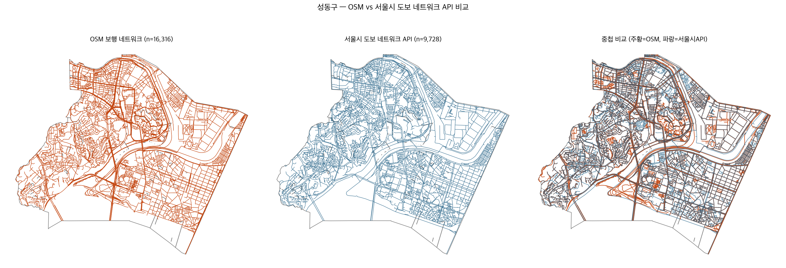

**그림 1.** 성동구 보행 네트워크 비교 — OpenStreetMap(좌, 주황) vs 서울시 도보
네트워크 API(중, 파랑) vs 중첩(우). 실제 보도 형상 기반의 API 네트워크가
차도 중심선이 섞인 OSM보다 시각적으로 더 정밀함을 확인할 수 있다(⚠️ 예시 —
최종 그림 아님).

### 2. MRT 산출 — SOLWEIG 단일 파이프라인

MRT는 SOLWEIG(Solar and LongWave Environmental Irradiance Geometry;
Lindberg et al., 2008)로 산출한다. SOLWEIG는 DSM(수치표면모델)에서 픽셀
단위로 하늘시야율(Sky View Factor)과 그림자 패턴을 계산하여 6방향 단파·
장파 복사 플럭스를 합산하는 방식으로 MRT의 공간 분포를 산출하며, 예테보리
현장 검증에서 R²=0.94, RMSE=4.8K의 성능을 보였다. Lindberg & Grimmond(2011)는
캐노피·수간부를 별도 DSM으로 분리 입력하는 식생 스킴을 추가해 SOLWEIG 2.0으로
발전시켰고(R²=0.91, RMSE=3.1K), 여름철 완전히 잎이 달린 수목의 단파 복사
투과율을 τ=0.05로 제시하였다. 본 연구는 UMEP SOLWEIG 처리도구의 기본값인
τ=0.03을 적용하였다(⚠️ 0.03 자체의 문헌 근거는 미확보 — 서치 필요, SOLWEIG
소프트웨어 기본값을 그대로 사용한 것). Lindberg
et al.(2016)은 지표면 재질별 표면온도 추정 스킴을 추가하였는데, 지표면
재질에 따른 MRT 차이는 그림자 유무에 따른 차이보다 작다는 결론을 제시하였다
— 본 연구가 링크 단위 이진적 제거에서 그림자·개방도의 공간 변이 포착에
집중하는 것을 뒷받침한다. 가장 최근에는 Wallenberg et al.(2026)이 건물
벽면 온도를 열전도율 기반 step heating 방식으로 추정하는 스킴을 추가하여
MRT 추정치가 최대 ±2.5°C까지 개선됨을 보고하였다(본 연구는 건물 구조코드
결측률이 높아 이 스킴은 미적용 — 한계로 명시).

SOLWEIG는 QGIS 기반 오픈소스 플랫폼 UMEP(Lindberg et al., 2018)에 통합되어
배포되며, 본 연구는 이 UMEP 배포판의 SOLWEIG 알고리즘을 그대로 사용한다.
서울 전역(약 605.70km²) 규모에서는 QGIS GUI가 아니라 각 파이프라인 단계
(DSM/CDSM 합성, 8분할 타일링, Wall Height/Aspect, SVF, SOLWEIG 실행,
모자이크)를 Python 스크립트로 서버에서 배치 실행하는 방식으로 확장 적용한다.

#### 2-1. 계산 해상도(5m) 선택의 실증적 근거

서울 전역에 SOLWEIG를 적용할 때 계산 해상도를 얼마로 할지는 계산 비용과
정밀도의 트레이드오프 문제다. 이를 임의로 정하지 않고, 성동구를 대상으로
1/5/10/15/30m 5개 해상도에서 **완전히 동일한 지형·건물·수목 입력
데이터**(1m 원본을 각 해상도로 다운샘플링한 소스)로 SOLWEIG→UTCI 전체
파이프라인을 각각 실행해 실증 비교했다(자체 산출 비교이며 외부 문헌 인용이
아님).

**소요시간**:

| 해상도 | 총 소요시간 | 1m 대비 배속 |
|---|---|---|
| 1m(9분할 타일링, 기준) | 85,999초(23시간 53분) | 1배 |
| 5m | 1,100초(18분 20초) | 약 78배 |
| 10m | 231초(3분 51초) | 약 372배 |
| 30m | 23초 | 약 3,739배 |

**정밀도**(1m을 기준값으로 삼아 5개 해상도의 링크 단위 지표 비교, 5,000+
링크, `width_final/2` 버퍼 + `all_touched=True` zonal mean):

| 해상도 | 링크 Tmrt r | 링크 UTCI r(KMA) | 이진적 제거(UTCI≥38°C) 판정 일치율(KMA) |
|---|---|---|---|
| 1m(기준) | 1.000 | 1.000 | 100.00% |
| 5m | 0.939 | 0.9448 | 92.65% |
| 10m | 0.825 | 0.8762 | 88.77% |
| 15m | 0.731 | 0.8038 | 86.33% |
| 30m | 0.575 | 0.6791 | 84.29% |

(Tmrt r은 기상방식과 무관해 이전과 동일. UTCI r·판정 일치율은 2026-08-09
KMA 격자기상 기준으로 재계산 — 구방식 대비 판정 일치율이 뚜렷이 낮아지고
단조 감소 추세로 바뀜(구 5m 98.95%→신 92.65%). §3의 도메인 단일값→KMA
격자기상 전환으로 38°C 경계 근처 값 분포가 달라지면서, 해상도가 이진적
판정에 미치는 영향이 구방식보다 커진 것으로 해석됨.)

**해석**: 두 지표(UTCI r, 판정 일치율) 모두 5m→10m→15m→30m로 뚜렷하게
단조 감소한다 — 구방식에서는 판정 일치율이 98% 안팎에서 평평해 해상도
선택의 근거로 쓰기 약했지만, KMA 격자기상 기준으로는 두 지표 모두 5m이
1m 대비 정밀도를 가장 잘 보존하는 지점임을 명확히 보여준다(UTCI r=0.9448,
판정 일치율 92.65%). 여기에 **실행가능선(feasibility threshold) 논리**를
더한다: 1m을 서울 전역(605.70km², 면적비 20.77배)으로 단순 선형 추정하면
약 496시간(약 20.7일)로 투고 타임라인상 명백히 비현실적이다(⚠️ 거친 선형
추정, 참고용 — 실제로는 타일 개수 증가에 따른 부가 비용으로 이보다 더
걸릴 가능성이 높음). 반면 5/10/30m은 셋 다 실행 가능한 영역에 있고, 그중
정밀도는 5m이 가장 높다. 즉 5m은 "정밀도가 가장 높다"는 기준과 "계산이
실행 가능하다"는 기준 둘 다를 만족하는 지점이다.

본 연구의 서울 전역 산출은 국토지리정보원 1m 실측 DEM(공개제한 자료)을
5m으로 다운샘플링한 소스를 사용하지만, 오픈소스 Copernicus GLO-30(30m)을
동일하게 5m으로 다운샘플링한 소스와 비교한 결과(서울 전역 469,010개 링크,
동일한 링크 버퍼 방법론) 링크 UTCI r=0.9995, 이진적 제거(UTCI≥38°C) 판정
일치율 99.27%로 사실상 동일한 결과를 낸다. 즉 제한된 접근 권한이 필요한
1m 실측 DEM 없이도, 누구나 내려받을 수 있는 GLO-30만으로 동일한 결론에
도달할 수 있음을 검증하였다 — 이는 "5m 계산격자 자체의 정확도"뿐 아니라
본 연구 결과물의 재현성(reproducibility)까지 함께 뒷받침한다.

### 3. UTCI 산출 및 기상 입력 방식

MRT 공간 분포와 기온·상대습도·풍속을 Bröde et al.(2012)의 표준 UTCI
회귀식(`pythermalcomfort` 라이브러리 구현)으로 결합해 5m 픽셀 단위로
UTCI를 직접 산출한다. 픽셀 단위로 먼저 계산한 뒤 링크로 집계하는
순서를 따르는데, 이는 UTCI가 MRT에 대한 비선형 회귀식이어서 입력을
먼저 평균 낸 뒤 함수를 적용하는 것과 함수를 적용한 뒤 평균 내는 것이
서로 다른 값을 주기 때문이다(Jensen 부등식). 링크 UTCI는 이렇게
산출된 픽셀 단위 UTCI 래스터에서 각 링크가 실제로 지나는 픽셀들의
평균값으로 배정한다(zonal mean, all_touched, 버퍼 미사용).

**MRT와 UTCI는 서로 다른 기상 입력 소스를 쓴다.** SOLWEIG(UMEP)는
도메인 전체에 적용되는 단일 시계열(met.txt) 기상만 입력받는 구조적
제약이 있어, §2의 MRT(Tmrt) 산출에는 도메인 대표 단일값 기상(기온·
상대습도·일사량)을 사용한다 — 이는 연구설계상의 선택이 아니라 SOLWEIG
자체의 아키텍처 제약이다. Tmrt의 공간적 그림자·복사 패턴은 이 단일값
기상 기반 계산 그대로 유지되며, 아래에서 다루는 격자기상 공간화는
UTCI 산출 단계에만 적용된다.

기온·상대습도·풍속은 §1의 KMA 500m 격자자료로 공간화하여 픽셀마다 다른
값을 투입한다. 이는 데이터 한계에 따른 타협이 아니라, 서울 전역이라는
연구 스케일 자체가 선행연구(Basu·Colaninno·Buo 등, 모두 도시 일부 구역
규모)보다 넓다는 점에서 기상 입력의 공간적 편차를 반영하는 것이 방법론적
완성도를 높인다는 판단에 따른 것이다. 실제로 도시 스케일 UTCI-보행접근성
선행연구 5편(Basu et al., 2024; Colaninno et al., 2024; Aydin et al., 2026;
Buo et al., 2026; Jia et al., 2022) 중 기상 입력에 다중관측소 공간보간
(IDW·크리깅 등)을 적용한 사례는 없었다 — 모두 단일 관측값을 도메인
전체에 적용했다. 이는 각 연구의 대상 스케일이 도시 일부 구역에 그쳐
단일값으로도 충분했기 때문으로 보이며, 서울 전역을 다루는 본 연구는
넓어진 스케일에 맞춰 이 공백을 채운다. 일사량만 기존 방식(ASOS 108 단일
관측소)을 유지하는 것은, 500m 격자망을 갖춘 기온·습도·풍속과 달리
서울 내 ASOS 관측소가 사실상 1개소뿐이라 인접 관측소(인천·수원 등,
20~50km 이격)로 보간해도 해상도 개선보다 외곽점 왜곡 위험이 크기
때문이다 — 즉 "관측망이 촘촘한 변수만 공간화했다"는 일관된 기준을
적용한다.

기존 도메인 단일값(AWS 단일 관측탑) 방식과 비교하면, 링크 기준
UTCI≥38°C(이진적 제거 대상) 비율은 시간대에 따라 차이의 크기가 크게
갈린다(자체 산출 비교, 2026-08-06):

| 시각 | 단일값 방식(%) | KMA 격자 방식(%) | 차이(%p) |
|---|---|---|---|
| 09 | 47.0 | 16.9 | −30.1 |
| 10 | 92.0 | 86.3 | −5.7 |
| 11 | 96.2 | 94.1 | −2.1 |
| 12 | 96.6 | 95.8 | −0.8 |
| 13 | 97.1 | 96.3 | −0.7 |
| 14 | 97.6 | 96.4 | −1.2 |
| 15 | 99.7 | 96.3 | −3.3 |
| 16 | 99.2 | 95.5 | −3.7 |
| 17 | 96.6 | 89.4 | −7.2 |
| 18 | 84.4 | 49.2 | −35.2 |
| 19 | 19.4 | 0.5 | −18.8 |

정오~오후 포화 시간대(11~16시)는 차이가 1~4%p 이내로 작은 반면, 전환
시간대(09·18·19시)에서는 차이가 크게 벌어진다. 이는 정확히 본 연구가
채택한 3축 시간대 프레임(§1, 아침 출근·저녁 퇴근)이 걸쳐 있는 시간대와
겹친다 — 기상 입력의 공간적 정밀도가 결과에 미치는 영향이 포화 구간이
아니라 전환 구간에 집중된다는 뜻이다. 아래 IV장의 감소율 산출은 이 KMA
격자기상 기반 UTCI를 사용해 산출한 값이다.

### 4. 이진적 제거 및 SEAR 산출

UTCI 공식 급간(Bröde et al., 2012, Table 3) 경계값을 초과하는 링크를 보행
네트워크에서 완전히 제거(이진적 제거)한 뒤, Dijkstra 알고리즘으로 재탐색하여
도달 가능한 노드 집합을 다시 산출한다.

```python
G_thermal = G.copy()
G_thermal.remove_edges_from({(u,v) for u,v,d in G.edges(data=True)
                              if d['utci'] >= THRESHOLD})  # THRESHOLD = 38.0(Very Strong Heat Stress 하한, Bröde et al., 2012)

S_classic  = reachable_nodes(G,        origin, budget=15min)
S_thermal  = reachable_nodes(G_thermal, origin, budget=15min)
```

출발지에서 15분(Moreno et al., 2021) 시간 예산 내 도달 가능한 노드 집합을
산출하며, 보행 속도는 4.0km/h로 고정한다(Bröde et al., 2012, p.483, UTCI
기준활동 보행속도). 이렇게 산출한 S_classic과 S_thermal을 각각 Classic
Catchment(CA)·Stress-Exposure Adjusted Reach(SEAR)로 부르며, 감소 정도는
감소율(%)로 정량화한다:

```
감소율_i(%) = (CA_i − SEAR_i) / CA_i × 100
```

**출발지 정의는 분석 목적에 따라 둘로 나뉜다**: 서울 전역 메인 분석은
서울 집계구 중심점을 각각 출발지로 스냅하며, 응봉역·성수역 링크 복구
파일럿(V장 2절)은 두 역 자체를 출발지로 삼아 "이 역까지 도보로 얼마나
접근 가능한가"를 역방향으로 묻는 사례 분석이다. 최초부터 Classic 기준
접근 불가인 출발지는 분석에서 제외한다.

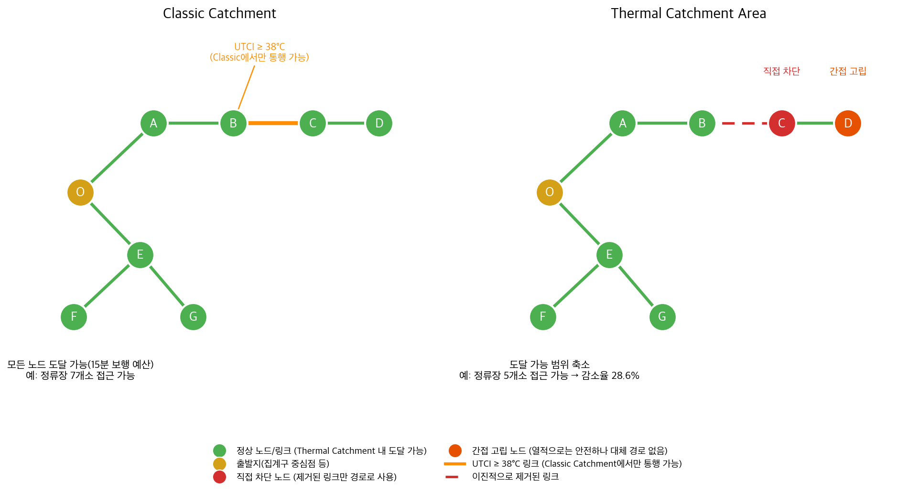

**개념도.** Classic Catchment(전체 노드 도달 가능)와 SEAR(이진적 제거 후
도달 가능 범위 축소) 비교. 제거된 링크를 실제로 지나야 하는 노드(직접
차단)뿐 아니라, 그 자체는 열적으로 위험하지 않더라도 15분 예산 내 대체
경로가 없어 도달 불가능해지는 노드(간접 고립)도 함께 발생함을 보여준다
(노드·수치는 예시이며 실측값 아님).

---

## IV. 연구 결과

### 1. 서울 전역 UTCI/MRT 공간 분포

서울 전역 5m 해상도 MRT 산출 결과, 한강이 뚜렷한 저온대로 나타나고 북한산·
관악산 등 산림 지역 역시 뚜렷하게 낮은 MRT를 보이는 반면, 도심 건축 밀집
지역은 높은 MRT를 나타냈다. 이러한 공간 패턴은 도로유형별 평균 MRT
비교에서도 체계적으로 확인된다: 등산로·숲길(path)이 37.9°C로 가장 낮고,
주거지역 도로(residential)는 50.5°C, 간선도로급(secondary/tertiary)은
51.5~52.2°C, 주간선도로(primary/trunk_link)는 53.1~53.5°C로 가장 높다.
이는 가로수·건물 그늘 유무가 도로 위계와 체계적으로 연관되어 있으며,
건조환경과 수목 분포가 열노출의 공간적 불균등을 만든다는 본 연구의
문제의식(I장)을 실증적으로 뒷받침한다.

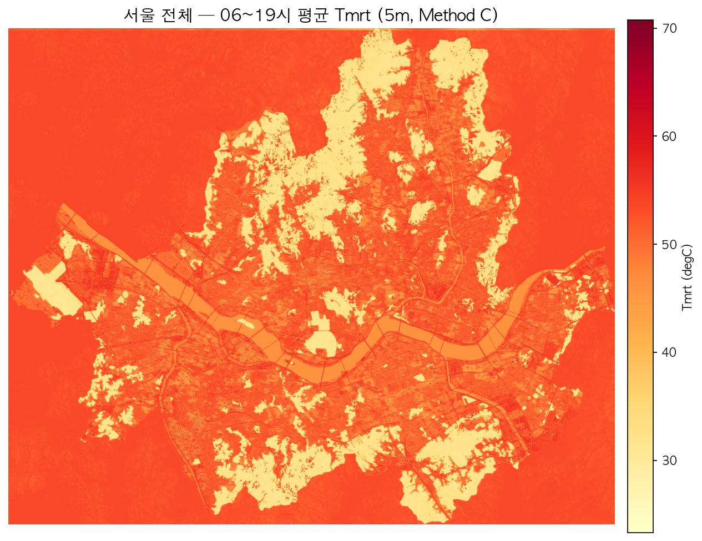

**그림 2.** 서울 전역 평균 평균복사온도(MRT) 공간분포(06~19시 평균, 5m
해상도). 한강과 산림 지역이 뚜렷한 저온대를, 도심 건축 밀집지역이 고온대를
형성한다(⚠️ 예시 — 최종 그림 아님).

MRT의 시간대별 표준편차는 06시 0.31°C, 12시 6.52°C, 19시 4.90°C로, 정오
무렵 링크 간 공간 분화가 가장 크게 벌어진다. UTCI는 06시 28.8°C에서 14시
43.1°C까지 변화하는데(KMA 격자기상 기반, 링크 평균), 그 값의 범위는 같은
시간대 MRT(약 23~70°C)보다 훨씬 좁게 압축되어 나타난다 — 이는 Bröde et
al.(2012) UTCI 회귀식이 극단적 MRT를 비선형적으로 완충하는 구조적 특성에
따른 결과다. UTCI 공식 열스트레스 급간(Table 3) 기준으로 분류하면, 낮
시간대(10~14시)는 링크 기준 93.8%가 Very Strong Heat Stress(≥38°C)
등급으로 대부분의 공간이 이에 해당하지만, 저녁 시간대(15~19시)는 66.2%로
다소 낮아진다 — 18~19시의 급격한 하락(§2)이 저녁 구간 평균을 끌어내리기
때문이다.

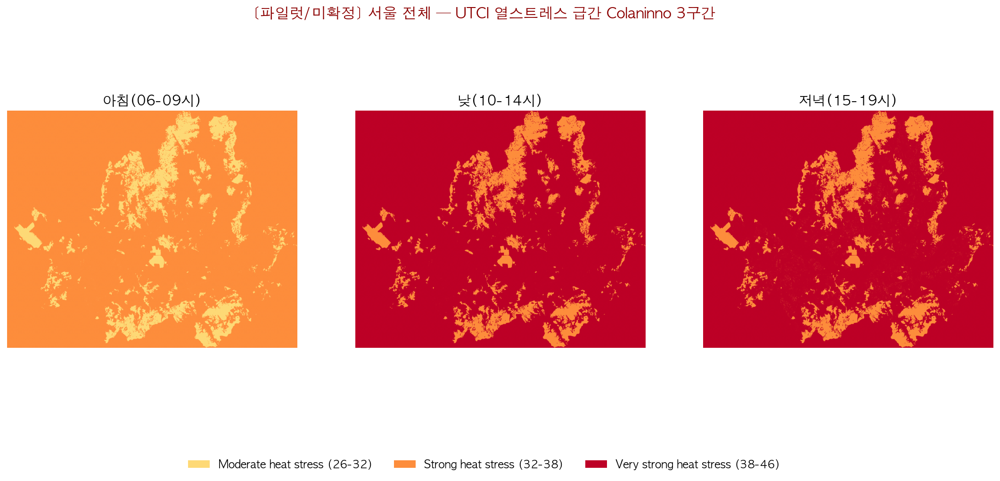

**그림 3.** 서울 전역 UTCI 열스트레스 급간(Bröde et al., 2012) 3구간 분포 —
아침(06~09시)은 대부분 Moderate/Strong 등급이나, 낮(10~14시)·저녁(15~19시)은
대부분 Very Strong Heat Stress(≥38°C, 적색)로 전환된다(⚠️ 예시 — 최종
그림·범례 재작업 필요).

### 2. 3축 시간대별 이진적 제거 대상 링크 비율

UTCI 38°C를 임계값으로 시간대별 이진적 제거 대상 링크 비율(전체 링크 중
UTCI가 38°C 이상인 비율)을 산출한 결과, 06시 0%에서 시작해 정오 무렵
96%대까지 상승한 뒤 저녁으로 갈수록 다시 낮아지는 종 모양 패턴을 보였다.
같은 데이터를 임계값-시간대 민감도 분석으로 확인하면, 링크의 약 50%가
임계값을 초과하는 "균형점" 온도(링크 UTCI 중앙값)가 시간대에 따라 이동함을
알 수 있다: 06시 28.8°C → 09시 37.0°C → 12~14시 42.9~43.5°C → 19시
34.8°C. 이 균형점의 이동은 하루 중 태양고도 변화와 대응되는 종 모양
곡선을 그린다.

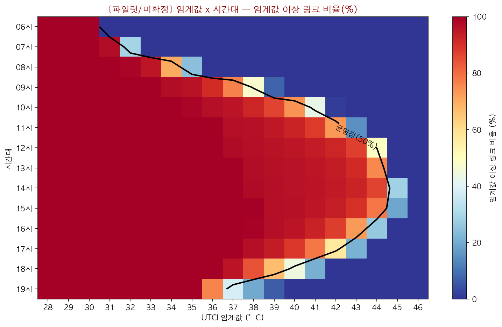

**그림 4.** 임계값×시간대 민감도 분석 — UTCI 임계값 이상 링크 비율(%),
검은 실선은 균형점(비율 50%) 궤적. 균형점이 하루 태양고도를 따라 이동하는
종 모양 곡선을 그린다(⚠️ 예시 — 최종 그림 아님, "파일럿/미확정" 표시
제거 필요).

이 결과는 공식 임계값 38°C가 오직 09시 근방(균형점 37.0°C)에서만 균형점에
가장 근접하며, 정오 무렵에는 균형점이 43°C 안팎까지 상승해 38°C 기준으로는
이미 포화(96%대) 상태임을 보여준다. 즉 고정된 단일 임계값으로는 하루 전체의
링크 간 공간 분화를 균일하게 포착할 수 없으며, 이것이 본 연구가 정오
단일 대표시각 대신 아침 출근·저녁 퇴근·낮 최고포화 시각의 3축 프레임을
채택한 실증적 근거다(III장 1절).

### 3. SEAR 및 감소율 산출 결과

#### 3.1 산출 방법 요약

서울시 집계구 17,754개(중복 스냅 제거 후) 중심점을 출발지로 CA와 SEAR를
산출하였다(§III.4). 컨투어 메저(Geurs and van Wee, 2004)의 정의에 따라,
도달 가능한 지하철역(367개) 및 버스정류장(10,916개) 개수를
"기회(opportunity)"로 계수하며, 감소율은 이 기회 개수를 기준으로
(CA − SEAR) / CA × 100을 산출한다 — 이는 Basu et al.(2024)이 동일 맥락에서
채택한 백분율 보고 방식과 궤를 같이한다.

#### 3.2 시간대별 감소율

| 시각 | 감소율(%) |
|---|---|
| 06~08 | 0.0 |
| 09 | 40.9 |
| 10 | 99.7 |
| 11~16 | 99.9 |
| 17 | 99.8 |
| 18 | 90.8 |
| 19 | 0.8 |

감소율은 아침 출근·저녁 퇴근 시간대(09·18시)에 낮았다가 정오~오후
포화 구간(10~17시, 99% 내외)에서 급등하고 19시에 다시 급락하는 종 모양
패턴을 보였다. 09시와 19시의 낮은 감소율은 이 시간대에 열환경 임계값
초과 여부가 시각에 따라 민감하게 갈려 공간적 분화가 가장 크게 나타남을
보여준다.

#### 3.3 검증 — 여러 공간 스케일 및 네트워크에서의 패턴 일관성

위와 동일한 패턴은 서로 다른 세 공간 스케일에서 반복적으로 확인되었다:
(1) 성동구 파일럿(응봉역·성수역 2개 지점), (2) 서울 전역 지하철역 367개
지점, (3) 서울 전역 집계구 17,754개 지점. 세 스케일 모두에서 정오~오후
포화 시간대는 감소율이 99% 내외로 균일하고, 아침·저녁 전환 시간대에서만
급격한 변동이 나타나는 동일한 구조가 재현되었다. 또한 메인 분석에 사용한
서울시 도보 네트워크 API 대신 OpenStreetMap으로 전체 파이프라인을 재현한
결과(2026-08-18), 정오~오후 포화 시간대는 감소율 차이가 0.3%p 이내로 거의
완전히 일치했고, 전환 시간대(09·18시)에서만 5.5~6.0%p의 차이가 나타났다
(전체 평균 절대차이 0.91%p) — 방법론이 네트워크 선택에 대체로 강건함을
추가로 확인하였다. 이러한 일관성은 본 연구가
채택한 이진적 제거 산출 방법론이 특정 지역·특정 네트워크의 국지적 특성에
좌우되지 않는 안정적인 결과를 산출함을 뒷받침한다.

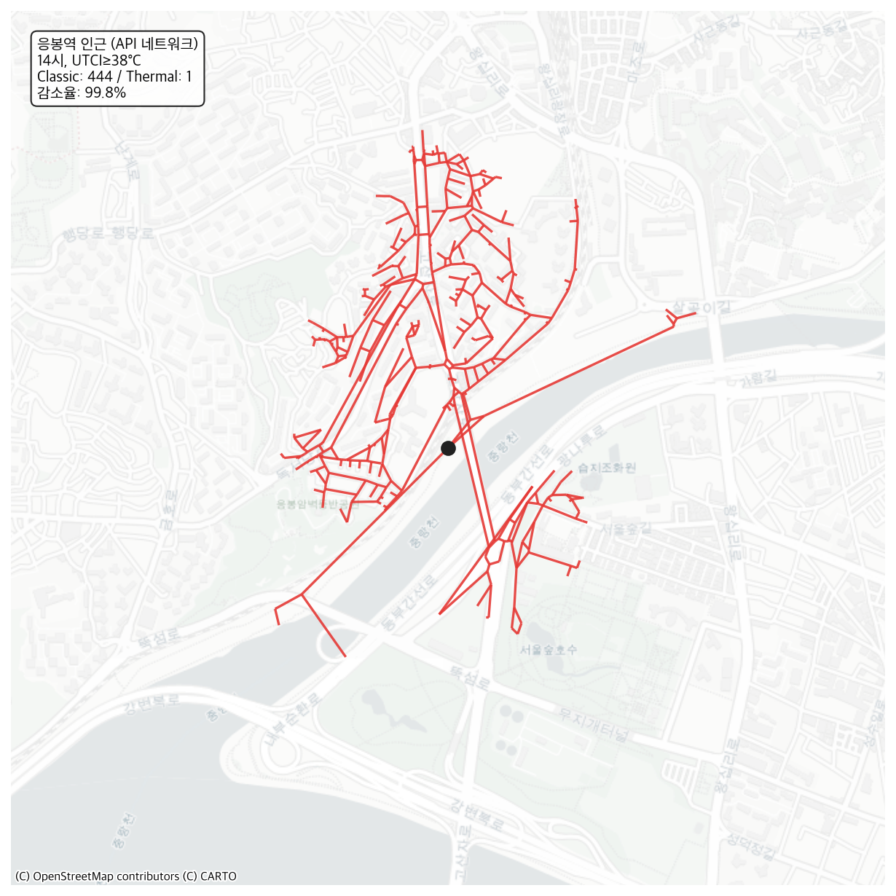

**그림 5.** 응봉역 인근 Classic vs SEAR — 서울시 도보 네트워크
API 기준, 14시·UTCI≥38°C. 빨간 선은 이진적 제거로 손실된 구간(⚠️ 예시 —
최종 그림 아님. 이 그림은 도달 가능한 전체 네트워크 노드 수 기준으로
시각화되어 있어, IV§3.5·V§2의 "기회(지하철역·버스정류장)" 기준 수치와는
척도가 다름 — 최종 그림 제작 시 기회 기준으로 재작성 필요).

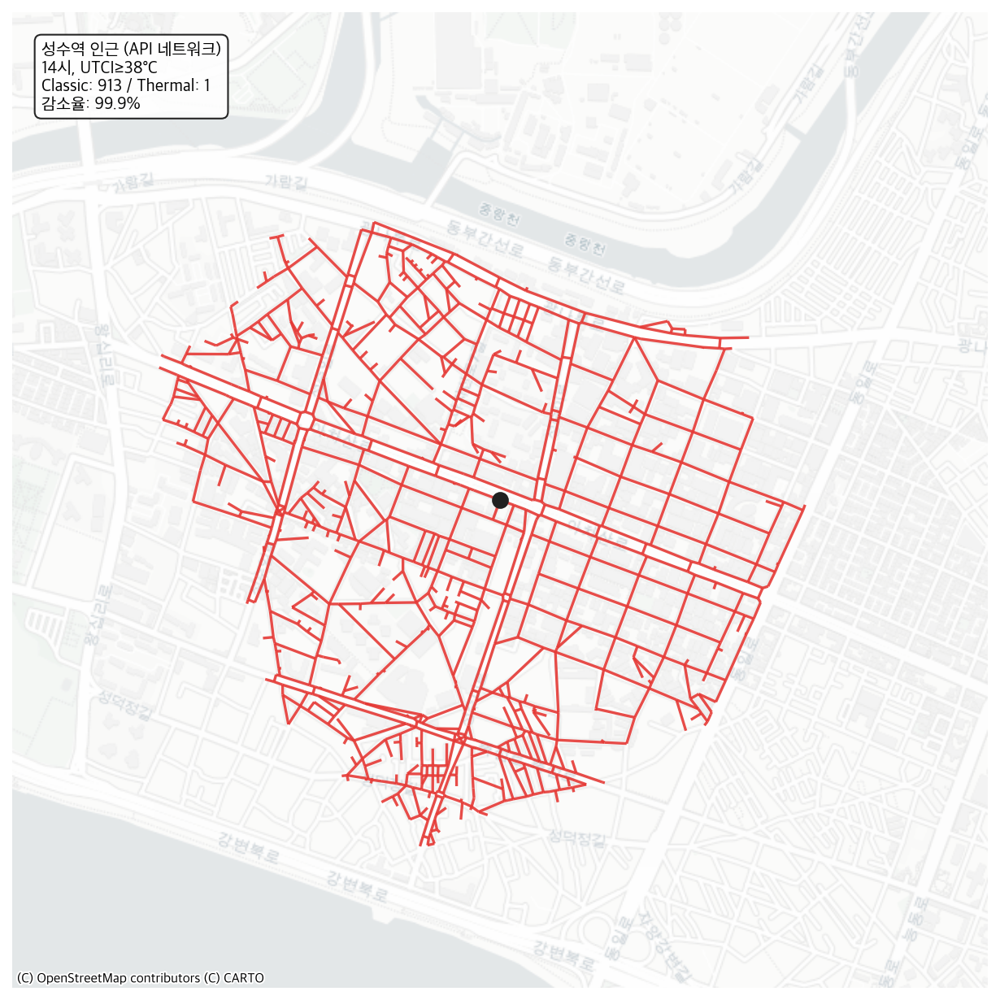

**그림 6.** 성수역 인근 Classic vs SEAR — 조건은 그림 5와 동일
(⚠️ 예시 — 최종 그림 아님, 그림 5와 동일한 척도 문제 있음).

#### 3.4 연속적 비용 부과 방식과의 차별점

이러한 비선형적 붕괴-회복 패턴(정오 전후 급격한 감소율 상승 및 하강)은
Basu et al.(2024)과 같은 연속적 비용 부과 기반 접근으로는 포착되지 않는
현상이다. 연속적 비용 부과 방식은 열노출 정도에 비례해 이동 비용을 완만하게
늘리므로, 특정 시간대에 접근성이 급격히(수 시간 내 0%에서 99%로) 붕괴하는
비선형적 단절을 완만한 감소 곡선으로 평활화(smoothing)하는 경향이 있다.
본 연구의 이진적 제거 기반 SEAR는 이러한 급격한 단절을 있는 그대로 드러내며,
이는 II장에서 제시한 이론적 차별화 지점이 실증 데이터로 뒷받침됨을 보여준다.

#### 3.5 네트워크 위상(topology)과 이진적 제거의 상호보완적 필요성

연속적 비용 부과 방식이 일상적 열 불편에 따른 점진적 행동 변화(예: 우회 경로
선택, 보행속도 감소)를 표현하는 데는 적합하지만, 본 연구가 다루는 Very
Strong Heat Stress(UTCI≥38°C, Bröde et al., 2012) 구간에서는 다른 성격의
현상이 나타난다. 성동구 파일럿 확인 결과, 보행 네트워크 노드의 평균 차수
(degree)는 2.50(중앙값 3)에 불과했으며, 노드의 28.2%는 차수 1(막다른
골목)이었다. 이러한 성긴 네트워크 구조에서는, 임계값을 초과하는 링크가
반경 내 일부(응봉역 반경 1.2km 기준 09시 10.5%)에 그치더라도, 도달 가능한
기회(지하철역·버스정류장, §3.1 정의) 기준 접근성은 09시 97.8% 감소하였다
(성수역은 35.2%) — 즉 감소율이 초과 링크 비율에 비례하지 않고, 출발지
인접 소수 링크의 초과 여부에 따라 접근 가능 영역이 통째로 단절되는
비선형적 붕괴가 관찰되었다. 반면 19시에는 두 지점 모두 반경 내 초과
링크가 사실상 사라져(0.0%) 접근성 손실도 전혀 발생하지 않았다(감소율
0.0%) — 이는 §3.2에서 확인한 19시 전체 감소율의 급락(1.0%)과 정확히
일치하며, 응봉역·성수역처럼 반경 내 기회 자체가 적은(각각 46개, 54개)
지점이라도 시간대에 따라 접근성이 극단적으로 갈릴 수 있음을 개별 사례로도
재확인시켜준다.

이는 연속적 비용 증가를 가정하는 모델 구조상 원리적으로 표현할 수 없는
현상이다 — 비용이 소폭씩 누적되는 방식으로는 "일부 링크만 초과했는데
접근성이 거의 전부 사라지는" 단절을 재현할 수 없다. 따라서 연속적 비용
부과와 이진적 제거는 경쟁 관계가 아니라 상호보완적 관계에 있으며, 특히
성긴 보행 네트워크에서의 극한 열노출 상황을 다루는 접근성 평가에는
이진적 제거 기반 분석이 별도로 필요하다.

---

## V. 논의

### 1. SEAR의 개념적 위치

이 연구가 기존 열환경 보행 접근성 연구(II장)와 구분되는 지점은 측정
대상이 다르다는 데 있다. Jia et al.(2022)·Basu et al.(2024)·Aydin et
al.(2026) 방식에서 열환경은 접근성 값을 낮추는 연속적 요소였다. 반면 본
연구에서 열환경은 이동 가능 공간의 범위 자체를 줄이는 요소다 — 같은 시간
예산이 주어지더라도 도달 가능한 공간이 아예 사라진다. Colaninno et
al.(2024)과는 재료(SOLWEIG+UTCI+보행)를 공유하지만 산출물의 성격(세그먼트별
연속 위험 순위 vs 네트워크 전체의 절대적 공간 범위 감소)이 다르다.

### 2. 정책적 함의 — 병목 링크 식별을 통한 개입 우선순위

SEAR는 개념 자체는 단순하지만(임계값 초과 링크 제거 후 재계산), 이미
산출된 CA·SEAR 결과를 재료로 삼아 "어디를 개선해야 접근성이 회복되는가"라는
정책적 질문에 답하는 데 활용될 수 있다. IV§3.5에서 확인한 네트워크 위상적
취약성은 "왜 감소율이 비선형적으로 붕괴하는가"를 설명하지만, "그렇다면
어디를 개선해야 하는가"에는 답하지 않는다. 이 질문에는 새로운 검증
방법론을 제안하기보다, 도로망 취약성 분석의 기존 표준 방법론(Jenelius,
Petersen & Mattsson, 2006 — 링크를 하나씩 복구/폐쇄했을 때 접근성이
얼마나 회복/감소하는지로 링크의 "중요도"를 정의하는 전체망 스캔 방식)을
그대로 적용하였다. 09시·38°C 기준으로 이진적 제거된 네트워크에서, 각
출발지의 인접 핫링크를 하나씩 복구했을 때 회복되는 기회(지하철역·
버스정류장) 개수를 측정하였다.

전체 18,650개 출발지 중 1,942개(10.4%)에서 인접 핫링크 하나의 복구가
접근성을 일부 회복시켰다. 대부분은 회복 효과가 크지 않았으나(중앙값
8.5%, 평균 13.3%), 44개 출발지는 단일 링크 복구만으로 손실의 50% 이상이
회복되었고 그중 4개는 80% 이상 회복되었다. 가장 뚜렷한 사례는 강서구
화곡8동의 한 출발지로, 원래 도달 가능한 기회 96개가 이진적 제거 후 0개로
완전히 고립되었는데, 인접한 핫링크 단 하나를 복구하는 것만으로 58개
(60.4%)가 다시 도달 가능해졌다. 화곡동 일대(2·4·8동)와 인헌동·갈현2동·
자양3동 등 특정 지역에 이러한 병목 링크가 집중되어 나타났다.

다만 이 결과를 도시 전체 문제의 해법으로 일반화해서는 안 된다. 회복
효과가 확인된 2,457개 후보 링크를 모두 복구하더라도, 서울 전역 09시
기준 총 손실(667,938건의 기회-출발지 조합)의 2.10%만 회복되었다(그림 7
참고). 즉 병목 링크 개입은 화곡동과 같은 국지적 지점에서는 매우 효과적인
정책 수단이지만, 폭염 조건에서의 전면적 접근성 붕괴 자체는 소수 링크의
개선으로 해결되지 않으며 광범위한 열환경 개선(가로수 식재, 차양 설치
등)이 필요함을 시사한다. 이는 IV§3.2·IV§3.5에서 확인한 이진적 제거 현상의
규모(정오~오후 시간대 99% 수준 감소)와 정합적이다 — 병목 링크 분석이
유효한 것은 부분 붕괴 구간(09·19시와 같은 전환 시간대)에 한정되며, 완전
포화 구간에서는 애초에 단일 링크로 회복될 여지 자체가 없다.

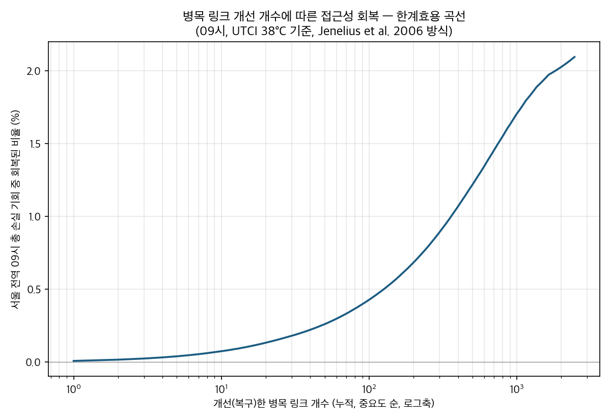

**그림 7.** 병목 링크 개선 개수에 따른 접근성 회복 누적 곡선(09시,
UTCI 38°C 기준, 로그축). 뚜렷한 변곡점 없이 완만하게 증가하여, 소수
링크 개선만으로 도시 전체 문제가 해결되지 않음을 보여준다.

> ⚠️ 위 서울 전역 분석은 계산량 제약으로 **출발지에 직접 인접한(1홉)
> 핫링크만** 후보로 검토하였다 — 실제로는 15분 도보 반경 내 어떤
> 핫링크든(2홉 이상도) 복구 시 도움이 될 수 있으므로, 위 2.10%는 병목
> 링크 개선의 참잠재력에 대한 **하한선(lower bound)**이다. 이를 확인하기
> 위해 응봉역·성수역 2개 지점에 한해 범위를 넓힌 예비 분석을 아래에
> 추가한다.

매 단계 즉시 이득이 있는 링크만 채택하는 단순 탐욕적 방식을 먼저
시도하였으나, 응봉역은 첫 단계부터 회복 효과가 0으로 나타나 조기
종료되었다. 원인을 확인한 결과, 응봉역의 3개 진입 링크가 전부 핫링크였고
그 다음 이웃 링크들도 전부 핫링크였다 — 즉 2겹 이상으로 둘러싸여 있어,
링크 하나만 복구해서는 그 다음 링크에서 다시 막히므로 즉시 이득이
발생하지 않는다. 이는 탐욕적 방식이 "이득이 동점(대부분 0)인 구간"을
다루지 못한 것이지 응봉역이 원천적으로 개선 불가능하다는 뜻은 아니므로,
Nemhauser, Fisher & Wolsey(1978)의 탐욕적 집합함수 최적화 방식(매 단계
한계이득이 가장 큰 후보를 선택)을 그대로 유지하되, 이득이 동점일 때는
출발지로부터의 거리가 가까운 후보를 우선하는 지연 규칙(tie-breaking)을
추가하여 재계산하였다. 개선 규모의 단위는 링크 개수 대신 **누적 길이
(m)**를 사용하였다 — 링크마다 길이 편차가 크므로(수 m~수백 m), 개수보다
길이가 실제 개입 비용(가로수 식재, 냉각시설 설치 등)에 더 가까운
근사치이며, 이는 도로망 취약성 분석 문헌이 "일반화된 비용"으로 중요도를
정의하는 관행(Jenelius et al., 2006)과도 부합한다.

그 결과 응봉역은 3,658m까지 복구해도 여전히 1개(2.2%)에 머물다가
9,662m 지점에서 21개(45.7%)로 급격히 열리며, 19,439m 복구 시 46개
전부(100.0%)에 도달하였다. 성수역은 4,660m만 복구해도 31개(57.4%)로
즉시 반응하기 시작해, 18,932m 복구 시 49개(90.7%)까지 도달하였다(그림
8, 9). 즉 응봉역과 성수역은 "복구 가능/불가능"이 아니라 **정책 개입이
효과를 내기까지 필요한 최소 개입 규모(문턱값)가 지점마다 질적으로
다르다** — 성수역은 소규모 개입에도 점진적으로 반응하는 반면, 응봉역은
약 9~10km 규모의 동시 개입 전까지는 효과가 거의 나타나지 않다가 그
지점을 넘으면 급격히 열린다.

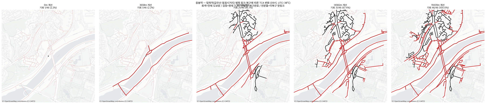

**그림 8.** 응봉역 — 병목 링크 누적 개선 길이별 SEAR 변화(09시, UTCI
38°C 기준). 회색=전체 도보망, 검정=현재 SEAR(도달 가능 구간), 진한
빨강=복구 완료 링크, 연분홍=미복구 핫링크. 9,662m 지점부터 SEAR(검정)가
급격히 확장되는 것을 볼 수 있다.

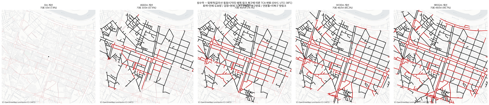

**그림 9.** 성수역 — 병목 링크 누적 개선 길이별 SEAR 변화(조건은 그림 8과
동일). 응봉역과 달리 초기 단계(4,660m)부터 SEAR가 넓게 확장된다.

응봉역·성수역 2개 지점의 사례가 우연이 아닌지 확인하기 위해, 동일한 탐욕적
복구 방법론을 성동구 전체 집계구(565개, 반경 내 기회가 아예 없는 4개 지점
제외)로 확장 적용하였다. 계산량을 줄이기 위해 완전 회복(100%)이 아니라
"CA 대비 50% 회복"까지 필요한 누적 복구 길이(m)만을 지점별 단일 지표로
산출하였으며, 06~19시 중 링크 단위 이진적 제거 비율이 대표적인 8개 시각
(07·08·09·10·16·17·18·19시)에 대해 전부 계산하여 하루 동안의 변화까지
확인하였다.

그 결과 병목 링크 복구 효율은 시티와이드 이진적 제거 비율(IV§2)과 거의
정확히 같은 종 모양 곡선을 그렸다(아래 표). 아침 출근·저녁 퇴근
직후인 07·08·19시는 이진적 제거 자체가 거의 발생하지 않아(0.0~0.5%) 전
지점이 개입 없이 이미 CA 50% 이상을 유지했다. 전환 시간대인 09시에는
561개 중 429개(76.5%)가 이미 개입 없이 50%를 회복한 상태였고, 나머지도
100m 이내 개입으로 86.6%, 1,000m 이내 개입으로 98.6%가 회복되어 —
1,000m를 초과하는 대규모 개입이 필요한 지점은 8개(1.4%)에 불과했다. 반면
정오~오후 포화 시간대(10·16·17시)에는 이진적 제거 비율이 86~96%에 달해,
**예외 없이 전 지점이 수만 m 규모(최댓값 35,722~38,640m)의 대규모 개입
없이는 50%도 회복하지 못했다**. 18시는 그 중간(이진적 제거 49.2%, 개입
불필요 1.4%, 1,000m 이내 15.3%)으로 전환 구간의 특성을 보였다.

| 시각 | 이진적 제거 비율 | 개입 불필요(0m) | ~100m 누적 | ~1,000m 누적 | 최댓값 |
|---|---|---|---|---|---|
| 07 | 0.0% | 100.0% | 100.0% | 100.0% | 0m |
| 08 | 0.0% | 100.0% | 100.0% | 100.0% | 0m |
| 09 | 16.9% | 76.5% | 86.6% | 98.6% | 10,545m |
| 10 | 86.3% | 0.0% | 0.0% | 0.0% | 35,722m |
| 16 | 95.5% | 0.0% | 0.0% | 0.0% | 37,866m |
| 17 | 89.4% | 0.0% | 0.0% | 0.0% | 38,640m |
| 18 | 49.2% | 1.4% | 6.4% | 15.3% | 25,231m |
| 19 | 0.5% | 100.0% | 100.0% | 100.0% | 0m |

(10·16·17시는 MAX_STEPS(800단계) 내 50% 미도달 지점(각 6·18·12개, 전체
561개 중)을 "사실상 무한대"로 간주해 최댓값·누적비율 계산에서 제외함)

이 결과는 응봉역·성수역에서 관찰한 "지점마다 개입 문턱값이 질적으로
다르다"는 현상이 두 지점만의 특수 사례가 아니라 성동구 전역·하루 전체에
걸쳐 나타나는 일반적 패턴임을 보여준다. 동시에 정책적으로는 오히려
낙관적인 함의를 갖는다 — 아침·저녁 통근 시간대는 대부분 이미 문제가
없고, 소수 국지적 핫스팟에만 자원을 집중해도 09시 기준 98.6%가 회복된다.
다만 이 낙관은 전환 시간대에 한정되며, 정오~오후 포화 시간대에는 병목
링크 개입 자체가 정책 수단으로 성립하지 않고 광범위한 열환경 개선
(가로수 식재, 차양 설치 등)이 필요함을 뜻한다.

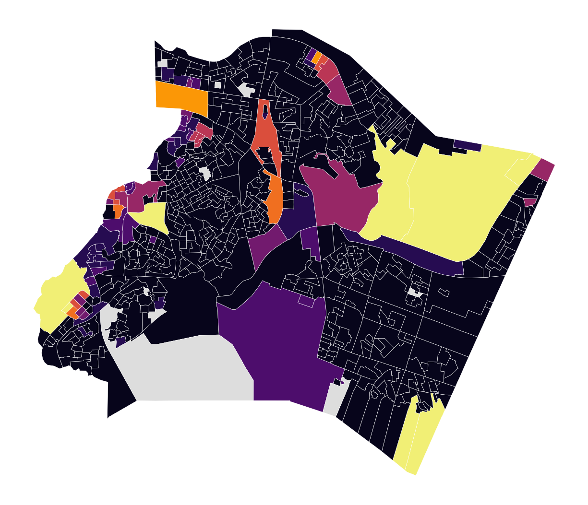

**그림 10.** 성동구 집계구별(565개) 병목 링크 복구 효율 — CA 대비 50%
회복까지 필요한 누적 복구 길이(m), 09시 기준(UTCI≥38°C, KMA 격자기상,
탐욕적 순서). 색이 옅을수록 적은 개입으로 회복되는 지역, 진할수록
대규모 개입이 필요한 지역. 나머지 7개 시각의 지도는 부록 참고.

이 분석들은 SEAR의 타당성을 검증하는 것이 아니라(검증은 IV장 3.3·3.4·3.5절),
SEAR가 산출한 결과를 재료로 삼아 무엇을 할 수 있는지 보여주는 응용
사례다 — 새로운 방법론을 추가로 제안하지 않고 기존에 확립된 방법
(Jenelius et al., 2006)만으로도 SEAR가 정책적 함의를 갖는다는 점을
실증한다.

### 3. 왜 UTCI를 직접 쓰는가, 왜 일사량만 단일값인가

UTCI를 직접 사용하는 것은 UTCI가 폭염 조건에서 포화(공간 분화 급감)되는
특성이 없어서가 아니다. 이 포화는 방법론적 결함이 아니라 폭염이라는 상황
자체가 보여주는 실태로 재해석하며, 그 결과 대표 시각을 정오 단일이 아니라
3개 시간대(아침 출근/저녁 퇴근/낮 시간대 중 포화 최고 시각)로 확장해
대응한다(II장, III장). 기온·습도·풍속은 기상청 API 허브의 500m 격자자료로
공간화하여 링크마다 다른 값을 투입하며(III장 3절), 이는 선행연구(Basu·
Colaninno·Buo 등)가 채택한 도메인 단일값보다 넓은 서울 전역 스케일에
맞춘 방법론적 확장이다. 일사량만 ASOS 108 단일 관측소값을 유지하는데,
이는 데이터·계산자원의 한계가 아니라 서울 내 ASOS 관측망이 사실상 1개소
뿐이라 공간보간이 물리적으로 의미를 갖기 어렵기 때문이다(III장 3절).

### 4. 이진적 제거의 한계

II장에서 확인했듯 Kar et al.(2024)의 Inclusive Access 1도 저자들 스스로
"binary constraint 단순화"를 한계로 인정하였다. 본 연구의 이진적 제거도
같은 성격의 한계를 안는다 — 임계값을 근소하게 상회하는 링크와 근소하게
하회하는 링크가 질적으로 다른 것처럼 취급된다. 다만 민감도 분석에 따르면
UTCI는 임계값 근처에서 약 4~8°C 폭의 급격한 전환("좁은 절벽")을 보이는데,
이는 임계값 선택의 자의성에 상대적으로 더 취약할 수 있음을 뜻한다 —
연속 비용함수와의 결합 가능성은 향후 연구 과제로 남긴다(Kar et al.
2024와 동일한 논조).

### 5. SOLWEIG의 도시 규모 확장 — 방법론적 기여

UMEP 공식 처리도구 어디에도 대용량 도메인을 자동으로 분할해주는 기능은
없다 — SOLWEIG는 메모리에 한 번에 들어가는 단일 래스터를 전제로 설계되어
있다. 이 한계는 본 연구만의 문제가 아니라 이 분야 최신 연구도 그대로
인정하는 지점이다. Buo et al.(2026)은 자신들의 실시간 열 라우팅 도구가
캠퍼스 규모(ASU Tempe, 32GB RAM·약 4시간)에서 작동함을 보이면서도, 도시
규모 확장을 위한 향후 과제로 (1) 도시 단위 분산 컴퓨팅 인프라 구축과
(2) SOLWEIG 출력을 학습한 신경망 대체모델(surrogate)이라는 두 방향을
함께 제시한다(§4.4). 본 연구는 이 둘 중 어느 것도 도입하지 않고,
태양기하학으로 유도한 버퍼(그림자 최대 수평거리 = 건물높이/
tan(태양고도각))를 적용한 타일링으로 SOLWEIG의 물리 계산을 그대로 보존한
채 서울 전역(605.70km²)에 적용하며, 이는 이 분야 미해결 과제(캠퍼스→도시
규모 확장)를 분산 인프라·신경망 근사 어느 쪽도 없이 단일 서버에서 해결한
사례로, 본 연구의 방법론적 기여 중 하나로 제시한다.

### 6. 한계 및 향후 연구

1. ASOS 한 지점이 서울 전체 일사량을 대표하는가는 검증되지 않은 가정이다
   (기온·습도·풍속은 KMA 500m 격자로 공간화했으나, 일사량은 서울 내 ASOS
   관측소가 사실상 1개소뿐이라 이 가정이 남아있다).
2. 건물 재질(벽면온도 파라미터화, Wallenberg 2026) 미반영 — 구조코드
   결측률이 높음.
3. 층수→높이 환산계수(3m/층) 국내 공식 출처 미확보.
4. 혼효림 수목 형태(원뿔/구형) 단순화 — 실제 침엽수 비율 반영 못 함.
5. 이진적 제거 자체의 한계(V장 4절).
6. UTCI는 원천적으로 연령·취약계층별 차별화가 안 되는 지표.
7. 도로 폭 근사값(OSM 도로유형별 고정값)이 법정 도로 등급 기준(「도시·군계획
   시설의 결정·구조 및 설치기준에 관한 규칙」 제9조) 범위 내에 있음은 확인
   하였으나, 개별 링크 단위로 법정 등급을 직접 매칭한 것은 아님.

향후 연구는: (1) SSP 기후 시나리오 기반 미래 폭염 조건 확장, (2) 위성 기반
일사량 격자자료 등을 활용한 일사량 입력의 추가 정교화, (3) 도로명 매칭 기반
법정 도로폭 등급 반영, (4) 성동구 1m 원본(무타일링) 해상도 결과와 타일링
방식 결과의 일치도 비교 검증, (5) 그늘막·쿨링포그 등 열저감 시설 설치
여부를 이진적 제거 판정에 결합하는 확장 — 시설이 설치된 링크는 UTCI
임계값을 초과하더라도 제거 대상에서 제외함으로써, 이미 시행된 정책
개입을 정확히 반영하거나 향후 개입 계획의 효과를 사전에 평가하는
도구로 SEAR를 활용할 수 있다.

---

## VI. 결론

본 연구는 폭염 조건에서 열노출이 보행 접근 가능 공간 자체를 어떻게
축소시키는지를 정량화하기 위해 Stress-Exposure Adjusted Reach(SEAR)를
새로운 공간 단위로 제안한다. 기존 선행연구(II장)가 열환경을 접근성 점수를 낮추는 연속적
요소로 다룬 것과 달리, 본 연구는 UTCI 임계값을 초과하는 링크를 네트워크에서
완전히 이진적으로 제거하는 방식으로 이동 가능 공간의 범위 자체가 줄어드는
것을 포착한다. 이 접근은 열환경에서 보행자가 속도가 아니라 경로 선택
자체를 바꾼다는 행동 증거(Melnikov et al., 2022; Azegami et al., 2023; Buo
et al., 2026)와, 다른 도메인(인지된 안전성)에서 이미 검증된 이분법적 링크
제거 구조(Kar et al., 2024)에 근거한다.

MRT는 SOLWEIG(UMEP) 파이프라인으로 서울 전역(약 605.70km²) 5m 해상도까지
확장 적용하며, 이는 선행연구가 다루지 않은 규모다. 이 확장은 물리량(태양
기하학) 기반 버퍼 타일링으로 이뤄졌으며, 이는 SOLWEIG 자체나 이 분야
선행연구(Buo et al., 2026)가 아직 풀지 못한 "캠퍼스 규모→도시 규모" 확장
문제를 분산 인프라·신경망 근사 어느 쪽도 없이 SOLWEIG의 물리 계산을
그대로 보존한 채 해결한 사례다(V장 5절). 기온·습도·풍속은 KMA 500m
격자자료로 공간화하여 링크마다
다른 값을 투입하였으며, 일사량만 ASOS 단일 관측소값을 유지하였다 — 관측망이
촘촘한 변수만 공간화한다는 일관된 기준에 따른 선택이다(III장 3절).

이를 서울 전역(약 605.70km²) 5m 해상도에 적용한 결과(IV장 1절), 한강과 산림
지역은 뚜렷한 저온대를, 도심 건축 밀집지역은 고온대를 형성하였으며, 이러한
공간 패턴은 도로유형별 평균 MRT 차이(등산로·숲길 37.9°C ~ 주간선도로
53.5°C)로도 체계적으로 확인되어 건조환경·수목 분포가 열노출의 공간적
불균등을 만든다는 문제의식(I장)을 실증하였다. UTCI 임계값 초과 링크
비율은 하루 동안 태양고도를 따라 종 모양으로 변화하였고, 임계값 초과
비율이 50%에 이르는 균형점 온도가 시간대마다 이동함을 확인함으로써(IV장
2절), 정오 단일 시각 대신 아침 출근·저녁 퇴근·낮 최고포화 시각의 3축
프레임을 채택한 실증적 근거를 제시하였다. 이러한 산출 방법론은 성동구
파일럿·서울 전역 지하철역·서울 전역 집계구라는 세 공간 스케일과
OpenStreetMap·서울시 도보 네트워크 API라는 두 종류의 네트워크 자료에서
반복적으로 검증되어(IV장 3.3절), 특정 지역·특정 네트워크의 국지적 특성에
좌우되지 않는 안정적인 결과임을 확인하였다.

SEAR 감소율은 정오~오후 시간대(10~17시)에 99% 내외로 포화되는 반면, 아침
(09시 40.9%)·저녁(19시 0.8%) 전환 시간대에서는 급격히 낮아지는 종 모양
패턴을 보였다(IV장 3.2절). 이 붕괴는 초과 링크 비율에 비례하는 완만한 감소가
아니라, 성긴 보행 네트워크(평균 노드차수 2.50, 막다른 골목 28.2%)에서
출발지 인접 소수 링크의 임계값 초과만으로 접근 가능 영역 전체가 단절되는
비선형적 양상으로 나타났다(IV장 3.5절). 이러한 비선형적 붕괴는 열노출을
연속적 비용으로 다루는 기존 접근(Jia et al., 2022; Basu et al., 2024;
Aydin et al., 2026)으로는 원리적으로 포착되지 않는 현상으로(V장 1절·4절),
연속적 비용 부과와 이진적 제거가 경쟁 관계가 아니라 상호보완적 관계에
있음을 보여준다.

이러한 결과는 정책적으로도 활용될 수 있다. 이진적 제거로 손실된 링크 중
일부는 기존에 확립된 도로망 취약성 분석 방법론(Jenelius, Petersen &
Mattsson, 2006)을 그대로 적용해 소규모 개입만으로 접근성을 크게 회복시킬
수 있는 병목 링크로 식별할 수 있었다(V장 2절) — 서울 전역 스캔에서는
전체 손실의 2.10%만 회복되어 병목 링크 개입이 도시 전체 문제의 해법은
아님을 보였지만, 응봉역·성수역 등 국지적 지점에서는 특정 개입 규모
(문턱값)를 넘어서면 접근성이 급격히 회복되는 지점을 확인함으로써, SEAR가
열노출 실태를 진단하는 데 그치지 않고 개입 우선순위를 제시하는 데까지
활용될 수 있음을 보여준다.

다만 본 연구는 몇 가지 한계를 갖는다. 이진적 제거는 임계값 근처의
경계선상 링크를 질적으로 다르게 취급하는 단순화를 전제하며(V장 4절),
UTCI 자체도 연령·취약계층별로 차별화된 열 스트레스를 반영하지 못한다(V장
6절). 일사량을 서울 전역 단일값으로 처리한 점(기온·습도·풍속은 KMA 500m
격자로 공간화), 건물 재질·수목 형태를 단순화한 점 또한 SOLWEIG 입력
자료의 한계로 남는다(V장 6절). 향후 연구는 SSP 기후 시나리오 기반 미래
폭염 조건으로의 확장, 위성 기반 일사량 격자자료 등을 통한 일사량 입력의
추가 정교화, 법정 도로폭 등급의 링크
단위 직접 반영, 연속적 비용함수와의 결합 가능성, 그늘막·쿨링포그 등
열저감 시설 정보를 이진적 제거 판정에 결합하는 확장 등을 통해 이러한
한계를 보완할 수 있을 것이다.

결론적으로 본 연구는 Catchment Area라는 접근성 개념 자체에 열노출을
반영하는 새로운 공간 단위, Stress-Exposure Adjusted Reach(SEAR)를
제안한다. 컨투어 메저(Geurs & van Wee, 2004)는 이렇게 구성된 SEAR를
활용해 접근성을 읽어내는 여러 방법 중 가장 단순한 방법을 택해 적용한
것이며, 2SFCA 등 다른 접근성 측정 방법에도 동일한 방식으로 적용 가능하다.

---

## 참고문헌

> 이 목록은 `references/reference_list.csv` 및 `references/all_papers_for_
> manuscript/`에서 파일명에 `reference_list` 포함된 최신 날짜 문서와 동기화
> 유지.

- Ali-Toudert, F. & Mayer, H. (2006). Numerical study on the effects of
  aspect ratio and orientation of an urban street canyon on outdoor thermal
  comfort in hot and dry climate. *Building and Environment*, 41(2), 94–108.
- Ali-Toudert, F. & Mayer, H. (2007). Effects of asymmetry, galleries,
  overhanging façades and vegetation on thermal comfort in urban street
  canyons. *Solar Energy*, 81(6), 742–754.
- Aydin, E.E. et al. (2026). UTCI-adjusted pedestrian accessibility.
  *Sustainable Cities and Society*, 143, 107335.
- Azegami, Y. et al. (2023). Effects of solar radiation in the streets on
  pedestrian route choice. *Building and Environment*, 244, 110250.
- Basu, R. et al. (2024). Hot and bothered: Exploring the effect of heat on
  pedestrian route choice behavior and accessibility. *Cities*, 155, 105435.
- Boeing, G. (2017). OSMnx. *Computers, Environment and Urban Systems*, 65,
  126–139.
- Bröde, P. et al. (2012). Deriving the operational procedure for the UTCI.
  *Int J Biometeorol*, 56(3), 481–494.
- Buo, I. et al. (2026). Cool Routes: Real-time Human Thermal Exposure
  Routing. *Building and Environment*, 298, 114622.
- Colaninno, N. et al. (2024). A sidewalk-level urban heat risk assessment
  framework. *EPB: Urban Analytics and City Science*, 52(5), 1071–1090.
- Dijkstra, E.W. (1959). A note on two problems in connexion with graphs.
  *Numerische Mathematik*, 1(1), 269–271.
- Geurs, K.T. & van Wee, B. (2004). Accessibility evaluation of land-use and
  transport strategies. *Journal of Transport Geography*, 12(2), 127–140.
- Hägerstrand, T. (1970). What about people in regional science? *Papers in
  Regional Science*, 24(1), 7–24.
- IPCC (2022). *Climate Change 2022: Impacts, Adaptation and Vulnerability*.
- Jenelius, E., Petersen, T., & Mattsson, L.-G. (2006). Importance and
  exposure in road network vulnerability analysis. *Transportation Research
  Part A: Policy and Practice*, 40(7), 537–560.
- Jia, S. et al. (2022). Influences of the thermal environment on
  pedestrians' thermal perception and travel behavior in hot weather.
  *Building and Environment*, 226, 109687.
- Kar, A., Le, H.T.K., & Miller, H.J. (2023). Inclusive Accessibility:
  Integrating Heterogeneous User Mobility Perceptions into Space-Time
  Prisms. *Annals of the American Association of Geographers*, 113(10),
  2456–2479.
- Kar, A., Xiao, N., Miller, H.J., & Le, H.T.K. (2024). Inclusive
  accessibility: Analyzing socio-economic disparities in perceived
  accessibility. *Computers, Environment and Urban Systems*, 114, 102202.
- Kántor, N. & Unger, J. (2011). The most problematic variable... *Central
  European Journal of Geosciences*, 3(2), 90–100.
- Lindberg, F. et al. (2008). SOLWEIG 1.0. *Int J Biometeorol*, 52(7),
  697–713.
- Lindberg, F. & Grimmond, C.S.B. (2011). The influence of vegetation and
  building morphology... *Theoretical and Applied Climatology*, 105(3),
  311–323.
- Lindberg, F. et al. (2016). Influence of ground surface characteristics on
  the mean radiant temperature. *Int J Biometeorol*, 60(9), 1439–1452.
- Lindberg, F. et al. (2018). UMEP. *Environmental Modelling & Software*,
  99, 70–87.
- McDonald, R.I. et al. (2021). The tree cover and temperature disparity in
  US urbanized areas: Quantifying the association with income across 5,723
  communities. *PLoS ONE*, 16(4), e0249715.
- Melnikov, V.R. et al. (2022). Behavioural thermal regulation explains
  pedestrian path choices. *Scientific Reports*, 12, 3131.
- Miller, H.J. (1991). Modelling accessibility using space-time prism
  concepts... *Int J Geographical Information Systems*, 5(3), 287–301.
- Moreno, C. et al. (2021). Introducing the "15-Minute City". *Smart
  Cities*, 4(1), 93–111.
- Nemhauser, G.L., Wolsey, L.A., & Fisher, M.L. (1978). An analysis of
  approximations for maximizing submodular set functions—I. *Mathematical
  Programming*, 14(1), 265–294.
- Park, J. et al. (2022). *International Journal of Geographical
  Information Science*, 36(6), 1185–1204.
- Shin, ? & Park, J. (2026). Green space accessibility. [지도교수 논문]
- Wallenberg, N. et al. (2026). A simple step heating approach for wall
  surface temperature estimation in the SOLWEIG model. *Geoscientific Model
  Development*, 19, 1321–1336.
- Yoon, D. et al. (2020). Recent changes in heatwave characteristics over
  Korea. *Climate Dynamics*, 55, 1685–1696.

---

## Abstract

The increasing frequency and intensity of heatwaves driven by climate
change intensify heat exposure risks for urban pedestrians. Existing
studies incorporating heat exposure into pedestrian accessibility,
however, represent heat exposure only as a continuous cost added to
travel time or perceived distance, and thus fail to capture the
phenomenon in which a route becomes categorically excluded from the
choice set once heat stress exceeds a critical threshold.

This study proposes Stress-Exposure Adjusted Reach (SEAR), a new
accessibility spatial unit that recomputes the reachable extent of a
pedestrian network after binarily removing links whose Universal
Thermal Climate Index (UTCI) exceeds a threshold of 38°C (Bröde et
al., 2012). Mean radiant temperature (MRT) was computed with the
SOLWEIG (UMEP) model, extended through a solar-geometry-based buffer
tiling scheme to cover the entire city of Seoul (approximately 605.70
km²) at 5 m resolution. UTCI was computed for a three-axis temporal
frame—morning commute, evening commute, and the hour of peak
saturation—averaged over 12 heatwave days in 2025. Using the contour
(cumulative-opportunity) measure of Geurs and van Wee (2004), with
subway stations and bus stops as opportunities, Classic Catchment (CA,
unrestricted) and SEAR were compared.

SEAR reduction rates converged to around 99% during midday and
afternoon hours (10:00–17:00), while morning and evening transition
hours dropped sharply, producing a bell-shaped diurnal pattern. This
collapse was non-linear rather than proportional to the share of
excluded links: because the pedestrian network is sparse
(mean node degree 2.50), the exclusion of only a handful of links
adjacent to an origin was sufficient to sever the entire reachable
area — a pattern confirmed consistently across three spatial scales
and two independent network datasets. Applying an established
road-network vulnerability method (Jenelius, Petersen & Mattsson,
2006) to identify bottleneck links recoverable through targeted
intervention, we found that accessibility at specific locations (e.g.,
Eungbong and Seongsu stations) recovers sharply once a
location-specific intervention threshold is exceeded; extending this
analysis across 565 census output areas in Seongdong-gu and eight
representative hours of the day showed that this threshold tracks the
citywide binary-removal rate closely — during transition hours (09:00,
18:00) most locations required little to no intervention (98.6%
recovered within 1,000 m of cumulative repair at 09:00), whereas
during saturated midday and afternoon hours (10:00, 16:00, 17:00)
every location required tens of kilometers of intervention without
exception, indicating that bottleneck-link intervention is only viable
as a policy tool during transition hours.

By embedding heat exposure directly into the construction of the
Catchment Area concept itself, rather than into the measure used to
evaluate it, this study contributes conceptually to pedestrian
accessibility assessment under intensifying heat, and demonstrates
that SEAR, through bottleneck-link identification, can also serve as a
practical tool for prioritizing local-scale heat-mitigation
interventions.

**Keywords**: Stress-Exposure Adjusted Reach (SEAR), heat exposure,
pedestrian accessibility, UTCI, binary link removal, contour measure,
SOLWEIG
